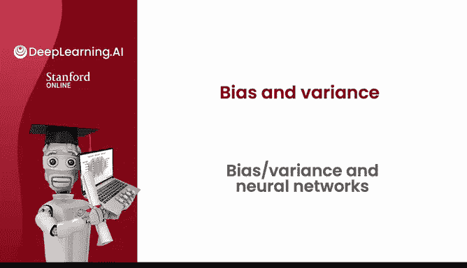
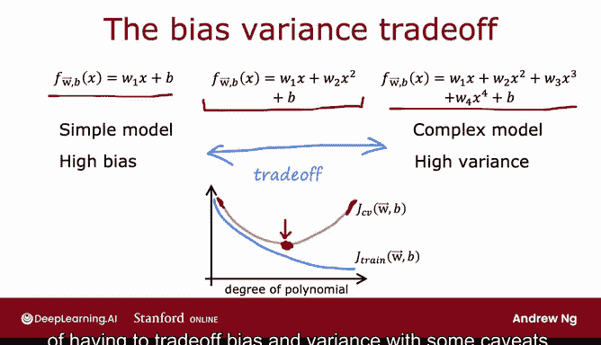
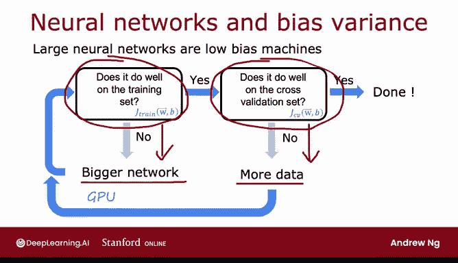
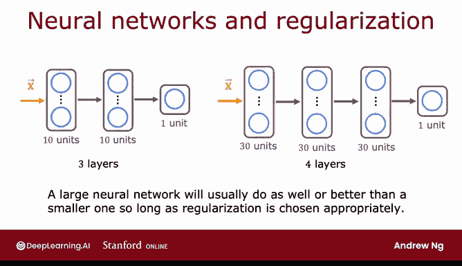

# 83：偏差、方差与神经网络 🧠

在本节课中，我们将学习偏差和方差的概念，并探讨神经网络如何通过其独特的性质，为我们提供一种新的方法来处理这两个问题，从而提升算法性能。



---

## 偏差与方差的权衡

上一节我们介绍了模型性能评估的基本概念，本节中我们来看看偏差和方差如何影响学习算法的表现。

高偏差和高方差都会损害算法的性能。在神经网络兴起之前，机器学习工程师经常讨论**偏差-方差权衡**。这意味着你必须在模型复杂度（例如多项式次数或正则化参数 λ）之间取得平衡，以确保偏差和方差都不会过高。



以下是偏差与方差权衡的直观理解：

*   **高偏差（欠拟合）**：模型过于简单，无法捕捉数据中的潜在模式。例如，用线性模型拟合非线性数据。
*   **高方差（过拟合）**：模型过于复杂，对训练数据中的噪声也进行了学习，导致在新数据上泛化能力差。例如，用一个非常高阶的多项式拟合数据。

传统方法需要在模型复杂度上做出取舍，以找到一个使验证集误差最低的“最佳点”。

---

## 神经网络：一种新的范式

然而，神经网络，特别是与大数据结合时，为我们提供了一种新的思路，可以在一定程度上摆脱这种严格的权衡困境。

事实证明，**大型神经网络在中小型数据集上训练时，通常是低偏差机器**。这意味着，只要你的神经网络足够大，你几乎总是可以很好地拟合训练集（前提是训练集不是特别巨大）。

这为我们提供了一种新的“配方”，可以根据需要分别减少偏差或方差，而不必在两者之间进行艰难的权衡。

---

## 神经网络开发实用指南

以下是一个简单但强大的实用指南，用于使用神经网络开发高精度模型：

1.  **首先，在训练集上训练你的算法**，并计算训练误差 `J_train`。
2.  **评估是否存在高偏差问题**：检查算法在训练集上的表现是否良好。如果 `J_train` 很高（例如，相对于人类水平或某个基准性能），则存在高偏差问题。
    *   **解决方案**：使用更大的神经网络（增加隐藏层数或每层的隐藏单元数）。不断增大网络规模，直到它在训练集上达到可接受的性能水平。
3.  **然后，评估是否存在高方差问题**：在算法很好地拟合训练集后，检查它在交叉验证集上的表现。如果 `J_CV` 远高于 `J_train`，则存在高方差问题。
    *   **解决方案**：获取更多训练数据。然后返回步骤1重新训练模型，并再次检查偏差和方差。

你可以循环执行此过程，直到模型在交叉验证集上表现良好为止。需要注意的是，在实际开发中，你可能需要在“增大网络”和“收集数据”之间来回切换，因为随着算法的调整，你面临的主要问题（偏差或方差）可能会发生变化。

---

## 关于大型神经网络的常见问题

人们常问：“如果我的神经网络太大，会不会导致高方差（过拟合）问题？”



答案是：**一个经过适当正则化的大型神经网络，其性能通常至少与小型神经网络一样好，甚至更好。**



用代码表示，在 TensorFlow 中为一个全连接层添加 L2 正则化的方式如下：

```python
# 无正则化的层
# tf.keras.layers.Dense(units=256, activation='relu')

# 添加 L2 正则化的层
tf.keras.layers.Dense(units=256, activation='relu',
                      kernel_regularizer=tf.keras.regularizers.l2(0.01))
```

因此，只要进行适当的正则化，使用更大的神经网络几乎总是有益的。主要的代价是**计算成本会增加**，可能会减慢训练和推理速度。

神经网络的正则化成本函数公式如下，与线性回归和逻辑回归类似：

`J_reg = J + (λ / 2m) * Σ ||w||^2`

其中，`J` 是原始成本函数（如均方误差或逻辑损失），求和项 `Σ ||w||^2` 是对网络中所有权重参数的平方和。

---

## 总结与核心要点

本节课中我们一起学习了偏差、方差的概念，以及神经网络如何改变我们处理这些问题的方式。

两个核心要点是：

1.  **只要进行适当的正则化，使用更大的神经网络几乎总是无害的**（主要代价是计算速度）。
2.  **只要训练集不是特别巨大，神经网络（尤其是大型神经网络）通常是一个低偏差机器**，它能很好地拟合复杂函数。这就是为什么在训练足够大的神经网络时，我们更常需要解决方差问题，而非偏差问题。

深度学习的发展确实改变了机器学习从业者对偏差和方差的思考方式。尽管如此，在训练神经网络时，测量偏差和方差并以此指导后续步骤，仍然是一个非常有效的方法。