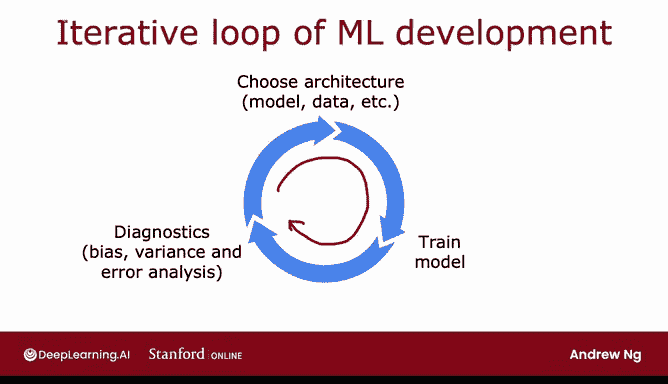
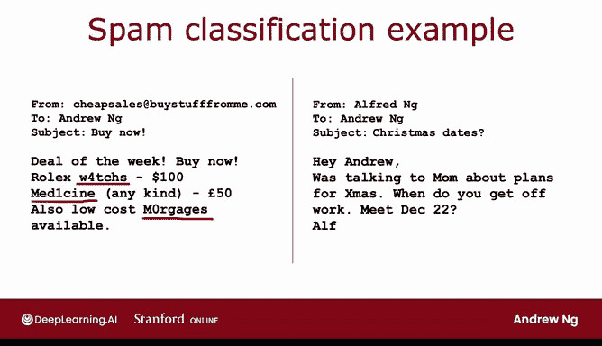
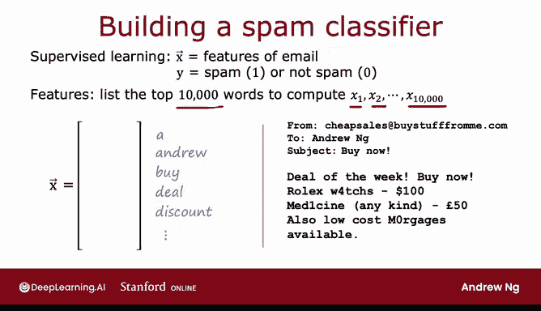
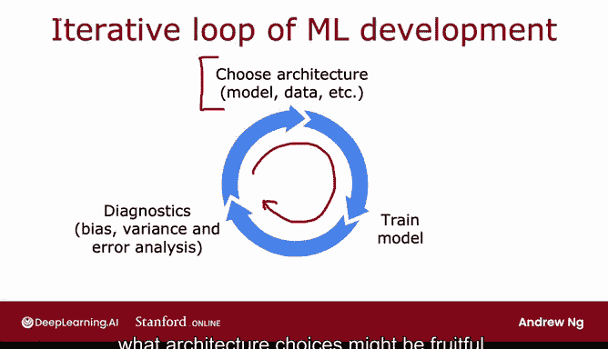

# 84：机器学习开发的迭代循环 🔄

在本节课中，我们将学习开发机器学习系统的完整过程，特别是其核心的迭代循环。通过了解这个过程，你将能够在机器学习开发的各个阶段做出更明智的决策。

## 机器学习开发的迭代循环

上一节我们介绍了课程目标，本节中我们来看看机器学习开发的核心模式——迭代循环。

开发一个机器学习模型通常遵循一个循环往复的过程。首先，你需要决定系统的整体架构。这意味着选择你的机器学习模型，决定使用哪些数据，可能还需要选择超参数等。

给定这些决策后，你将实现并训练一个模型。正如之前提到的，当你第一次训练一个模型时，它几乎永远不会达到你期望的效果。

我建议的下一步是实施或查看一些诊断方法。例如，查看算法的偏差和方差，或者我们将在下一节视频中看到的“误差分析”。

基于诊断得出的见解，你可以做出决策，例如：是否应该让你的神经网络变得更大？是否应该改变Lambda正则化参数？或者是否应该添加更多数据、增加更多特征、或减少一些特征？

然后，你带着新的架构选择再次进入这个循环。通常需要多次迭代才能达到你想要的性能。

## 构建垃圾邮件分类器的例子

为了更好地理解这个循环，让我们看一个构建垃圾邮件分类器的具体例子。许多人都非常讨厌垃圾邮件，这也是我多年前研究过的一个问题。

左边的例子是一个典型的垃圾邮件，其中可能包含故意拼错的单词，如“watches”、“medicine”和“mortgages”，以试图绕过垃圾邮件识别器。相比之下，右边的邮件是我弟弟Alfred发来的关于圣诞节聚会的真实邮件。

那么，如何构建一个分类器来识别垃圾邮件和非垃圾邮件呢？

## 构建分类器的方法

以下是构建文本分类器的一种方法：

*   **模型选择**：训练一个监督学习算法。输入特征`X`是邮件的特征，输出标签`Y`是1或0，分别代表是垃圾邮件或不是垃圾邮件。
*   **特征工程**：一种构造邮件特征的方法是，选取英语（或其他词典）中的前10,000个单词，并用它们来定义特征`x1, x2, ..., x10000`。
    *   例如，给定右边的邮件，如果我们的单词列表是`[a, Andrew, buy, deal, discount, ...]`，那么我们会根据单词是否出现在邮件中，将这些特征设置为0或1。
    *   另一种方法是让这些数字不仅仅是0或1，而是计算该单词在邮件中出现的次数。
*   **算法训练**：给定这些特征，你可以训练一个分类算法，例如逻辑回归模型或神经网络，来根据特征`X`预测`Y`。

## 改进算法的思路

在你训练了初始模型后，如果它的表现不如预期，你很可能会产生多个改进学习算法性能的想法。

以下是一些可能的改进方向：

*   **收集更多数据**：例如，通过“蜜罐”项目创建大量虚假电子邮件地址，故意让垃圾邮件发送者获取，从而收集大量已知的垃圾邮件数据。
*   **开发更复杂的特征**：例如，基于电子邮件路由信息（即邮件在到达你之前经过的服务器序列）开发特征。邮件头中的路径信息有时能帮助判断其是否为垃圾邮件。
*   **优化文本特征**：从邮件正文中提取更复杂的特征。例如，在之前提到的特征中，“discounting”和“discount”可能被视为不同的单词，但也许它们应该被视为同一个词。
*   **检测拼写错误**：设计算法来检测故意拼错的单词（如“watches”），这可能有助于判断邮件是否为垃圾邮件。

## 如何选择改进方向

面对所有这些甚至更多的想法，你如何决定哪些更有前景呢？选择更有前景的方向，可以轻松地将你的项目速度提升10倍，相比选择一些不那么有希望的方向。

例如，我们已经知道，如果你的算法存在高偏差而非高方差，那么花数月时间在蜜罐项目上可能不是最有效的方向。但如果你的算法存在高方差，那么收集更多数据可能会大有帮助。

因此，在机器学习开发的迭代循环中，你可能会有很多关于如何修改模型或数据的想法。而提出不同的诊断方法，可以为你提供大量指导，告诉你哪些模型、数据或架构部分的选择最有希望尝试。

在之前的几节视频中，我们已经讨论了偏差和方差。在下一节视频中，我将开始向你介绍误差分析过程，这是另一套关键思想，用于深入了解哪些架构选择可能富有成效。

## 总结

本节课中我们一起学习了机器学习开发的迭代循环。我们了解到，开发过程是一个“决定架构 -> 实现训练 -> 诊断分析 -> 调整改进”的循环。通过垃圾邮件分类器的例子，我们看到了在模型表现不佳时，存在多种可能的改进路径（如增加数据、优化特征），而有效的诊断（如偏差/方差分析、误差分析）是选择正确改进方向的关键。下一节，我们将深入探讨误差分析的具体方法。