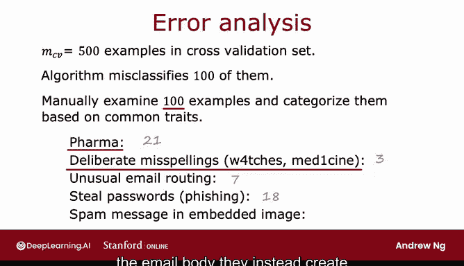
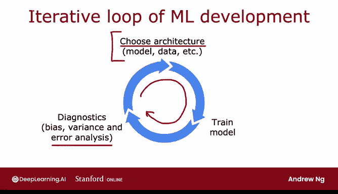

# 85：误差分析 🧐

在本节课中，我们将学习如何通过**误差分析**来诊断和改进机器学习算法。误差分析是继偏差-方差分析之后，第二重要的诊断工具。它能帮助你理解算法在哪些地方出错，并指导你优先处理哪些改进措施。

上一节我们介绍了偏差-方差分析，它帮助你判断模型是欠拟合还是过拟合。本节中我们来看看**误差分析**，它能告诉你模型具体在哪些类型的例子上犯错。

## 什么是误差分析？

误差分析指的是**手动检查**算法分类错误的样本，并尝试找出这些错误样本的共同模式或属性。

假设你的交叉验证集有500个样本（MCV = 500），其中算法错误分类了100个。

误差分析的过程就是仔细查看这100个被错误分类的样本。

## 如何进行误差分析？

以下是进行误差分析的具体步骤：

首先，你需要找出算法错误分类的样本，并尝试将它们按共同特征分组。

例如，在垃圾邮件分类任务中，你可能会发现许多被错误分类的垃圾邮件是推销药品的。

接下来，你可以手动统计这些类别的数量。例如，统计有多少封错误分类的邮件是药品推销邮件。假设你发现有21封。

同样，如果你怀疑故意拼写错误会影响分类器，你也可以统计有多少错误分类的样本包含故意拼写错误。假设你发现100个错误中有3个。

继续检查，你可能还会发现：
*   7封邮件有异常的邮件路由信息。
*   18封邮件是试图窃取密码的网络钓鱼邮件。

有时，垃圾邮件发送者会将垃圾信息写在图片里，而不是邮件正文中，这使得算法更难识别。这类邮件可以归类为“图片内嵌垃圾邮件”。

经过统计，你可能会得到类似下面的表格：

## 如何解读分析结果？

这个表格告诉你，**药品推销垃圾邮件**和**钓鱼邮件**是主要问题，而**故意拼写错误**虽然存在，但影响较小。

具体来说，这个分析表明，即使你开发一个非常复杂的算法来检测故意拼写错误，也只能解决100个错误中的3个。因此，其净收益可能并不大。这并不意味着不值得做，但当你在**确定工作优先级**时，可能不会将其放在首位。

我之所以讲这个故事，是因为我曾经花了很多时间构建检测故意拼写错误的算法，后来才发现其整体影响其实很小。这是一个我希望在投入大量时间之前能进行更仔细误差分析的例子。

## 关于误差分析的注意事项

关于这个过程，有几点需要注意：

1.  **类别可以重叠**：这些分类并不是互斥的。例如，一封药品推销垃圾邮件可能同时具有异常的路由信息；一封钓鱼邮件可能同时包含故意拼写错误。因此，一封邮件可以被计入多个类别。
2.  **处理大量错误样本**：如果你的交叉验证集很大，例如有5000个样本，算法错误分类了1000个，你可能没有时间手动检查所有错误样本。在这种情况下，我通常会**随机抽取一个子集**（大约100到200个样本）进行检查。希望在合理时间内检查大约100个样本，能为你提供足够的统计数据，了解最常见的错误类型，从而找到最值得关注的方向。

## 误差分析如何指导后续行动？

完成分析后，如果你发现很多错误是药品推销垃圾邮件，这可能会给你一些改进的灵感。

例如：
*   **收集更多特定数据**：你可能决定收集更多**药品推销垃圾邮件**的数据，而不是所有类型的数据，以帮助算法更好地识别这类邮件。
*   **设计新特征**：你可能决定设计一些与特定药品名称相关的新特征，以帮助算法更好地识别这类垃圾邮件。

同样，对于钓鱼邮件，这个分析可能会启发你：
*   查看邮件中的URL，并编写特殊代码来生成额外特征，以检测是否链接到可疑URL。
*   专门收集更多钓鱼邮件的数据来帮助算法。

误差分析的意义在于，通过手动检查算法错误分类的样本，常常能**激发灵感**，知道尝试什么改进可能有用。同时，它也能告诉你某些类型的错误非常罕见，不值得花费大量时间去修复。

## 总结与关联

回顾我们的改进清单：
*   **偏差-方差分析**告诉你收集更多数据是否有帮助。
*   基于我们刚才的**误差分析**，看起来：
    *   更复杂的邮件特征可能有点帮助。
    *   专门检测药品推销或钓鱼邮件的更复杂特征可能会很有帮助。
    *   而检测拼写错误的帮助则不会那么大。

总的来说，我发现**偏差-方差诊断**和**这种形式的误差分析**对于筛选或决定尝试哪些模型更改更有希望，都非常有帮助。

## 误差分析的局限性

误差分析的一个局限性是，它对于**人类擅长的任务**更容易进行。例如，你可以查看一封邮件并判断它为什么是垃圾邮件，以及算法为什么出错。

对于**人类也不擅长的任务**，误差分析会困难一些。例如，预测用户会在网站上点击什么，我无法预测，因此那里的误差分析往往更加困难。

但是，当你将误差分析应用于你能理解的问题时，它对于**将你的注意力集中在更有希望的尝试方向上**极为有用，这反过来可以轻松为你节省数月徒劳无功的工作时间。

本节课中我们一起学习了**误差分析**的方法、步骤和意义。它通过手动检查错误样本，帮助我们定位算法的主要问题所在，并指导我们优先处理最有效的改进措施，从而避免在低收益的工作上浪费精力。

在下一个视频中，我们将更深入地探讨为学习算法添加数据的问题。有时你判断存在高方差，并希望为其获取更多数据，而有一些技术可以使你添加数据的方式更加高效。让我们来看看这些方法，希望你能掌握一些为学习应用获取更多数据的好方法。