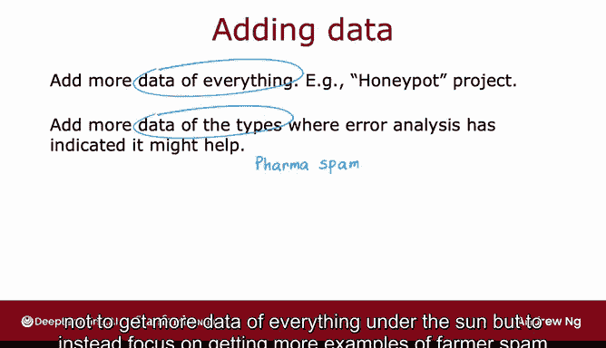
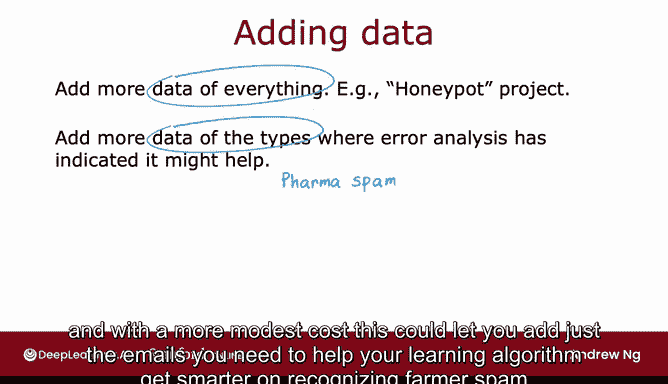
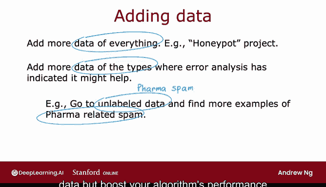
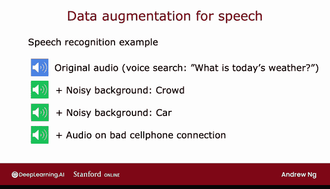
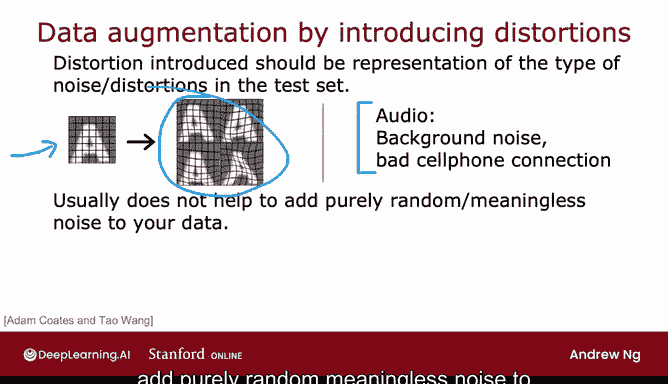
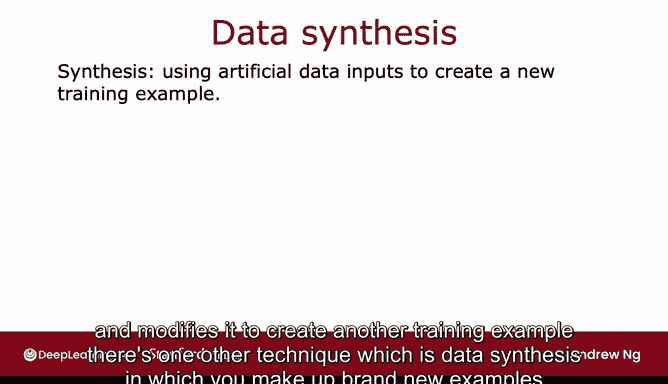
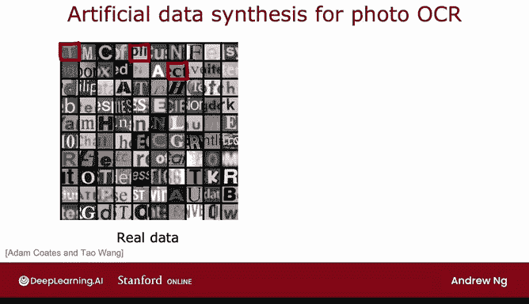
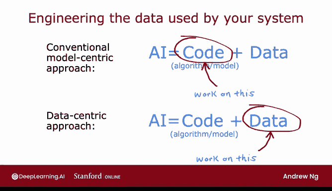

# 86：增加数据的方法 📈

在本节课中，我们将学习如何为机器学习应用增加、获取甚至创造更多数据。我们将探讨几种实用的技术，包括有针对性的数据收集、数据增强和数据合成。这些方法能帮助你更有效地提升模型性能，而不必总是盲目地收集所有类型的数据。

---

## 1. 有针对性的数据收集 🎯

上一节我们介绍了增加数据的重要性。本节中我们来看看如何更高效地增加数据。

通常，我们总是希望拥有更多数据。但试图获取所有类型的数据可能既缓慢又昂贵。一个替代方法是，根据误差分析的结果，有针对性地增加特定类型的数据。

例如，如果误差分析显示“药品垃圾邮件”是一个主要问题，那么你可以集中精力获取更多药品垃圾邮件的例子，而不是获取所有类型的邮件。这样能以更低的成本，帮助你的学习算法更聪明地识别这类垃圾邮件。

以下是具体操作步骤：
1.  如果你有大量未标记的电子邮件数据。
2.  可以要求标注人员快速浏览这些未标记数据，专门找出更多与药品相关的垃圾邮件例子。
3.  与盲目增加所有类型邮件数据相比，这种方法能更有效地提升算法性能。

我希望你从这个例子中得到的通用模式是：虽然增加所有类型的数据没有错，但如果误差分析表明算法在某些特定数据子集上表现不佳，那么有针对性地增加这些类型的数据，可能是更高效的改进方式。

---

## 2. 数据增强技术 🔄

除了获取全新的训练样本 `(X, Y)`，还有一种技术可以显著增加训练集大小，尤其是在图像和音频数据上，这种技术叫做**数据增强**。

数据增强的做法是，对一个现有的训练样本进行修改，以创建一个新的训练样本。

### 图像数据增强示例

假设你正在构建一个OCR（光学字符识别）系统，用于识别A到Z的字母。给定一张字母“A”的图像，你可以通过以下方式创建新的训练样本：
*   将图像旋转一定角度。
*   放大或缩小图像。
*   改变图像的对比度。

这些图像扭曲操作并不会改变“这是字母A”的事实。对于某些字母（并非所有），你还可以使用镜像。通过这种方式，你告诉算法：旋转、放大或缩小一点的字母A，仍然是字母A。创建这样的额外示例有助于学习算法更好地学习如何识别字母。

一个更高级的数据增强例子是，在字母A上放置一个网格，并引入网格的随机扭曲，从而创建出更丰富的字母A示例库。这个过程可以将一张图像变成一个训练示例，帮助算法更稳健地学习“什么是字母A”。

### 音频数据增强示例

这个想法同样适用于语音识别。假设你有一个原始音频片段：“What is today's weather?”。你可以通过以下方式进行数据增强：
1.  取一段嘈杂的背景音频（如人群声音）。
2.  将原始音频与背景噪音叠加，生成一个听起来像在嘈杂人群中说话的音频片段。
3.  同样，可以叠加汽车噪音，生成听起来像在车里说话的音频片段。
4.  还可以模拟糟糕的手机连接效果。

这样，你就可以将一个音频片段变成三个训练示例。在我从事语音识别系统工作时，这确实是人工增加训练数据规模、构建更准确识别器的关键技术。

### 数据增强的关键提示

数据增强的一个关键点是，你对数据所做的更改或扭曲，应该能代表测试集中可能出现的噪声或扭曲类型。

例如，扭曲字母A的图像，应该看起来像你在实际中可能希望识别的字母。为音频添加背景噪音或糟糕的手机连接效果，如果这能代表你预期在测试集中听到的情况，那么就是有益的增强方式。

相反，向数据添加纯粹随机、无意义的噪声通常帮助不大。例如，给字母A图像的每个像素添加随机噪声，生成的图像可能并不代表测试集中的常见情况，因此可能不那么有帮助。

你可以这样思考数据增强：如何以一种使生成的数据仍然与测试集数据非常相似的方式，来修改、扭曲或增加数据的噪声？因为学习算法最终需要在这些数据上表现良好。

---

## 3. 数据合成技术 🧪

数据增强是对现有训练样本进行修改以创建新样本，而另一种技术是**数据合成**，即从头开始创造全新的样本，而不是修改现有样本。

以照片OCR（照片光学字符识别）任务为例，该任务旨在让计算机自动读取图像中的文字。训练一个OCR算法来识别图像中的文字，一个关键步骤是能够识别小图像中心的字母。

为这项任务创建人工数据的一种方法是：利用计算机文本编辑器中的多种字体，打出随机文本，并使用不同的颜色、对比度和字体进行截图，从而生成如右图所示的合成数据。左边的图像是来自真实世界的真实数据，右边的图像是使用计算机字体合成的，看起来相当逼真。

通过这样的合成数据生成，你可以为照片OCR任务生成大量图像或示例。为特定应用编写代码以生成逼真的合成数据可能需要大量工作，但当你花时间做到这一点时，它有时能帮助你为应用生成大量数据，并大幅提升算法的性能。

数据合成技术主要用于计算机视觉任务，在其他应用（如音频）中使用较少。

---

## 4. 以数据为中心的开发方法 💡

本节课中介绍的所有技术都涉及如何设计系统所使用的数据。在机器学习过去几十年的发展中，大多数研究者的注意力都集中在传统的以模型为中心的方法上。

一个机器学习或AI系统既包含实现算法或模型的代码，也包含用于训练算法的数据。过去几十年，大多数机器学习研究者会下载数据集并固定数据，同时专注于改进算法或模型的代码。

得益于这种研究范式，我们今天拥有的算法（如线性回归、逻辑回归、神经网络以及下周将看到的决策树）已经非常优秀，能在许多应用中良好工作。

因此，有时将更多时间花在以数据为中心的方法上可能更有成效。这种方法专注于设计算法所使用的数据，可以包括：
*   收集更多数据。
*   根据误差分析结果，专门收集更多特定类型（如药品垃圾邮件）的数据。
*   使用数据增强生成更多图像或音频。
*   使用数据合成创建更多训练示例。

有时，这种对数据的关注可能是帮助学习算法提升性能的有效途径。希望本视频为你提供了一套工具，能高效地为学习算法增加更多数据，使其工作得更好。

---

## 总结 ✨

本节课中我们一起学习了为机器学习应用增加数据的几种核心方法：
1.  **有针对性的数据收集**：基于误差分析，高效增加特定薄弱环节的数据。
2.  **数据增强**：通过对现有样本（如图像旋转、音频加噪）进行合理变形来扩充数据集。
3.  **数据合成**：从头创造全新的、逼真的训练样本，尤其在计算机视觉任务中有效。

我们还探讨了从以模型为中心转向以数据为中心的开发思路，这往往是提升算法性能的更高效途径。当然，有些应用确实难以获得更多数据，在下一节课中，我们将学习一种名为“迁移学习”的强大技术，它可以在数据有限的情况下，利用其他相关任务的数据来大幅提升你的算法性能。