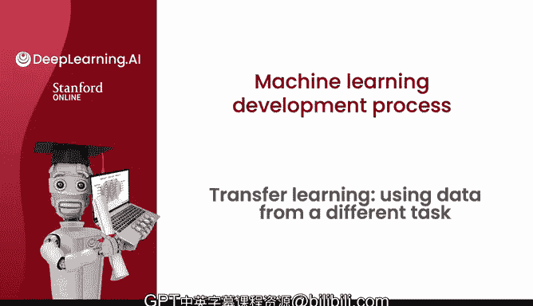
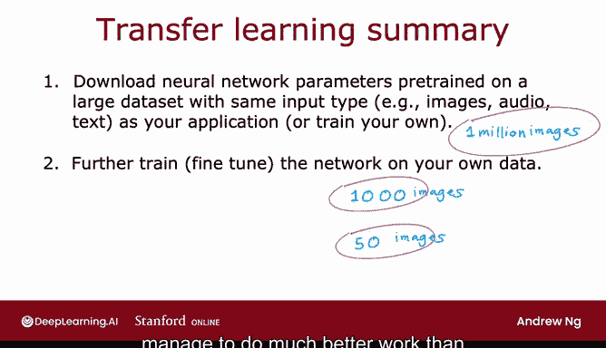

# 87：迁移学习 🚀

在本节课中，我们将要学习一种名为“迁移学习”的强大技术。当你的应用缺乏足够数据时，迁移学习允许你利用来自其他任务的数据来提升模型性能。这是一种非常实用的方法。

## 概述

迁移学习的核心思想是：**将一个在大规模数据集上训练好的模型（或其部分参数）应用到另一个相关但数据量较小的任务上**。这能有效解决数据不足的问题，并加速模型训练。

---

## 迁移学习的工作原理

上一节我们介绍了迁移学习的基本概念，本节中我们来看看它的具体工作流程。

假设你想构建一个识别手写数字0到9的模型，但缺乏足够的手写数字标注数据。你可以按以下步骤操作：

1.  **寻找并利用大型数据集**：首先，找到一个包含100万张图片的大型数据集，这些图片涵盖了猫、狗、汽车、人物等1000个不同类别。

    

2.  **预训练基础模型**：在这个大型数据集上训练一个神经网络。该网络以图像`X`作为输入，学习识别这1000个类别。训练完成后，你会得到网络各层的参数：`W1, b1`, `W2, b2`, `W3, b3`, `W4, b4`, `W5, b5`。

3.  **复制并修改网络结构**：为了应用迁移学习，复制这个训练好的神经网络。保留前四层的参数（`W1, b1` 到 `W4, b4`），但**移除原来的顶层（输出层）**。

4.  **构建新的输出层**：替换为一个新的、更小的输出层。对于手写数字识别任务，新输出层应有10个输出单元（对应数字0-9），而不是原来的1000个。因此，顶层的参数`W5, b5`需要重新初始化并训练，因为维度发生了变化。

5.  **参数初始化与微调**：使用从预训练模型中获得的前四层参数作为新网络的初始值。然后，在你的手写数字小数据集上，运行优化算法（如梯度下降）来训练网络。

---

## 微调策略

在将预训练模型应用到新任务时，有两种主要的微调策略。以下是具体说明：

**选项一：仅训练顶层参数**
*   保持从预训练模型中获得的前四层参数（`W1, b1` 到 `W4, b4`）固定不变。
*   只训练新添加的顶层参数（`W5, b5`）。

**选项二：训练所有参数**
*   使用预训练模型的前四层参数作为初始值。
*   然后，在你的数据集上训练**所有**层的参数，包括`W1, b1` 到 `W5, b5`。

**选择建议**：
*   如果你的训练集**非常小**，选项一可能效果更好，因为它能有效防止过拟合。
*   如果你的训练集**稍大一些**，选项二可能带来更好的性能，因为它允许模型根据新任务调整所有特征。

---

## 为什么迁移学习有效？ 🧠

你可能会疑惑，识别猫、狗、汽车学到的参数，怎么能帮助识别手写数字呢？这背后的直觉在于图像特征的层次性。

一个训练用于物体检测的神经网络，其各层学习到的特征具有通用性：
*   **第一层**：通常学习检测**边缘**等低级特征。
*   **第二层**：将边缘组合起来，学习检测**角点**和简单形状。
*   **更高层**：组合简单形状，学习检测**更复杂的通用形状**（如曲线、基本部件）。

因此，通过在大规模图像数据集上预训练，模型学会了提取图像的通用低级和中级特征（如边缘、角点、形状）。这些特征对于许多计算机视觉任务（包括手写数字识别）都是有用的基础。

---

## 重要限制与前提

迁移学习并非万能，它有一个关键限制：

**预训练和微调步骤的输入类型`X`必须相同**。
*   如果你的最终任务是计算机视觉（处理图像），那么预训练模型也必须在**图像数据**上训练。
*   如果你的任务是语音识别（处理音频），那么预训练模型应该在**音频数据**上训练。
*   对于文本任务同理，预训练模型应基于**文本数据**。

简而言之，特征空间需要对齐。

---

## 实践步骤与社区资源

在实践中，迁移学习通常包含两个步骤：

**第一步：获取预训练模型**
*   从互联网下载一个在大型数据集上预训练好的神经网络及其参数。该网络的输入类型需与你的应用相同（如图像、音频、文本）。
*   或者，你也可以自己训练一个大型模型，但这通常更耗时耗力。

**第二步：在你的数据上微调**
*   将下载的预训练模型的顶层替换为适合你任务的新输出层。
*   使用你自己的（通常较小的）数据集，采用上述选项一或选项二进行微调。

**利用社区力量**：
机器学习社区的一个巨大优势是开源与共享。许多研究人员会将自己花费数周训练的大型预训练模型（如基于ImageNet的图像模型、GPT/BERT等文本模型）公开发布。你可以直接下载这些模型作为起点，这极大地降低了应用先进技术的门槛，让每个人都能在巨人的肩膀上快速构建有效的模型。

---

## 总结

本节课中我们一起学习了迁移学习技术。我们了解到：
1.  **迁移学习**通过利用在大规模任务上学到的知识，来帮助解决数据稀缺的小规模任务。
2.  其核心步骤是**预训练**和**微调**。
3.  微调时可以选择**冻结部分层**或**更新所有权重**。
4.  它有效的关键在于神经网络学习的**底层特征具有通用性**。
5.  其应用前提是**输入数据类型必须一致**。
6.  积极利用社区共享的**预训练模型**可以极大提升开发效率。

迁移学习是机器学习社区协作精神的完美体现，通过共享代码、模型和参数，我们共同推动了整个领域的发展。希望未来你也能为这个社区贡献自己的力量。

这就是关于迁移学习的全部内容。在下一个视频中，我们将探讨一个完整的机器学习项目周期所涉及的各个步骤。