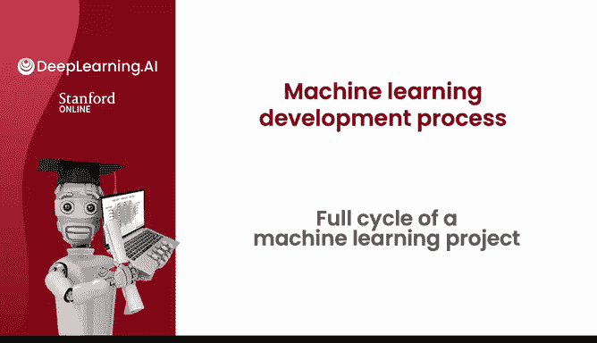
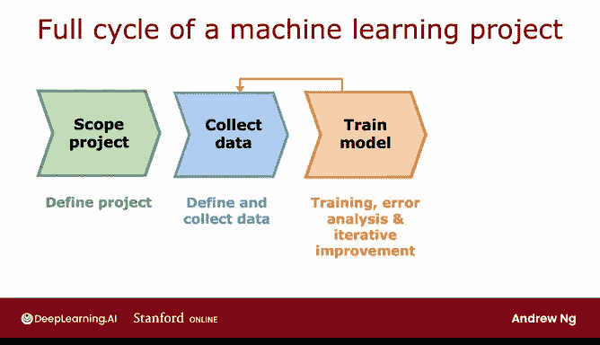
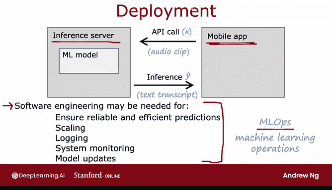

# 88：机器学习项目完整周期 🚀

在本节课中，我们将学习一个机器学习项目从开始到部署及维护的完整生命周期。我们将以语音识别项目为例，详细讲解每个关键步骤，并了解在构建实际、有价值的机器学习系统时需要考虑的各个方面。

---

## 项目范围界定 🎯

首先，机器学习项目的第一步是界定项目范围。这意味着需要决定项目的具体内容和目标。例如，我曾决定开发一个用于语音搜索的项目，即让用户通过手机语音而非打字来进行网络搜索。这就是项目范围界定。

## 数据收集 📊

在决定了项目内容后，下一步是收集数据。你需要确定训练机器学习系统所需的数据类型，并着手获取音频数据及其对应的文本转录或标签。这就是数据收集阶段。

## 模型训练与迭代 🔄

在完成初步的数据收集后，便可以开始训练模型。例如，训练一个语音识别系统，并进行错误分析以持续改进模型。在训练模型和进行错误分析或偏差-方差分析后，常常会发现需要返回去收集更多数据。这可能意味着收集更多通用数据，或者根据错误分析的结果，专门收集某一特定类型的数据来提升算法性能。

例如，在开发语音识别系统时，我发现当背景中有汽车噪音时，模型表现很差。因此，我决定通过数据增强技术，获取更多听起来像在汽车环境中的语音数据，以提升算法性能。

你会多次经历这个循环：训练模型 -> 进行错误分析 -> 返回收集更多数据。这个过程会持续一段时间，直到你认为模型足够好，可以部署到生产环境中。

## 部署与监控 🚀

部署意味着让用户能够使用你的系统。部署系统后，必须持续监控其性能，并在性能下降时进行维护以恢复其表现。仅仅将机器学习模型放在服务器上是不够的。

有时在部署后，你会发现系统表现不如预期，这时可能需要返回重新训练模型，甚至收集更多数据。实际上，如果获得用户许可，从生产部署中收集的数据可以为你提供更多资源，用于持续提升系统性能。

## 部署细节：推理服务器与API

在训练出一个高性能的机器学习模型（如语音识别模型）后，常见的部署方式是将模型实现在一个服务器上，我们称之为**推理服务器**。它的职责是调用你训练好的模型来进行预测。

如果你的团队开发了一个移动应用（例如搜索应用），当用户对着应用说话时，应用可以通过API调用，将录制的音频片段传递给推理服务器。推理服务器的任务是将音频输入机器学习模型，并返回模型的预测结果，在这个例子中就是语音对应的文本转录。

这是一种常见的实现模式：应用通过API调用推理服务器，服务器根据输入 `X` 反复进行预测。用公式表示这个过程就是：`Y_hat = model(X)`。

实现这一过程可能需要一些软件工程工作，来编写所有相关的代码。根据你的应用是需要服务少数用户还是数百万用户，所需的软件工程工作量会有很大不同。

## 系统监控与维护 🛠️

通常，你需要记录获取的数据，包括输入 `X` 和预测结果 `Y_hat`（前提是用户隐私和许可允许存储这些数据）。这些数据对于系统监控非常有用。

例如，我曾基于某个数据集构建了一个语音识别系统。但当有新的名人突然走红，或选举产生了新的政治家时，人们会搜索这些不在训练集中的新名字，导致我的系统表现不佳。正是通过监控系统，我们才能发现数据分布发生了变化，算法准确性在下降，从而促使我们重新训练模型并进行更新。

部署过程可能需要一定量的软件工程工作。对于某些只在个人电脑或一两个服务器上运行的应用，可能不需要太多运维工作。根据团队分工，可能由你构建机器学习模型，而由另一个团队负责部署。

## MLOps：机器学习运维

机器学习领域正在兴起一个名为 **MLOps** 的领域，它代表机器学习运维。MLOps 指的是如何系统化地构建、部署和维护机器学习系统的一系列实践，以确保你的机器学习模型可靠、可扩展、有良好的日志记录、受到监控，并能在适当时机进行更新以保持良好的运行状态。

例如，如果你要将系统部署给数百万用户，你可能需要确保实现高度优化，以控制服务大量用户的计算成本不至于过高。

## 总结 📝

在本节课中，我们一起学习了机器学习项目的完整生命周期。我们从**项目范围界定**开始，经历了**数据收集**、**模型训练与迭代**，最终到达**部署与监控**阶段。我们了解到，训练一个高性能模型是核心，但要将系统成功部署给用户，还需要考虑软件工程、系统监控、性能维护以及 MLOps 实践。最后，我们提到了构建机器学习系统时需要考虑的伦理问题，这将是许多应用中的关键议题。

在接下来的课程中，我们将继续探讨与机器学习系统伦理相关的重要理念。