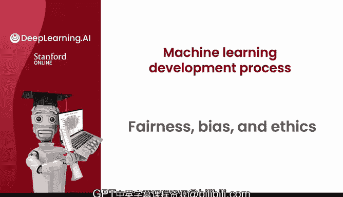
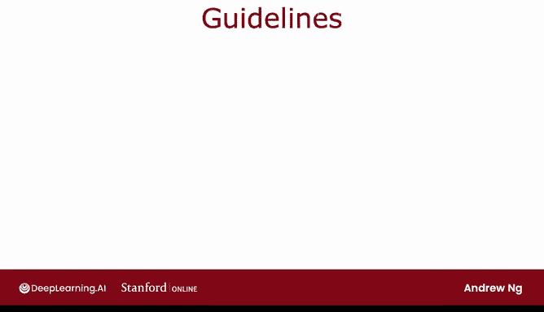
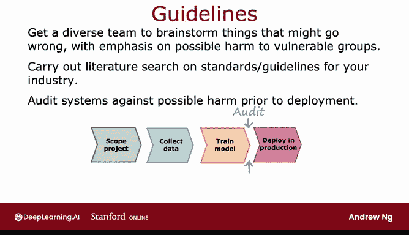

# 89：公平性、偏见与伦理 ⚖️

在本节课中，我们将要学习机器学习中的公平性、偏见与伦理问题。机器学习算法如今影响着数十亿人，确保我们构建的系统公平、无偏见且符合伦理至关重要。我们将探讨相关案例，并学习一些实用的指导原则。

## 公平性与偏见问题

上一节我们介绍了课程主题，本节中我们来看看机器学习历史上一些因偏见而导致严重后果的案例。

不幸的是，在机器学习的历史中，确实出现过一些系统，其中一些被广泛报道，表现出完全不可接受的偏见水平。

例如，曾有一个招聘工具被证明歧视女性。虽然开发该系统的公司后来停止使用它，但人们更希望该系统从一开始就没有被部署。

还有一个有据可查的例子，人脸识别系统将深色皮肤个体与罪犯照片匹配的频率远高于浅色皮肤个体。这显然是不可接受的，我们整个社区应该做得更好，从一开始就不构建和部署存在此类问题的系统。

有些系统在批准银行贷款时存在偏见，歧视某些亚群体。我们也非常希望学习算法不会产生强化负面刻板印象的毒害效应。例如，如果我女儿在网上搜索某些职业，却看不到任何像她一样的人，我不希望这会阻碍她从事某些职业。

## 机器学习的负面用例

除了对个人的偏见和公平待遇问题，机器学习也存在一些不利的用例或负面用例。

例如，有一个被广泛引用和观看的视频，由BuzzFeed公司完全透明地发布，内容是前美国总统巴拉克·奥巴马的深度伪造视频。如果你愿意，可以在网上找到并观看整个视频。但创建此视频的公司是出于完全透明和充分披露的目的。显然，未经同意和披露就使用此技术生成虚假视频是不道德的。

不幸的是，我们也看到社交媒体有时会传播有毒或煽动性言论。因为优化用户参与度导致了算法这样做。

有些机器人被用来生成虚假内容，无论是出于商业目的（如在产品上发布虚假评论）还是政治目的。

机器学习也被用于构建有害产品、实施欺诈等。在机器学习的某些领域，就像电子邮件一样，垃圾邮件发送者和反垃圾邮件社区之间一直存在斗争。例如，我今天在金融行业看到，试图实施欺诈的人和打击欺诈的人之间也存在斗争。

不幸的是，机器学习被一些欺诈者和一些标准制定者所使用。因此，为了社会的利益，请不要构建对社会有负面影响的机器学习系统。如果你被要求从事你认为不道德的应用工作，我敦促你离开。就我而言，我曾多次审视一些项目，它们似乎财务上可行，能为公司赚钱，但我基于不道德的理由终止了这些项目。因为我认为，即使财务上可行，它也会让世界变得更糟，我永远不想参与这样的项目。

## 伦理的复杂性与指导原则

伦理是一个非常复杂和丰富的主题，人类已经研究了至少几千年。当人工智能变得更加普及时，我实际上去阅读了多本哲学和伦理学书籍，因为我曾天真地希望，如果能有一个包含五件事项的清单，我们做了这五件事就能符合伦理。但我失败了，我认为没有人能够提出一个简单的待办事项清单，来提供关于如何符合伦理的具体指导。

因此，我希望与大家分享的不是一个清单（因为我没能想出一个），而是一些通用的指导和建议，以确保工作偏见更少、更公平、更符合伦理。我希望这些相对通用的指导也能对你的工作有所帮助。

以下是使你的工作更公平、偏见更少、更符合伦理的一些建议。

### 部署前的风险评估

在部署一个可能造成伤害的系统之前，我通常会尝试组建一个多元化的团队，集思广益可能出错的事情，重点是可能对弱势群体造成的伤害。

在我的职业生涯中，我发现很多次，拥有一个更多元化的团队（我所说的多元化是指多个维度，从性别到种族，到文化，再到许多其他特质），实际上能使团队集体更善于提出可能出错的想法，并增加了我们在推出系统并给特定群体造成伤害之前识别问题并修复问题的几率。

### 行业标准与文献检索

除了进行多元化的头脑风暴，我还发现对你所在行业或特定应用领域的任何标准或指南进行文献搜索也很有用。

例如，在金融行业，已经开始建立关于系统（比如决定向谁批准贷款的系统）合理公平和无偏见意味着什么的标准。这些在不同领域仍在不断涌现的标准，可以根据你正在从事的工作为你的工作提供参考。

### 系统审计与性能测量

在识别出可能的问题后，我发现部署前根据这些已识别的可能伤害维度对系统进行审计很有用。你在上一个视频中看到了机器学习项目的完整周期，其中一个关键步骤通常是在你训练了一个模型之后、部署到生产环境之前，这是防止部署有问题东西的关键防线。如果团队已经集思广益，认为它可能对某些亚群体（如某些性别或种族）存在偏见，那么你可以命令系统测量性能，看看它是否真的对某些性别、种族或其他亚群体存在偏见，并确保在部署前识别并修复任何问题。

### 制定缓解与监控计划

最后，我发现制定一个缓解计划（如果适用的话）很有用。一个简单的缓解计划就是回退到我们知道相对公平的早期系统。即使在部署之后，也要持续监控伤害，以便在出现需要解决的问题时触发缓解计划并迅速采取行动。例如，所有优秀的自动驾驶汽车团队在将自动驾驶汽车上路之前，都制定了万一汽车发生事故时的缓解计划。这样，如果汽车发生事故，就已经有一个可以立即执行的缓解计划，而不是在事故发生后才手忙脚乱地想办法。

## 总结与展望

我已经参与了许多机器学习系统的工作，让我告诉你，伦理、公平和偏见问题需要认真对待，不能轻视或忽视。当然，有些项目的伦理影响比其他项目更严重。例如，如果我正在构建一个神经网络来决定如何烘焙我的咖啡豆，其伦理影响显然远小于你正在构建一个决定批准哪些银行贷款的系统，后者如果存在偏见会造成重大伤害。

但我希望我们所有从事机器学习工作的人能够不断进步，辩论这些问题，发现问题，在它们造成伤害之前修复它们，这样我们集体就可以避免机器学习世界以前犯过的一些错误。因为这很重要，我们构建的系统可以影响很多人。

以上就是关于开发机器学习系统过程的全部内容，祝贺你完成了本周的必修视频。本周我还有两个可选视频给你，关于处理倾斜数据集，即正负样本比例远非50:50的数据集。事实证明，处理这类机器学习应用需要一些特殊技术。所以，我希望在下个关于如何处理倾斜数据集的可选视频中见到你。