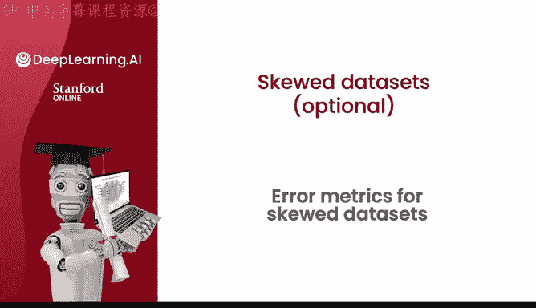
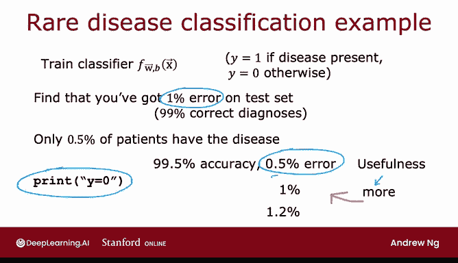
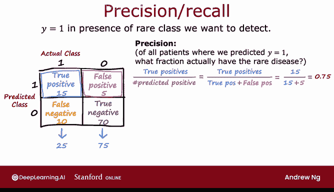

# 90：偏斜数据集的误差指标 📊



在本节课中，我们将要学习当处理类别分布极不均衡（即偏斜数据集）的分类问题时，为何传统的准确率指标会失效，以及如何采用更合适的评估指标——精确率与召回率。

## 偏斜数据集的问题 🤔

上一节我们介绍了分类问题的基本评估方法。本节中我们来看看当数据集中正负样本比例严重失衡时会出现什么问题。

假设你正在训练一个二元分类器，用于根据患者的化验数据检测一种罕见疾病。如果疾病存在，则 `y = 1`；否则 `y = 0`。假设你的模型在测试集上达到了 1% 的错误率，即 99% 的正确诊断率。这听起来是个很好的结果。

但如果这是一种罕见疾病，例如只有 0.5% 的患者真正患病，那么这个结果可能并不像听起来那么出色。具体来说，如果你写一个程序，总是输出 `y = 0`，这个极其简单的非学习算法将拥有 99.5% 的准确率（0.5% 的错误率）。

**代码示例：**
```python
# 一个总是预测为负类的“笨”算法
def dumb_algorithm(features):
    return 0  # 总是预测 y = 0
```



因此，这个非常“笨”的算法（错误率 0.5%）竟然优于你的学习算法（错误率 1%）。但显然，一个总是说“没病”的诊断工具是毫无用处的。这意味着，仅凭 1% 的错误率，你无法判断结果的好坏。特别是当你有多个算法分别达到 99.5%、99.2%、99.6% 的准确率时，很难判断哪个算法最好，因为错误率最低的可能就是那个总是预测 `y = 0` 的无用算法。

## 精确率与召回率 📈

在偏斜数据集问题上，我们通常使用不同的误差指标，而不是仅仅依赖分类错误率，来评估学习算法的性能。具体来说，一对常用的指标是精确率和召回率。

为了评估算法在罕见类别（例如我们想检测的罕见疾病，`y = 1`）上的表现，构建一个混淆矩阵会很有用。混淆矩阵是一个 2x2 的表格。

以下是混淆矩阵的构成：

*   **横轴**：实际类别（1 或 0）。
*   **纵轴**：预测类别（1 或 0）。

通过统计验证集或测试集上的样本，我们可以填充这个矩阵。假设有 100 个验证样本，我们得到以下数据：

*   **真正例**：实际为 1，预测为 1。例如：15 个。
*   **假正例**：实际为 0，预测为 1。例如：5 个。
*   **假反例**：实际为 1，预测为 0。例如：10 个。
*   **真反例**：实际为 0，预测为 0。例如：70 个。

基于混淆矩阵，我们可以计算精确率和召回率。

### 精确率

精确率衡量的是：在所有我们预测为阳性的样本中，有多少是真正的阳性。



**公式：**
```
精确率 = 真正例 / (真正例 + 假正例)
```

在上述例子中，精确率 = 15 / (15 + 5) = 0.75。这意味着，在所有被算法诊断为患病的患者中，有 75% 的人确实患病。

### 召回率

召回率衡量的是：在所有实际为阳性的样本中，我们正确检测出了多少。

**公式：**
```
召回率 = 真正例 / (真正例 + 假反例)
```

在上述例子中，召回率 = 15 / (15 + 10) = 0.60。这意味着，在所有真正患病的患者中，算法成功找出了其中的 60%。

计算精确率和召回率有助于你判断算法是否有效。如果一个算法总是预测 `y = 0`，那么它的真正例数为 0，召回率将为 0。通常，精确率或召回率为 0 的算法不是有用的算法。

## 总结与展望 🎯

本节课中我们一起学习了偏斜数据集带来的评估挑战。我们了解到，传统的准确率指标在类别不平衡时可能产生误导。为此，我们引入了混淆矩阵、精确率和召回率这三个关键概念。精确率关注预测阳性的准确性，而召回率关注找出所有真实阳性的能力。通过确保这两个指标都保持在一个合理的较高水平，我们可以更有信心地认为学习算法是实用且有效的。

在下一节视频中，我们将探讨如何在精确率和召回率之间进行权衡，以优化学习算法的整体性能。