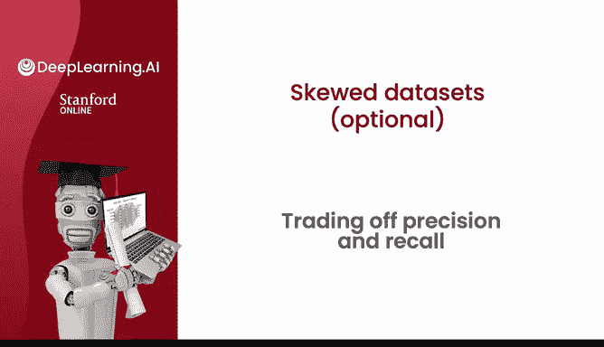
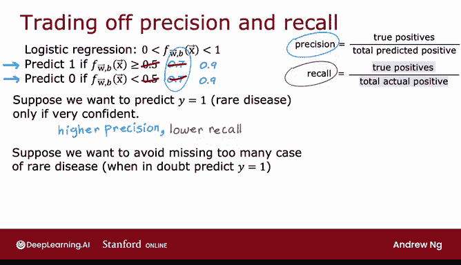
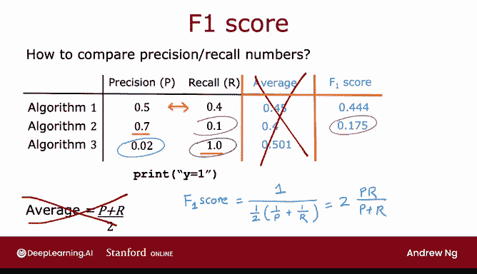

# 91：精确率与召回率的权衡 ⚖️

在本节课中，我们将学习机器学习中两个重要的评估指标——精确率与召回率，并探讨它们之间存在的权衡关系。我们将了解如何通过调整分类阈值来影响这两个指标，并学习一个结合它们的单一指标：F1分数。

## 精确率与召回率的定义 📊

上一节我们介绍了精确率与召回率的概念。本节中我们来看看它们的正式定义。

以下是精确率与召回率的计算公式：

*   **精确率**：在所有被模型预测为正例的样本中，真正为正例的比例。
    *   **公式**：`精确率 = 真阳性 / (真阳性 + 假阳性)`
*   **召回率**：在所有实际为正例的样本中，被模型正确预测为正例的比例。
    *   **公式**：`召回率 = 真阳性 / (真阳性 + 假阴性)`

## 分类阈值的影响 ⚙️

在理想情况下，我们希望模型同时拥有高精确率和高召回率。高精确率意味着当模型诊断一个病人患有罕见疾病时，该病人很可能确实患病，诊断是准确的。高召回率意味着如果一个病人确实患有该罕见疾病，模型很可能正确地识别出他们患病。

然而在实践中，精确率和召回率之间往往存在权衡。在本节中，我们将探讨这种权衡关系，以及如何选择一个合适的权衡点。

如果我们使用逻辑回归模型进行预测，模型会输出一个介于0和1之间的概率值。我们通常会将输出值与一个阈值（例如0.5）进行比较来做出预测。

以下是调整阈值对预测结果的影响：

*   **提高阈值（例如设为0.7或0.9）**：仅当模型非常有把握时，才预测为正例（y=1）。这会导致**精确率提高**（因为预测为正例时更可能是正确的），但**召回率降低**（因为会漏掉更多实际的正例）。
*   **降低阈值（例如设为0.3）**：只要模型认为有一定可能性，就预测为正例。这会导致**召回率提高**（因为能识别出更多实际的正例），但**精确率降低**（因为预测为正例时可能包含更多错误）。

通过选择不同的阈值，我们可以在精确率和召回率之间做出不同的权衡。对于大多数学习算法，都存在这样的权衡曲线。

## 如何选择阈值？ 🎯

通过绘制不同阈值下的精确率-召回率曲线，我们可以尝试选择一个阈值，该阈值对应曲线上的一个点，能够平衡假阳性（误报）和假阴性（漏报）的成本，或者平衡高精确率和高召回率的好处。

需要注意的是，选择阈值通常不能通过交叉验证自动完成，因为这需要你根据具体应用场景来指定最佳的权衡点。在许多应用中，手动选择阈值来权衡精确率和召回率是最终的做法。

## F1分数：结合精确率与召回率 🔢

如果我们想自动权衡精确率和召回率，而不是手动进行，可以使用一个称为 **F1分数** 的指标。它有时被用来自动结合精确率和召回率，以帮助你选择最佳值或两者之间的最佳权衡点。

使用精确率和召回率评估算法的一个挑战是，你现在使用两个不同的指标。如果你训练了三个不同的算法，它们的精确率和召回率数值可能难以直接比较。为了帮助你决定选择哪个算法，将精确率和召回率结合成一个单一的分数可能很有用。

以下是结合精确率与召回率的方法比较：

*   **简单平均（不推荐）**：直接计算精确率和召回率的算术平均值。这种方法效果不佳，因为它没有对较低的数值给予足够重视。
*   **F1分数（推荐）**：这是结合精确率（P）和召回率（R）最常用的方法。F1分数是一种调和平均数，它对P和R中较低的值赋予更大的权重。其计算公式如下：
    *   **公式**：`F1 = 2 * (P * R) / (P + R)`
    *   这等价于先计算1/P和1/R的平均值，再取倒数。

F1分数提供了一种在精确率和召回率之间进行权衡的方法。通过计算F1分数，我们可以更容易地比较不同算法的整体性能，并选择分数最高的那个。

## 总结 📝

本节课中我们一起学习了精确率与召回率之间的重要权衡关系。我们了解到，通过调整分类阈值，可以影响模型的精确率和召回率。此外，我们还介绍了F1分数，这是一个将精确率和召回率结合起来的单一指标，有助于我们更便捷地评估和比较不同的机器学习模型。掌握这些概念对于构建有效的机器学习系统至关重要。