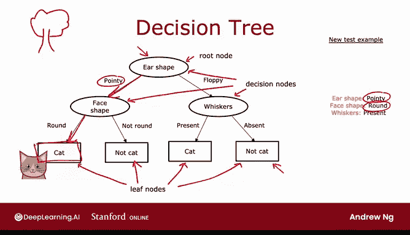
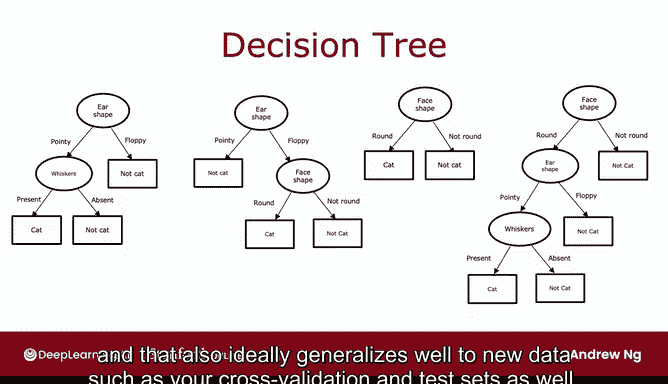

# 92：决策树模型 🌳

在本节课中，我们将学习一种强大且广泛应用的机器学习算法——决策树。尽管决策树在学术界受到的关注相对较少，但它在实际应用和机器学习竞赛中表现卓越，是值得掌握的重要工具。我们将通过一个简单的猫分类示例，逐步理解决策树的工作原理和构建方法。

## 概述 📋


决策树是一种树形结构的模型，用于分类或回归任务。它通过一系列基于特征值的判断，最终在叶子节点给出预测结果。本节我们将以猫分类为例，详细介绍决策树的基本概念、结构以及学习过程。

## 决策树的基本概念 🧩

为了解释决策树的工作原理，我们使用一个猫分类的示例。假设你经营一个猫咪领养中心，需要根据动物的特征快速判断它是否为猫。

### 数据集示例

我们有一个包含10个训练样本的数据集，每个样本有三个特征：
- **耳朵形状**（Ear Shape）：尖耳朵（Pointy）或垂耳朵（Floppy）
- **脸型**（Face Shape）：圆形（Round）或非圆形（Not Round）
- **胡须**（Whiskers）：有（Present）或无（Absent）

目标标签是**是否为猫**（Is Cat），用1（是）或0（否）表示。

以下是数据集的部分示例：

| 耳朵形状 | 脸型   | 胡须   | 是否为猫 |
|----------|--------|--------|----------|
| Pointy   | Round  | Present| 1        |
| Floppy   | Not Round | Present | 1        |
| ...      | ...    | ...    | ...      |

该数据集中包含5只猫和5只狗，特征值为分类变量（即取有限离散值），任务为二分类。

### 决策树模型示例

决策树学习算法训练后可能输出如下模型：

```
根节点（Ear Shape）
├── 左分支（Pointy） → 决策节点（Face Shape）
│   ├── 左分支（Round） → 叶子节点（预测为猫）
│   └── 右分支（Not Round） → 叶子节点（预测为非猫）
└── 右分支（Floppy） → 决策节点（Whiskers）
    ├── 左分支（Present） → 叶子节点（预测为猫）
    └── 右分支（Absent） → 叶子节点（预测为非猫）
```

#### 节点类型说明

- **根节点（Root Node）**：树的顶部节点，第一个判断特征。
- **决策节点（Decision Node）**：根据特征值决定分支方向。
- **叶子节点（Leaf Node）**：树的末端，给出最终预测。

#### 分类过程示例

对于新样本（耳朵形状=尖，脸型=圆，胡须=有）：
1. 从根节点开始，检查耳朵形状为“尖”，进入左分支。
2. 在决策节点检查脸型为“圆”，进入左分支。
3. 到达叶子节点，预测为猫。

## 决策树的多样性 🌿

决策树的结构可以多种多样。例如，另一棵决策树可能以胡须特征为根节点，或以不同顺序判断特征。不同的树在训练集和测试集上的表现可能不同。

以下是几种可能的决策树结构示例：



1. 以耳朵形状为根节点，其次判断胡须。
2. 以脸型为根节点，其次判断耳朵形状。
3. 以胡须为根节点，其次判断脸型。
4. 其他特征组合顺序。

决策树学习算法的目标是从所有可能的树中，选择在训练集上表现良好且能泛化到新数据（如交叉验证集和测试集）的模型。

## 总结 🎯



本节课我们一起学习了决策树的基本概念。我们通过猫分类示例，了解了决策树的结构（包括根节点、决策节点和叶子节点）以及分类过程。决策树通过一系列特征判断进行预测，具有直观易懂的优点。不同的决策树结构可能影响模型性能，因此学习算法需要选择最优的树。在接下来的课程中，我们将深入探讨如何构建和训练决策树。