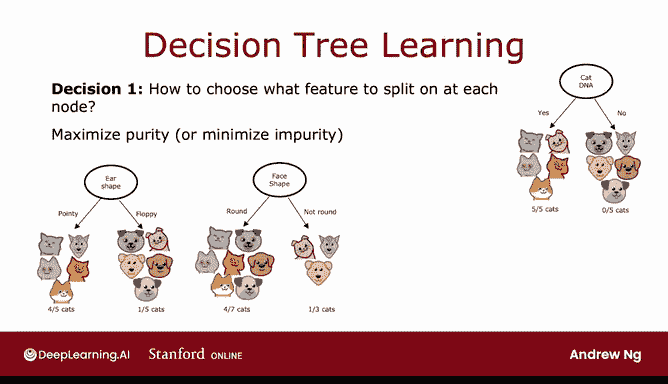
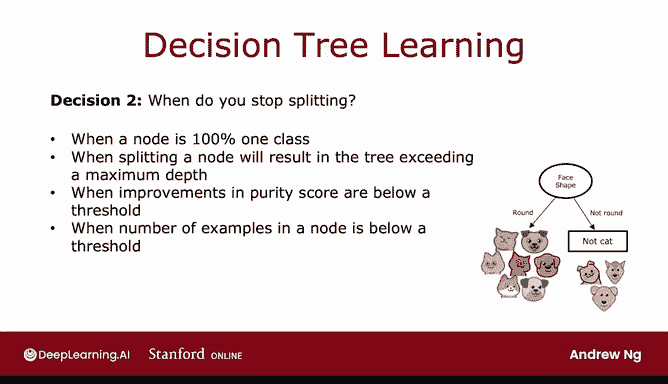

# 93：决策树学习过程 🌳

在本节课中，我们将学习如何构建决策树。决策树是一种常用的机器学习算法，用于分类和回归任务。我们将详细介绍构建决策树的步骤，包括如何选择特征进行分裂以及何时停止分裂。

---

## 决策树构建过程概述

给定一个训练集，构建决策树的过程包括几个关键步骤。在上一节中，我们介绍了决策树的基本概念。本节中，我们来看看构建决策树的具体流程。

---

## 构建决策树的步骤

以下是构建决策树的主要步骤：

1. **选择根节点的特征**  
   首先，我们需要决定在根节点使用哪个特征。例如，在一个包含10个猫和狗样本的训练集中，我们可能选择“耳朵形状”作为根节点的特征。

2. **根据特征值分裂数据**  
   根据选定的特征值，将训练样本分成不同的子集。例如，将“尖耳朵”的样本移到左侧分支，将“垂耳朵”的样本移到右侧分支。

3. **递归分裂子节点**  
   对每个分支重复上述过程，选择新的特征进行分裂，直到满足停止条件。

4. **创建叶节点**  
   当某个节点的样本全部属于同一类别时，创建叶节点并做出预测。

---

## 关键决策点

在构建决策树的过程中，有两个关键决策需要做出：

### 1. 如何选择分裂特征

在每个节点，我们需要选择一个特征来分裂数据。决策树算法通常会选择能够最大化“纯度”的特征。纯度指的是子集中样本属于同一类别的程度。

例如，假设我们有以下特征：
- 耳朵形状（尖耳朵、垂耳朵）
- 脸型（圆形、非圆形）
- 胡须（有、无）

算法需要计算每个特征分裂后的纯度，并选择纯度最高的特征。纯度的计算公式如下：

**纯度 = 同一类别的样本数 / 总样本数**

### 2. 何时停止分裂

停止分裂的条件包括：
- 节点中的样本全部属于同一类别。
- 树的深度达到预设的最大值。
- 纯度提升低于某个阈值。
- 节点中的样本数量过少。

例如，如果最大深度设置为2，则树不会分裂到深度3的节点。这有助于防止过拟合并保持树的简洁性。

---

## 决策树的深度

决策树的深度定义为从根节点到某个节点的跳数。根节点的深度为0，其子节点的深度为1，以此类推。限制树的深度可以防止树过于复杂，并减少过拟合的风险。

---

## 总结

本节课中，我们一起学习了决策树的构建过程。我们介绍了如何选择分裂特征以及何时停止分裂，并讨论了决策树深度的概念。决策树虽然包含许多细节，但这些步骤组合在一起形成了一个高效的机器学习算法。

在接下来的课程中，我们将深入探讨如何计算纯度以及如何选择最佳分裂特征。让我们继续学习！