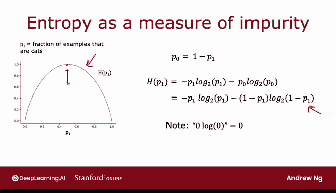

# 94：📊 测量纯度

在本节课中，我们将学习如何量化一组样本的“纯度”。如果一组样本全部属于同一类别（例如全是猫或全不是猫），那么它就是非常“纯”的。但如果样本混合了不同类别，我们该如何衡量其纯度呢？让我们一起来了解“熵”的定义，它是衡量数据集“不纯度”的一个指标。


## 📈 熵的定义与直观理解

上一节我们引入了“纯度”的概念，本节中我们来看看如何用“熵”来具体测量它。熵函数通常用大写字母 **H(P1)** 表示，其中 **P1** 代表数据集中正例（例如“猫”）的比例。

下图展示了熵函数 **H(P1)** 的曲线。横轴是 **P1**（猫的比例），纵轴是熵值。


当样本中猫狗各半（**P1 = 0.5**）时，熵值达到最高点 **1**，此时数据集最“不纯”。相反，当样本全是猫（**P1 = 1**）或全不是猫（**P1 = 0**）时，熵值为 **0**，此时数据集最“纯”。

为了加深理解，我们来看几个具体例子。

以下是几个不同样本组成下的熵值计算示例：

*   **示例1：3只猫，3只狗**
    *   **P1 = 3/6 = 0.5**
    *   熵 **H(0.5) = 1**。这是最不纯的情况。
*   **示例2：5只猫，1只狗**
    *   **P1 = 5/6 ≈ 0.83**
    *   熵 **H(0.83) ≈ 0.65**。纯度比示例1高。
*   **示例3：6只猫，0只狗**
    *   **P1 = 6/6 = 1**
    *   熵 **H(1) = 0**。这是完全纯的情况（全是猫）。
*   **示例4：2只猫，4只狗**
    *   **P1 = 2/6 ≈ 0.33**
    *   熵 **H(0.33) ≈ 0.92**。由于接近0.5，不纯度很高。
*   **示例5：0只猫，6只狗**
    *   **P1 = 0/6 = 0**
    *   熵 **H(0) = 0**。这是完全纯的情况（全不是猫）。

从这些例子可以看出，随着样本从猫狗混合变为全是猫，不纯度（熵）从1降到了0，或者说纯度增加了。

## 🧮 熵的数学公式

了解了熵的直观意义后，现在我们来学习其具体的计算公式。设 **P1** 为正例（猫）的比例，那么负例（非猫）的比例 **P0 = 1 - P1**。

熵的计算公式如下：

**H(P1) = -P1 * log₂(P1) - P0 * log₂(P0)**

或者等价地写为：

**H(P1) = -P1 * log₂(P1) - (1 - P1) * log₂(1 - P1)**

**代码描述：**
```python
import numpy as np

def entropy(p1):
    if p1 == 0 or p1 == 1:
        return 0
    p0 = 1 - p1
    return -p1 * np.log2(p1) - p0 * np.log2(p0)
```

**关于公式的几点说明：**

1.  **对数底数**：我们使用以2为底的对数（log₂），这是约定俗成的做法，它使得函数峰值恰好为1，便于解释。
2.  **处理边界情况**：当 **P1 = 0** 或 **P1 = 1** 时，会出现 **0 * log₂(0)** 的情况。按照计算熵的惯例，我们定义 **0 * log₂(0) = 0**，这样能正确计算出熵值为0。
3.  **与逻辑损失的相似性**：你可能注意到这个公式与之前课程中学到的逻辑损失函数有些相似。这背后确有数学原理，但本课程不深入探讨。对于构建决策树来说，直接应用这个熵公式即可。

## 🔚 总结与预告

本节课中，我们一起学习了“熵”这一核心概念。熵是衡量数据集不纯度（或纯度）的函数，其值在0到1之间。当数据集中样本类别完全相同时，熵为0（最纯）；当正负例各占一半时，熵为1（最不纯）。其计算公式为 **H(P1) = -P1 * log₂(P1) - (1 - P1) * log₂(1 - P1)**。

除了熵，还有其他类似函数（如基尼系数）也可用于衡量不纯度，但在本系列课程中，我们将主要使用熵。



现在我们已经掌握了测量纯度的方法，在下一讲中，我们将看看如何利用熵在决策树的节点上做出选择，决定根据哪个特征进行数据分割。

