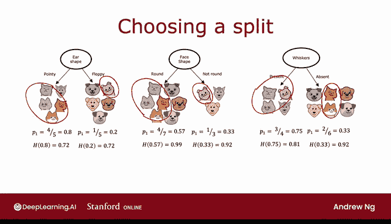
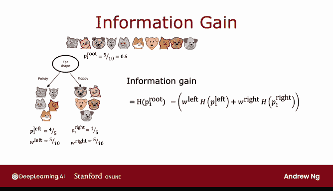

# 95：决策树分裂准则——信息增益 📊


在本节课中，我们将学习决策树构建过程中的一个关键步骤：如何选择最佳特征进行节点分裂。我们将重点介绍**信息增益**的概念，它通过计算熵的减少量来帮助我们做出选择。

---

## 概述

决策树通过一系列特征分裂将数据划分为更纯净的子集。在上一节中，我们介绍了**熵**作为衡量数据不纯度的指标。本节中，我们来看看如何利用熵的减少量——即**信息增益**——来选择在每个节点上使用哪个特征进行分裂，从而构建更有效的决策树。

---

## 信息增益的定义

在决策树学习中，熵的减少量被称为**信息增益**。我们的目标是选择那个能最大程度降低子节点加权平均熵的特征进行分裂。

信息增益的通用计算公式如下：

```
信息增益 = 根节点熵 - (W_left * 左子节点熵 + W_right * 右子节点熵)
```

其中：
*   **根节点熵**：分裂前，当前节点数据的不纯度。
*   **W_left, W_right**：分别代表进入左、右子节点的样本数占总样本数的比例（权重）。
*   **左/右子节点熵**：分裂后，左、右子节点数据的不纯度。



---

## 计算示例：识别猫的决策树

假设我们正在构建一个识别猫的决策树，根节点有10个样本（5只猫，5只狗）。我们考虑三个候选特征：耳朵形状、脸型、是否有胡须。

以下是每个特征分裂后的数据分布与熵值计算：

### 1. 按“耳朵形状”分裂
*   左子节点：5个样本，其中4只猫。`P1_left = 4/5 = 0.8`，熵 ≈ 0.72。
*   右子节点：5个样本，其中1只猫。`P1_right = 1/5 = 0.2`，熵 ≈ 0.72。
*   根节点熵（`P1_root = 0.5`）为1。
*   信息增益 = `1 - (5/10 * 0.72 + 5/10 * 0.72) = 0.28`。

### 2. 按“脸型”分裂
*   左子节点：7个样本，其中4只猫。`P1_left = 4/7 ≈ 0.57`，熵 ≈ 0.99。
*   右子节点：3个样本，其中1只猫。`P1_right = 1/3 ≈ 0.33`，熵 ≈ 0.92。
*   信息增益 = `1 - (7/10 * 0.99 + 3/10 * 0.92) ≈ 0.03`。

### 3. 按“胡须”分裂
*   左子节点：4个样本，其中3只猫。`P1_left = 3/4 = 0.75`，熵 ≈ 0.81。
*   右子节点：6个样本，其中2只猫。`P1_right = 2/6 ≈ 0.33`，熵 ≈ 0.92。
*   信息增益 = `1 - (4/10 * 0.81 + 6/10 * 0.92) ≈ 0.12`。

---

## 如何选择分裂特征

比较三个特征的信息增益：
*   耳朵形状：**0.28**
*   脸型：0.03
*   胡须：0.12

“耳朵形状”特征带来了最大的信息增益（0.28），意味着它能最有效地降低数据的不纯度。因此，我们选择在根节点按“耳朵形状”进行分裂。

---

## 为什么使用信息增益

使用信息增益（熵的减少量）而不仅仅是子节点的熵，主要有两个原因：
1.  **加权考虑**：它通过`W_left`和`W_right`考虑了进入各子节点的样本数量。一个包含大量样本的高熵子节点，比一个只包含少量样本的高熵子节点问题更严重。
2.  **提供停止准则**：如果所有可能分裂带来的信息增益都小于某个阈值，我们可以决定不再分裂该节点。这有助于防止树过度生长，降低过拟合风险。

---

## 总结

本节课中我们一起学习了决策树的核心分裂准则——**信息增益**。关键要点如下：



*   信息增益衡量了通过某个特征分裂后，数据不纯度（熵）的减少程度。
*   选择分裂特征时，我们计算每个特征对应的信息增益，并选择**增益最大**的那个。
*   其计算公式为：`信息增益 = 根节点熵 - 加权平均子节点熵`。
*   使用信息增益不仅能找到最佳分裂点，还为决策树提供了重要的**预剪枝**停止准则。

现在你已经掌握了如何计算信息增益并选择分裂特征，下一节我们将把这些知识整合起来，看看构建决策树的完整算法。