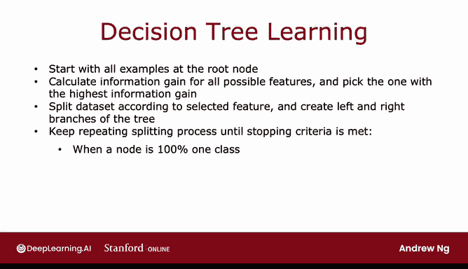
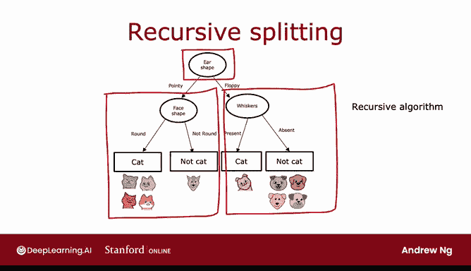

# 96：决策树的构建与实现 🌳

在本节课中，我们将学习如何将信息增益准则应用于决策树的多个节点，从而构建一个包含多个节点的大型决策树。我们将详细介绍决策树的构建过程、停止分裂的条件，以及如何对新样本进行预测。

---

## 决策树的构建过程

上一节我们介绍了信息增益准则，本节中我们来看看如何利用它来构建整个决策树。

决策树的构建是一个递归过程，从根节点开始，逐步选择最佳特征进行分裂，直到满足停止条件。

以下是构建决策树的主要步骤：

1.  **从根节点开始**：将所有训练样本置于决策树的根节点。
2.  **计算信息增益**：针对所有可能的特征，计算其信息增益。
3.  **选择最佳特征**：选择能带来**最高信息增益**的特征作为当前节点的分裂依据。
4.  **创建分支**：根据所选特征的值，将数据划分为两个子集，并创建左、右分支。
5.  **递归分裂**：对左分支和右分支重复步骤2-4，直到满足停止条件。

---

## 停止分裂的条件

在递归分裂过程中，我们需要设定停止条件，以防止树过度生长和过拟合。以下是常见的停止条件：

*   **节点纯度达到100%**：当节点中所有样本都属于同一类别时（熵为零），停止分裂。
*   **达到最大深度**：当树的深度达到预设的**最大深度**时，停止分裂。
*   **信息增益过小**：如果进一步分裂带来的**信息增益**小于某个阈值，则停止分裂。
*   **节点样本数过少**：如果节点中的样本数量低于某个阈值，则停止分裂。

构建过程会持续进行，直到满足你设定的一个或多个停止条件。

---

## 构建过程示例

让我们通过一个图示来具体了解这个过程。

我们首先将所有样本放在根节点。计算所有三个特征（耳形、胡须、脸形）的信息增益后，决定**耳形**是根节点的最佳分裂特征。根据此特征，我们创建左（尖耳）和右（垂耳）分支，并将数据子集分别发送到这两个分支。

现在，我们聚焦于左分支（包含5个样本）。我们的停止条件是“节点内样本属于同一类别”。由于该节点混合了猫和狗，不满足条件，因此需要继续分裂。

接下来，我们仅使用这5个样本，计算剩余特征（胡须、脸形）的信息增益。由于所有样本耳形相同，分裂耳形的信息增益为零。在胡须和脸形之间，**脸形**的信息增益最高。因此，我们选择脸形进行分裂。

分裂后，左子分支全是猫，满足停止条件，我们创建一个预测为“猫”的**叶节点**。右子分支全是狗，同样满足条件，创建一个预测为“非猫”的叶节点。

完成左子树后，我们以同样的方式构建右子树（包含另外5个样本）。计算信息增益后发现，**胡须**特征的信息增益最高。根据胡须是否存在进行分裂后，两个新分支都达到了纯度要求，因此分别创建预测“猫”和“非猫”的叶节点。

---

## 递归算法

请注意我们构建过程中的一个有趣特点：在决定了根节点的分裂特征后，我们构建左子树的方式是在一个5样本的子集上构建一个决策树，构建右子树的方式亦然。在计算机科学中，这被称为**递归算法**。

递归意味着编写能调用自身的代码。构建决策树时，你通过构建更小的子树（左子树和右子树）来构建整个决策树，并将它们组合在一起。这就是为什么在决策树的软件实现中，你有时会看到对递归算法的引用。

如果你不完全理解递归算法的概念，也无需担心。你仍然可以完成本周的练习，并使用库来让决策树为你工作。但如果你要从零开始实现决策树算法，递归将是必须实现的步骤之一。

---

## 参数选择与过拟合

你可能会想知道如何选择**最大深度**这类参数。虽然没有唯一答案，但一些开源库会提供良好的默认值可供使用。

一个直观的理解是：**最大深度**越大，你允许构建的决策树就越大。这有点像拟合更高次数的多项式或训练更大的神经网络。它让决策树能够学习更复杂的模型，但如果对数据拟合了过于复杂的函数，也会增加**过拟合**的风险。

理论上，你可以使用**交叉验证集**来调整像最大深度这样的参数，尝试不同的值并选择在验证集上表现最好的那个。但在实践中，开源库有更好的方法为你选择这个参数。

另一个可以用来决定何时停止分裂的标准是：如果额外分裂带来的**信息增益**小于某个阈值（即任何特征分裂只能带来很小的熵减少或信息增益），那么你也可以决定不再分裂。

最后，你还可以在节点中的**样本数量**低于某个阈值时决定停止分裂。

---

## 使用决策树进行预测

现在你已经学会了如何构建决策树。如果你想进行预测，可以遵循本周第一个视频中介绍的过程：取一个新样本（例如测试样本），从根节点开始，沿着决策路径向下，直到到达一个叶节点，该叶节点会给出最终的预测结果。

---

## 总结

本节课中我们一起学习了决策树学习算法的核心构建过程。我们了解了如何从根节点开始，递归地使用信息增益选择最佳分裂特征，并设定了多种停止分裂的条件以防止过拟合。我们还简要探讨了递归算法在其中的作用以及如何选择树的最大深度等参数。最后，我们回顾了如何使用训练好的决策树对新样本进行预测。

在接下来的视频中，我们将进一步探讨这个算法的其他改进，例如如何处理具有两个以上取值的分类特征。