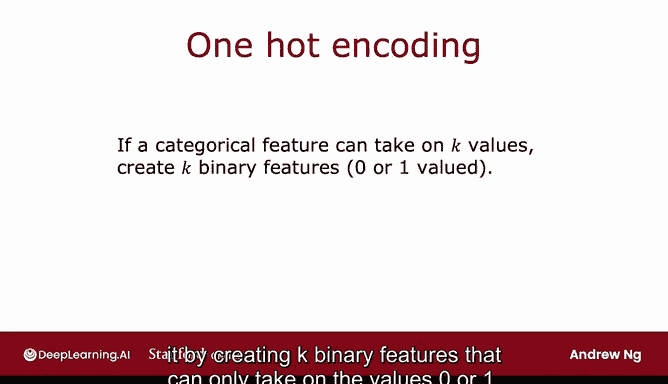

# 97：使用分类特征的独热编码 🏷️

在本节课中，我们将要学习如何处理可以取多个离散值的分类特征。我们将重点介绍一种称为“独热编码”的技术，它可以将具有多个类别的特征转换为多个二进制特征，从而使决策树等算法能够直接处理。

## 概述

在之前看到的例子中，每个特征只能取两个可能的值之一。例如，耳朵形状要么是尖的，要么是耷拉的；脸型要么是圆的，要么不是；胡须要么存在，要么不存在。但是，如果你有一个特征可以取两个以上的离散值，该怎么办呢？本节视频将介绍如何使用独热编码来处理这类特征。

## 引入多值分类特征

这里有一个我们宠物领养中心应用程序的新训练集。除了耳朵形状特征外，所有数据都与之前相同。现在，耳朵形状不仅可以是尖的或耷拉的，还可以是椭圆的。

因此，耳朵形状特征仍然是一个分类特征，但它可以取三个可能的值，而不仅仅是两个。这意味着，当你根据这个特征进行分割时，最终会创建三个数据子集，并为树构建三个子分支。

## 独热编码的解决方案

在本视频中，我想描述一种不同的方法来处理可以取多个值的特征，即使用独热编码。

具体来说，我们不使用一个可以取三个可能值的耳朵形状特征，而是创建三个新特征：
*   第一个特征是：这个动物有尖耳朵吗？
*   第二个特征是：它有耷拉耳朵吗？
*   第三个特征是：它有椭圆耳朵吗？

对于第一个例子，我们之前说耳朵形状是尖的。现在，我们说这个动物的“尖耳朵”特征值为1，“耷拉耳朵”和“椭圆耳朵”特征值为0。

对于第二个例子，我们之前说它有椭圆耳朵。现在，我们说它的“尖耳朵”特征值为0（因为它没有尖耳朵），“耷拉耳朵”特征值也为0，但“椭圆耳朵”特征值为1。数据集中的其余示例依此类推。

这样，我们不是用一个可以取三个可能值的特征，而是构造了三个新特征，每个特征只能取两个可能值之一：0或1。

## 独热编码的通用方法

更详细地说，如果一个分类特征可以取k个可能的值（在例子中k=3），那么我们将通过创建k个只能取值0或1的二进制特征来替换它。

你会注意到，在这三个特征中，如果你查看任何一行，**恰好有一个值等于1**，这正是这种特征构建方法被称为“独热编码”的原因。因为这些特征中总有一个取值为1（即“热”特征），所以得名“独热编码”。

## 应用决策树算法

通过这种特征选择，我们现在回到了每个特征只取两个可能值之一的原始设置。因此，我们之前看到的决策树学习算法无需任何进一步修改即可应用于此数据。

## 扩展到神经网络

顺便说一下，尽管本周的材料主要关注训练决策树模型，但使用独热编码对分类特征进行编码的思想也适用于训练神经网络。

具体来说，如果你要获取脸型特征，并用1和0替换“圆”和“不圆”（其中“圆”对应1，“不圆”对应0），对于胡须特征，类似地用1替换“存在”，用0替换“不存在”。

那么请注意，我们已经获取了所有已有的分类特征（耳朵形状有3个可能值，脸型有2个，胡须有2个），并将其编码为这五个特征的列表：三个来自耳朵形状的独热编码，一个来自脸型，一个来自胡须。现在，这五个特征的列表也可以输入到神经网络或逻辑回归中，以尝试训练一个猫分类器。

因此，独热编码不仅适用于决策树学习，还可以让你使用1和0对分类特征进行编码，以便将其作为输入提供给神经网络（神经网络期望数字作为输入）。

## 总结

本节课中我们一起学习了独热编码。通过独热编码，你可以让决策树处理可以取两个以上离散值的特征。你也可以将此技术应用于神经网络、线性回归或逻辑回归的训练。

那么，对于可以取任何数值（不仅仅是少量离散值）的特征呢？在下一个视频中，让我们看看如何让决策树处理可以是任何数字的连续值特征。