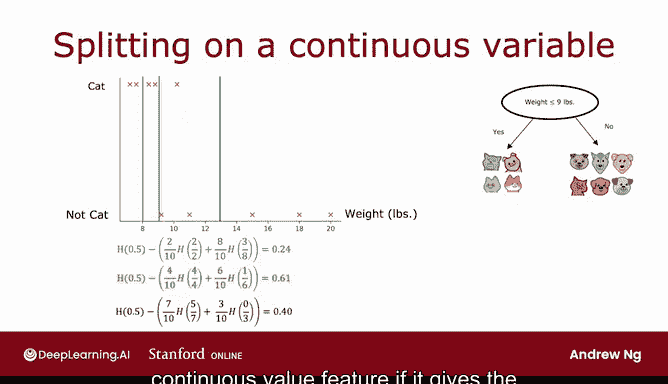

# 98：连续值特征处理 🎯

在本节课中，我们将学习如何修改决策树算法，使其能够处理连续值特征，而不仅仅是离散值特征。连续值特征是指可以取任意数值的特征，例如动物的体重。

## 从离散到连续：决策树的扩展

上一节我们介绍了决策树如何处理离散特征（如耳朵形状）。本节中我们来看看当特征（如体重）是连续值时，决策树算法应如何调整。

决策树算法的核心流程与之前类似，但在选择分裂特征时，除了考虑“耳朵形状”、“脸型”和“胡须”等离散特征，现在也需要考虑“体重”这样的连续特征。如果根据“体重”特征进行分裂能带来比其他特征更高的信息增益，那么算法就会选择在“体重”特征上进行分裂。

## 如何对连续特征进行分裂？

关键在于如何确定分裂的阈值。我们通过一个例子来理解这个过程。

假设我们有一个修改后的宠物领养中心数据集，新增了“体重”（磅）这一连续特征。下图展示了根节点处数据的分布情况，横轴是动物体重，纵轴是标签（1代表猫，0代表非猫）。

对连续特征“体重”进行分裂，意味着我们需要选择一个阈值（例如8磅），并根据“体重是否小于等于该阈值”将数据划分为两个子集。学习算法的任务就是找到最佳的这个阈值。

以下是寻找最佳阈值的基本步骤：
1.  考虑多个不同的候选阈值。
2.  对每个候选阈值，计算其对应的信息增益。
3.  选择能带来最高信息增益的阈值。

## 信息增益计算示例

让我们通过计算来具体理解。

**情况一：以体重 ≤ 8磅 为阈值**
*   左子集：包含2只猫。
*   右子集：包含3只猫和5只狗。
*   信息增益计算为：`信息增益 = H(0.5) - [ (2/10)*H(1) + (8/10)*H(3/8) ] ≈ 0.24`

**情况二：以体重 ≤ 9磅 为阈值**
*   左子集：包含4只猫。
*   右子集：包含1只猫和5只狗。
*   信息增益计算为：`信息增益 = H(0.5) - [ (4/10)*H(1) + (6/10)*H(1/6) ] ≈ 0.61`

**情况三：以体重 ≤ 13磅 为阈值**
*   信息增益计算结果约为 0.40。

比较可知，以9磅为阈值的信息增益（0.61）最高。

## 选择候选阈值的通用方法

在实际操作中，我们不会只尝试三个值。一个通用的做法是：
1.  将所有训练样本按该连续特征的值从小到大排序。
2.  考虑排序后相邻样本特征值之间的中点作为候选阈值。
3.  如果有10个训练样本，则会产生9个候选阈值。
4.  计算每个候选阈值对应的信息增益，并选择增益最高的那个。

如果从该连续特征上分裂获得的信息增益，高于从任何其他特征（离散或连续）上分裂的增益，那么算法就会决定在当前节点按此特征和选定的阈值进行分裂。

在本例中，0.61的信息增益是最高的，因此算法会选择按“体重是否≤9磅”来分裂根节点，从而得到两个数据子集。

随后，可以递归地使用这两个子集来构建决策树的其余部分。

## 总结与过渡

本节课中我们一起学习了如何让决策树处理连续值特征。核心方法是：在每个节点考虑分裂时，为连续特征尝试不同的分裂阈值，进行常规的信息增益计算，如果该特征能提供所有可能特征中最高的信息增益，则按选定的阈值在此连续特征上进行分裂。

这就是决策树处理连续值特征的方法：尝试不同阈值，进行常规信息增益计算，并在该特征能提供最佳信息增益时，使用选定的阈值进行分裂。

以上是决策树核心算法的必备内容。接下来有一个可选视频，将把决策树学习算法推广到**回归树**。目前我们只讨论了用决策树进行**分类**预测（如判断是否为猫）。但如果你遇到的是**回归**问题，想要预测一个具体数值呢？下一个视频我将介绍决策树的一种泛化形式来处理这种情况。