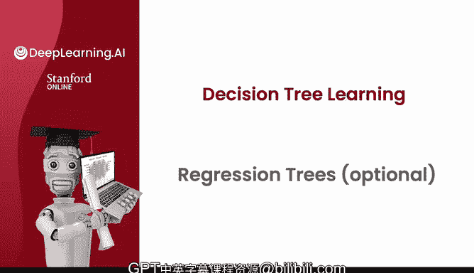
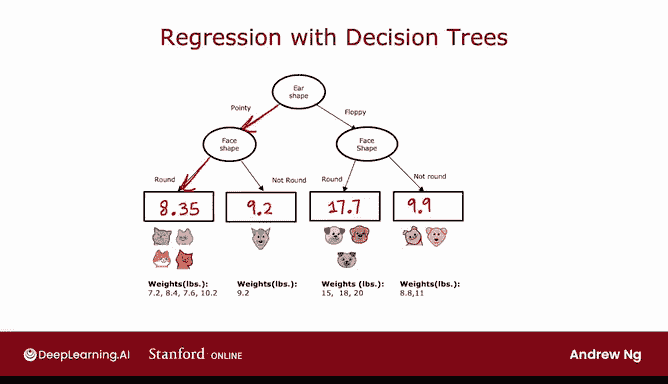
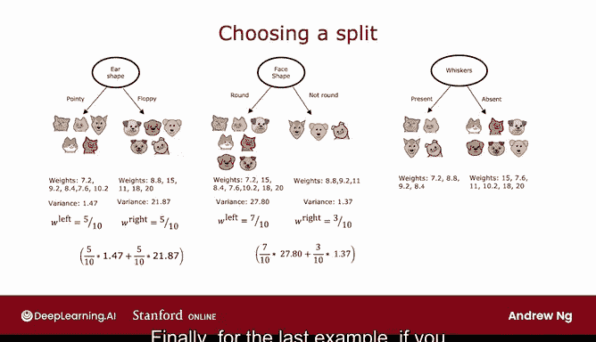

# 99：回归树 🌳

在本节课中，我们将学习如何将决策树算法从分类问题推广到回归问题，用于预测连续数值。我们将通过一个预测动物体重的具体例子，详细讲解回归树的构建过程、核心的分裂选择标准，以及它与分类树的区别。

---

## 从分类到回归

上一节我们介绍了决策树在分类问题中的应用。本节中，我们来看看如何将其用于回归任务，即预测一个具体的数字。

我使用的例子是，利用之前用过的离散特征（如耳朵形状、脸型等）来预测动物的体重 `Y`。需要明确的是，这里的体重是我们要预测的目标输出值，而不是输入特征。这是一个回归问题，因为我们预测的是一个连续数值。

让我们看看回归树会是什么样子。

---

## 回归树的结构与预测

这里我已经为这个回归问题构建了一棵树。根节点根据耳朵形状分裂，然后左子树和右子树再根据脸型进行分裂。决策树在左右分支上选择相同的特征进行分裂是完全可行的，如果分裂算法认为这样做合适的话。

如果在训练中确定了这些分裂点，那么最下方的这个叶节点将包含四个动物，体重分别为 7.2、8.4、7.6 和 10.2。另一个节点则包含一个体重为 9.2 的动物，其余节点同理。

我们需要为这个决策树填充的最后一步是：如果一个测试样本到达了这个叶节点，我们应该为这个拥有尖耳朵和圆脸的动物预测什么体重？

决策树的预测方法是：取到达该叶节点的所有训练样本体重的平均值。通过计算这四个数字的平均值，我们得到 8.35。

另一方面，如果一个动物有尖耳朵但不是圆脸，那么模型将预测 9.2（或 9.20 磅），因为到达这个叶节点的唯一训练样本体重就是 9.2。同理，其他叶节点的预测值分别为 17.70 和 9.90。

因此，这个模型的工作流程是：给定一个新的测试样本，像往常一样沿着决策节点向下，直到到达一个叶节点，然后预测该叶节点的值。这个值是在训练时，通过计算到达同一叶节点的所有动物体重的平均值得到的。

---

## 如何选择分裂特征

如果你要从头开始构建一棵决策树来预测体重，关键决策（正如本周早些时候所看到的）是如何选择在哪个特征上进行分裂。让我通过一个例子来说明如何做出这个决定。

在根节点，你可以选择在耳朵形状上分裂。如果这样做，你会得到树的左右分支，每个分支有五个动物，其体重如下所示。

如果你选择在脸型上分裂，你会得到左右分支的动物及其对应的体重。

如果你选择在有/无胡须上分裂，则会得到这样的结果。

那么问题是：在根节点，给定这三个可能的分裂特征，你应该选择哪一个，才能在构建回归树时对动物体重做出最好的预测？

与分类问题中试图减少**熵**（一种不纯度的度量）不同，在回归树中，我们试图减少每个数据子集中目标值 `y`（这里是体重）的**方差**。

如果你在其他上下文中见过方差的概念，那很好，这就是我们即将使用的统计学或数学上的方差概念。如果你以前不知道如何计算一组数字的方差，不用担心。在本节中，你只需要知道方差非正式地衡量了一组数字的变化范围有多大。

对于第一组数字（7.2, 9.2, ... , 1.2），其方差计算结果是 1.47，说明变化不大。而第二组数字（8.8, 15, 11, 18, 20）从 8.8 一直到 20，方差要大得多，计算结果是 21.87。

我们将这样评估这个分裂的质量：和之前一样，计算 `W_left` 和 `W_right` 作为进入左右分支的样本比例。

分裂后的加权平均方差将是：
`W_left * Var_left + W_right * Var_right`

在这个例子中，就是 `(5/10) * 1.47 + (5/10) * 21.87`。这个加权平均方差的作用，类似于我们在分类问题中决定使用哪个分裂时使用的加权平均熵。

我们可以为树中其他可能的分裂特征选择重复这个计算。对于中间的例子（按脸型分裂），左边数字的方差是 27.80，右边是 1.37。`W_left = 7/10`，`W_right = 3/10`，因此可以计算出加权方差。

最后，对于按胡须特征分裂的例子，这是左右两边的方差以及对应的 `W_left` 和 `W_right`，加权方差如下所示。

---

## 选择最佳分裂：方差减少量

一个好的分裂选择方法是直接选择加权方差最低的那个。类似于计算信息增益时，我们不只是测量加权平均熵，而是测量熵的减少量（即信息增益）。对于回归树，我们同样测量**方差的减少量**。

事实证明，如果你查看训练集中所有 10 个样本并计算它们的总方差，结果是 20.51。这个值对于根节点在所有情况下都是相同的，因为根节点就是这相同的 10 个样本。

因此，我们实际计算的是根节点的方差（20.51）减去分裂后的加权平均方差。对于按耳朵形状分裂，计算结果是 `20.51 - 11.67 = 8.84`。这意味着在根节点，方差是 20.51，按耳朵形状分裂后，这两个节点的平均加权方差降低了 8.84，所以方差减少量是 8.84。

类似地，计算中间例子（按脸型分裂）的方差减少量是 `20.51 - 19.87 = 0.64`，这是一个非常小的减少。对于胡须特征，方差减少量是 6.22。

在这三个例子中，8.84 给出了最大的方差减少量。因此，正如之前我们会选择给出最大信息增益的特征一样，对于回归树，我们会选择给出**最大方差减少量**的特征。这就是为什么选择耳朵形状作为分裂特征。

选择了耳朵形状作为分裂特征后，你现在在左右子分支中各有 5 个样本的子集。然后，你可以（递归地）对这 5 个样本构建一个新的决策树，再次评估不同的分裂特征选项，选择给出最大方差减少量的那个。在右侧分支也进行同样的操作。你会持续分裂，直到满足停止分裂的条件。

---

## 总结与展望

本节课中，我们一起学习了如何将决策树应用于回归问题。核心在于将预测目标从离散类别改为连续数值，并将分裂标准从最小化熵（信息增益）改为最小化加权平均方差（方差减少量）。我们通过计算不同分裂带来的方差减少量，来选择最佳分裂特征，从而构建出回归树。

到目前为止，我们讨论的是如何训练单个决策树。事实证明，如果你训练很多决策树（我们称之为决策树集成），你可以得到更好的结果。让我们在下一个视频中看看为什么以及如何做到这一点。