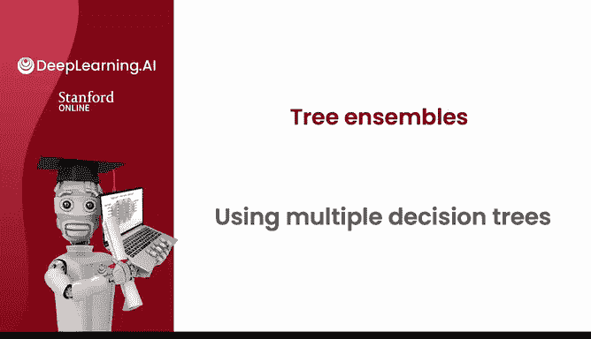
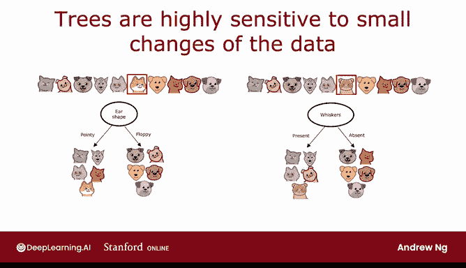
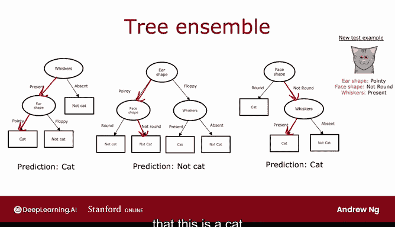

# 100：决策树集成 🎄

在本节课中，我们将要学习单个决策树的一个主要弱点，并探索一种通过构建多个决策树来提升模型鲁棒性的强大方法——决策树集成。

## 单个决策树的弱点

上一节我们介绍了决策树的基本构建过程。本节中我们来看看单个决策树存在的一个问题：**它对数据中的微小变化可能非常敏感**。

具体来说，如果训练数据发生一点变动，生成的决策树结构可能会完全不同。这导致模型的预测不够稳定和可靠。

## 一个具体的例子

让我们通过一个例子来理解这种敏感性。我们一直使用的数据集中，在根节点进行分裂时，信息增益最高的特征是“耳朵形状”，这产生了两个数据子集，并在此基础上继续构建子树。

但是，如果你只改变10个训练样本中的1个——例如，将一只“尖耳朵、圆脸、有胡须”的猫，改为“软耳朵、圆脸、有胡须”的猫——情况就会发生变化。

仅仅改变这一个训练样本，最高信息增益的分裂特征就从“耳朵形状”变成了“胡须”。因此，左右子树得到的数据子集变得完全不同。随着递归运行决策树学习算法，左右两侧构建出的子树也完全不同。

**改变一个训练样本就导致算法在根节点选择不同的分裂方式，从而生成一棵完全不同的树**，这使得该算法不够鲁棒。

## 解决方案：决策树集成

正因为如此，使用决策树时，如果你训练的不是单个决策树，而是**一整组不同的决策树**，你通常会得到更好的结果，即更准确的预测。

这就是我们所说的**树集成**，它指的是一组（多棵）决策树的集合。在接下来的视频中，我们将看到如何构建这种树集成。

## 集成如何工作：投票机制

如果你拥有一个由三棵树组成的集成，其中每一棵都可能是对“猫”与“非猫”进行分类的一种合理方式。

当有一个新的测试样本需要分类时，你需要做的是：
1.  让所有三棵树对这个新样本进行推理。
2.  让它们对最终预测进行**投票**。

例如，一个测试样本具有“尖耳朵、非圆脸、有胡须”的特征：
*   第一棵树会沿着它的路径推断，并预测它是猫。
*   第二棵树会沿着它的路径推断，并预测它不是猫。
*   第三棵树会沿着它的路径推断，并预测它是猫。

这三棵树做出了不同的预测，我们将让它们投票。这三棵树中的多数票是“猫”，因此这个树集成的最终预测是：这是一只猫（这恰好是正确的预测）。

## 使用树集成的原因

我们使用树集成的原因是：通过拥有大量决策树并让它们投票，可以使你的整体算法对任何单棵树的行为不那么敏感（因为每棵树只占一票），从而使整体算法更加**鲁棒**。

## 关键问题与下节预告

但是，如何获得所有这些合理但又略有不同的决策树，以便让它们投票呢？

在下一个视频中，我们将讨论一种来自统计学的技术，称为**有放回抽样**。这将成为我们在后续视频中构建树集成的关键技术。让我们进入下一个视频来探讨有放回抽样。

---

**本节课总结**：本节课我们一起学习了单个决策树对数据敏感的问题，并引入了**决策树集成**作为解决方案。我们了解了集成通过让多棵树投票来工作，从而使预测更加稳定和鲁棒。最后，我们提出了如何生成这些不同树的关键问题，为下一课的内容做好了铺垫。