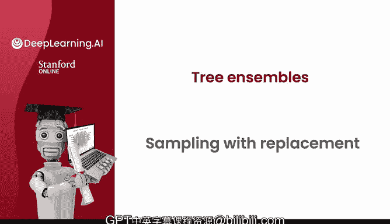
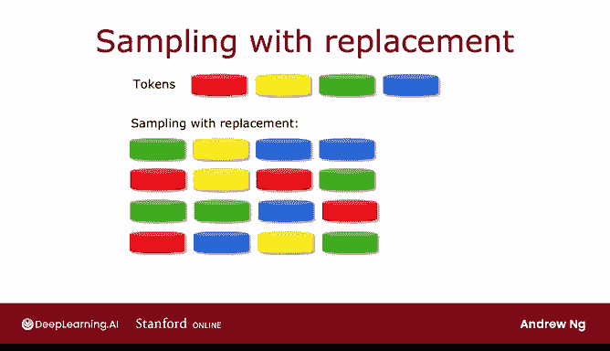

# 101：有放回抽样 🎲

在本节课中，我们将学习一种称为“有放回抽样”的技术。这是构建树集成模型（如随机森林）的关键步骤。我们将通过简单的例子来理解其工作原理，并了解它如何应用于创建多个略有差异的训练集。

---

为了构建树集成模型，我们需要一种名为“有放回抽样”的技术。让我们来看看它的含义。

为了说明有放回抽样如何工作，我将用一个包含红、黄、绿、蓝四种颜色令牌的演示来展示。

我这里有四个颜色的令牌：红、黄、绿、蓝。我将用它们来演示有放回抽样的过程。

这是一个空的黑丝绒袋子。我将把这四个令牌例子放进袋子里。

我将进行四次有放回抽样。这意味着我将摇晃袋子，随机取出一个令牌，例如绿色。关键在于“有放回”部分：在取出下一个令牌之前，我需要把这个绿色令牌放回袋中，再次摇晃。然后取出另一个，比如黄色，再将其放回。接着取出蓝色，同样放回。最后再取出一个，结果又是蓝色。

我得到的令牌序列是：绿、黄、蓝、蓝。请注意，我得到了两次蓝色，而红色一次也没有被抽到。

如果你多次重复这个有放回抽样的过程，你可能会得到“红、黄、红、绿”或“绿、绿、蓝、红”等序列。你也可能得到“红、蓝、黄、绿”。

“有放回”这部分至关重要。因为如果每次抽样后不将令牌放回，那么从一个装有四个令牌的袋子里连续抽取四次，你将总是得到完全相同的四个令牌。这就是为什么每次抽取后将令牌放回很重要，它能确保我们不会每次都得到完全相同的四个令牌。

---

上一节我们通过令牌的例子理解了有放回抽样的基本概念。本节中，我们来看看这项技术如何应用于构建树集成模型。

有放回抽样应用于构建树集成的方式如下：我们将构建多个随机训练集，它们都与原始训练集略有不同。

具体来说，我们以10个猫狗训练样本为例。我们将这10个训练样本放入一个“理论上的袋子”中。

请不要真的把猫或狗放进袋子。你可以想象将训练样本放入一个理论上的袋子。使用这个理论上的袋子，我们将创建一个新的、包含10个样本的随机训练集，其大小与原始数据集完全相同。

创建方法如下：我们将伸手进入袋子，随机选取一个训练样本。假设我们得到了这个样本。然后，我们将其放回袋中。接着，再次随机选取一个训练样本，比如得到那个样本。如此反复，一次又一次。

请注意，这第五个训练样本与我们第二次取出的样本完全相同，但这没关系。继续这个过程，我们会得到另一个重复的样本，依此类推，直到最终获得10个训练样本，其中一些是重复的。

你还会注意到，这个新的训练集并没有包含原始10个训练样本中的所有样本，但这没关系，这是有放回抽样过程的一部分。

---

有放回抽样的过程让你能够构建一个新的训练集，它与你的原始训练集既有些相似，又相当不同。事实证明，这将是构建树集成模型的关键基石。

在下一节视频中，让我们看看如何利用这一点来构建树集成。

---

**本节课总结**

本节课中，我们一起学习了“有放回抽样”技术。我们通过颜色令牌的演示理解了其核心机制：每次抽取样本后都将其放回总体，从而允许同一样本被多次抽取，并可能产生包含重复样本且未包含所有原始样本的新数据集。我们了解到，这项技术是构建树集成模型（如随机森林）的基础，因为它能方便地生成多个略有差异的训练集，用于训练集成的各个决策树。