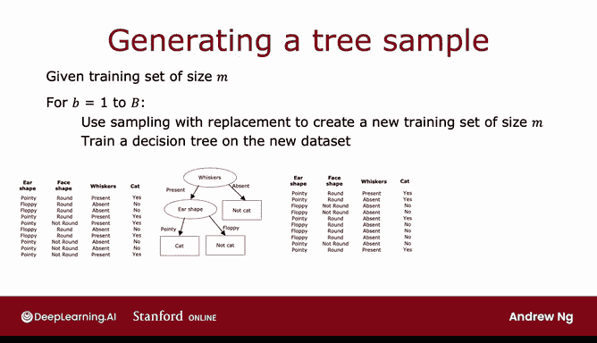
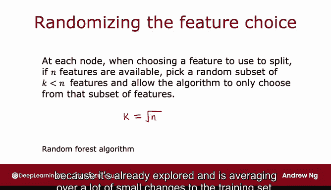

# 102：随机森林算法 🌲🤖

在本节课中，我们将学习如何构建一个比单一决策树更强大的树集成算法——随机森林。我们将从创建新训练集的方法开始，逐步讲解如何生成多棵决策树，并通过投票机制获得最终预测。最后，我们会探讨一个关键改进，使算法性能更优。

---

## 构建树集成的基础

上一节我们介绍了使用有放回抽样来创建新训练集的方法。本节中，我们来看看如何利用这种方法构建第一个树集成算法。

给定一个大小为 `M` 的训练集，我们可以通过以下步骤生成一个包含多棵决策树的集成模型：

以下是构建树集成的核心步骤：

1.  设定一个循环次数 `B`（例如，`B = 100`）。
2.  对于 `b = 1` 到 `B`：
    *   使用**有放回抽样**从原始训练集中创建一个新的、大小同样为 `M` 的训练集。
    *   在这个新生成的数据集上训练一棵决策树。

> 注意：有放回抽样意味着同一个训练样本可能在新数据集中出现多次，这是允许的。

通过这个过程，我们最终会得到 `B` 棵不同的决策树。当需要进行预测时，就让所有这些树进行“投票”，以决定最终的预测结果。

将 `B` 设置得更大通常不会损害性能，但超过某个点（例如，远大于10）后，性能提升会变得微乎其微，而计算成本却显著增加。因此，通常不推荐使用上千棵树。

---

## 从袋装决策树到随机森林 🌳➡️🌲🌲🌲

我们刚刚描述的算法通常被称为**袋装决策树**。这个名字来源于将训练样本放入一个“虚拟袋子”中进行抽样的想法。

然而，这个算法有一个可以改进的地方，这个改进能将它转变为性能更强大的**随机森林算法**。

有时，即使使用了有放回抽样，生成的许多树在根节点或靠近根节点的位置仍然可能选择相同的特征进行分裂。为了进一步使每棵树更加不同，我们可以在每个节点选择分裂特征时引入随机性。

以下是随机森林算法的关键改进：

*   在每个节点，当需要从 `n` 个可用特征中选择一个进行分裂时：
    *   我们不从全部 `n` 个特征中挑选。
    *   而是**随机选择一个包含 `k` 个特征的子集**（其中 `k < n`）。
    *   算法只能从这个 `k` 个特征的子集中，选择信息增益最高的特征来进行分裂。

当特征数量 `n` 很大时（例如几十、几百个），`k` 的一个典型选择是 `k = sqrt(n)`。这个技巧在特征数量较多的问题上效果更明显。

---

## 为什么随机森林更强大？

随机森林比单一决策树更稳健的原因在于：

1.  **有放回抽样**：已经让算法探索了训练数据的许多微小变化，并训练了不同的决策树。
2.  **特征子集选择**：进一步增加了树与树之间的差异性。
3.  **集成平均**：算法对所有由数据微小变化产生的树进行了平均。

这意味着，训练集的任何进一步微小变化，都不太可能对随机森林的整体输出产生巨大影响，因为它已经探索并平均了许多数据变化。

---

## 总结与预告

本节课中，我们一起学习了**随机森林算法**。我们从基础的袋装决策树开始，理解了如何通过有放回抽样构建多棵决策树。接着，我们引入了**在每个节点随机选择特征子集**的关键改进，从而得到了更强大、更稳健的随机森林算法。

随机森林是一种非常有效的算法，希望你能在工作中很好地应用它。

在随机森林之外，还有一种性能更优的算法——**提升决策树**。在下一节课中，我们将讨论一个名为 **XGBoost** 的提升决策树算法。