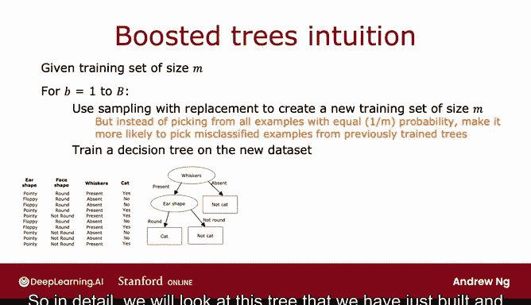
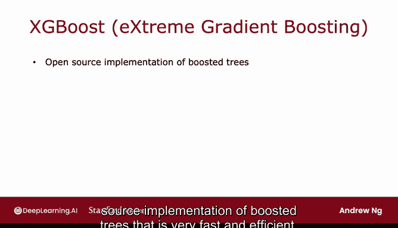
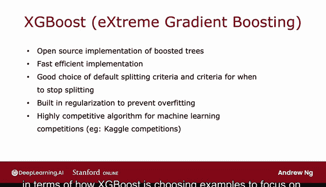
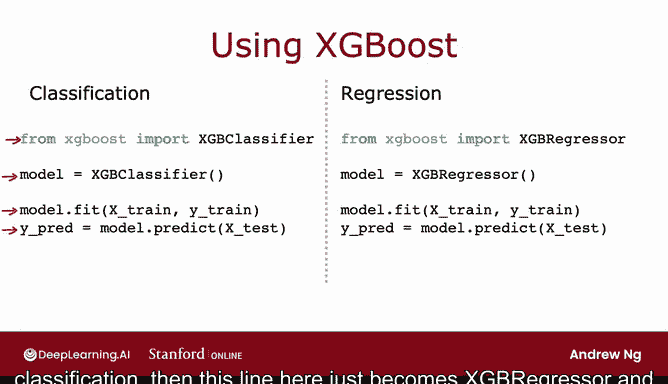

# 103：XGBoost 算法详解 🚀

在本节课中，我们将要学习一种强大且广泛应用的机器学习算法——XGBoost。我们将了解它如何通过改进传统的决策树集成方法，来更高效、更准确地构建模型。

多年来，机器学习研究者提出了许多构建决策树和决策树集成的方法。如今，最常用、最流行的决策树集成实现是一种名为 **XGBoost** 的算法。它运行速度快，开源实现易于使用，并且已成功应用于赢得众多机器学习竞赛以及许多商业场景中。让我们来看看 XGBoost 是如何工作的。

## 从装袋法到提升法 🔄


上一节我们介绍了装袋法决策树算法。本节中我们来看看如何对其进行修改，使其性能大幅提升。

以下是之前写下的装袋法算法：

```python
for b in range(1, B+1):
    # 使用有放回抽样创建大小为 M 的新训练集
    new_training_set = sample_with_replacement(original_training_set, size=M)
    # 在新数据集上训练决策树
    tree_b = train_decision_tree(new_training_set)
```

给定一个大小为 M 的训练集，重复 B 次：使用有放回抽样创建一个大小为 M 的新训练集，然后在新数据集上训练决策树。第一次循环时，我们可能创建一个这样的训练集并训练出这样的决策树。

但这里我们将要改变算法，即在除了第一次之外的每一次循环中（第二次、第三次等），当我们进行抽样时，不再以 1/M 的均等概率从所有 M 个样本中选取，而是**增加选取那些先前训练的树在训练中表现不佳（即分类错误）的样本的概率**。

## 核心思想：刻意练习 🎹

这背后有一个称为“刻意练习”的理念。例如，如果你正在学习弹钢琴并试图掌握一首曲子，与其一遍又一遍地练习整首（比如五分钟的）曲子（这非常耗时），不如先弹奏整首曲子，然后将注意力集中在你尚未弹好的部分，反复练习这些较小的片段。事实证明，这是你学好钢琴的更有效方法。

提升法的思想与此类似。我们将查看目前已训练好的决策树，找出我们仍然做得不好的地方，然后在构建下一个决策树时，**更多地关注那些我们尚未处理好的样本**。这样，我们不是查看所有训练样本，而是将更多注意力集中在尚未处理好的那部分样本上，让新构建的决策树（集成中的下一个树）努力在这些样本上表现良好。这就是提升法背后的思想，事实证明它有助于学习算法更快地学习并做得更好。

## 提升法的工作流程 📊

具体来说，我们会查看刚刚构建的这棵树，然后回到原始训练集（注意，这是原始训练集，不是通过有放回抽样生成的），遍历所有 10 个样本，查看这个已学习的决策树对所有 10 个样本的预测结果。

以下是预测结果列，我在每个样本旁边根据树的分类是否正确打上了勾或叉。



那么，在第二次循环中，我们将使用有放回抽样生成另一个包含 10 个样本的训练集，但每次我们从这 10 个样本中选取一个时，**会给予这三个我们仍然分类错误的样本更高的被选中概率**。这样，第二个决策树就能通过类似“刻意练习”的过程，将注意力集中在算法尚未处理好的样本上。


提升过程将总共进行 B 次迭代。在每次迭代中，你会查看集成中从第 1 棵树到第 B-1 棵树尚未处理好的样本。当你构建第 B 棵树时，你将**更高概率地选取那些先前已构建的树集成仍然表现不佳的样本**。

关于具体如何增加选取这个样本与那个样本的概率的数学细节相当复杂，但为了使用现成的树实现，你无需担心这些细节。

## 主流实现：XGBoost ⚡

在不同的提升法实现方式中，当今应用最广泛的是 **XGBoost**，它代表“极限梯度提升”。这是一个开源的提升树实现，非常快速高效。XGBoost 还很好地选择了默认的分裂标准和停止分裂的条件。XGBoost 的一项创新是它内置了正则化以防止过拟合。

在机器学习竞赛中（例如广泛使用的竞赛网站 Kaggle），XGBoost 通常是一种极具竞争力的算法。事实上，XGBoost 和深度学习算法似乎是这类竞赛中最常胜出的两种算法。

有一个技术细节需要注意：XGBoost 实际上不是通过有放回抽样来操作，而是**为不同的训练样本分配不同的权重**。因此，它实际上不需要生成大量随机选择的训练集副本，这使得它比使用有放回抽样过程效率更高一些。但你在上一张幻灯片上看到的关于 XGBoost 如何选择关注样本的直觉仍然是正确的。



## 如何使用 XGBoost 🛠️

XGBoost 的实现细节相当复杂，这就是为什么许多从业者会使用实现它的开源库。以下是你使用 XGBoost 需要做的全部。

以下是使用 XGBoost 的步骤：

1.  导入 XGBoost 库。
2.  将模型初始化为 XGBoost 分类器。
3.  使用 `.fit()` 方法在训练数据上训练模型。
4.  使用训练好的模型进行预测。

```python
# 1. 导入库
from xgboost import XGBClassifier

# 2. 初始化模型
model = XGBClassifier()


# 3. 训练模型
model.fit(X_train, y_train)



# 4. 进行预测
predictions = model.predict(X_test)
```

如果你想将 XGBoost 用于回归而不是分类，那么只需将上面这行代码中的 `XGBClassifier` 改为 `XGBRegressor`，代码的工作方式类似。


## 总结 📝

本节课中我们一起学习了 XGBoost 算法。我们了解到，XGBoost 是对传统装袋法决策树的一种改进，它通过“刻意练习”的思想，在构建后续决策树时，更多地关注先前模型表现不佳的样本，从而提升集成的整体性能。XGBoost 因其高效、快速、内置正则化以及出色的竞赛表现，成为当今最流行的决策树集成算法之一。通过简单的几行代码，我们就可以轻松调用 XGBoost 库来构建强大的分类或回归模型。

希望你会发现这个算法对你未来构建的许多应用都非常有用。



