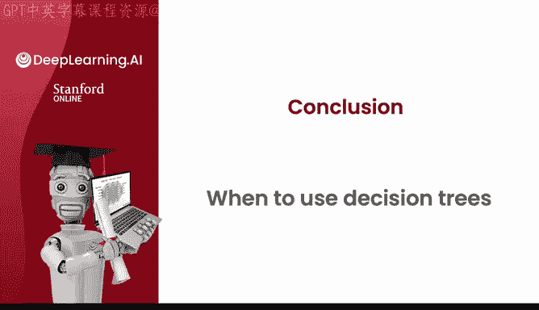
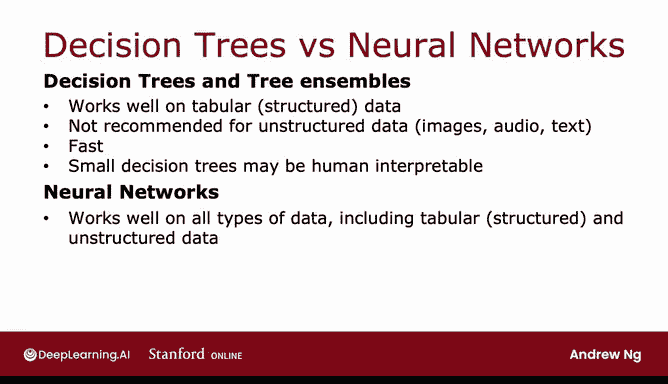

# 104：何时使用决策树 🌳

在本节课中，我们将探讨决策树（包括树集成方法）与神经网络这两种强大的学习算法各自的优缺点，并分析在何种场景下应选择其中一种。我们将从数据类型、训练速度、可解释性等多个维度进行比较。

---

## 结构化数据与非结构化数据 📊

上一节我们介绍了两种主要的算法类型，本节中我们来看看它们各自适合处理的数据类型。

决策树和树集成方法通常在**表格数据**（也称为**结构化数据**）上表现良好。这意味着如果你的数据集看起来像一个巨大的电子表格，那么决策树值得考虑。

例如，在房价预测应用中，数据集包含房屋面积、卧室数量、楼层数和房龄等特征。这类数据以分类或连续值特征的形式存储在电子表格中，无论是用于分类（预测离散类别）还是回归（预测数值）问题，决策树都能处理得很好。

相比之下，不建议在**非结构化数据**上使用决策树和树集成方法。非结构化数据包括图像、视频、音频或文本，这些数据通常不以电子表格格式存储。我们稍后会看到，神经网络在处理非结构化数据任务时往往表现更佳。

---

## 决策树的优势与劣势 ⚖️

了解了适用数据类型后，我们来详细看看决策树类算法的具体特点。

决策树和树集成方法的一大优势是**训练速度非常快**。你可能还记得前几周讨论的机器学习开发迭代循环图：如果模型需要数小时来训练，那么这会限制你迭代优化算法性能的速度。由于决策树（包括树集成）训练速度相当快，这允许你更快速、更高效地完成迭代循环。

此外，**小的决策树可能具有人类可解释性**。如果你只训练一个单独的决策树，并且该树只有几十个节点，那么你可以打印出这棵树来准确理解它是如何做出决策的。

我认为决策树的可解释性有时被略微高估了。因为当你构建一个包含100棵树的集成模型，且每棵树都有数百个节点时，通过观察整个集成模型来理解其行为就变得困难，可能需要借助单独的可视化技术。但如果你有一个小的决策树，你确实可以查看它并理解其分类逻辑，例如，它是通过以某种方式查看某些特征来判断某物是否为猫。

如果你决定使用决策树或树集成方法，对于大多数应用，我可能会推荐使用 **XGBoost**。树集成方法的一个小缺点是，它比单个决策树计算成本稍高。因此，如果你的计算预算非常紧张，可能会使用单个决策树。但除此之外，我几乎总是会使用树集成方法，特别是 XGBoost。

---

## 神经网络的特点 🔄

看完了决策树，我们再来看看神经网络在相同维度上的表现。

与决策树和树集成方法相比，神经网络在**所有类型的数据**上都能良好工作，包括表格/结构化数据、非结构化数据，以及同时包含结构化和非结构化组件的混合数据。

在表格化结构化数据上，神经网络和决策树通常具有竞争力。但在图像、视频、音频和文本等非结构化数据上，神经网络将是首选算法，而非决策树或树集成。

然而，神经网络的缺点是**可能比决策树慢**。一个大型神经网络可能需要很长时间来训练。

神经网络的其他好处包括支持**迁移学习**。这一点非常重要，因为对于许多只有少量数据的应用，能够使用迁移学习并在更大的数据集上进行预训练，对于获得有竞争力的性能至关重要。

最后，如果你正在构建一个由多个机器学习模型协同工作的系统，将多个神经网络串联起来进行训练可能比串联多个决策树更容易。这背后的原因相当技术性，在本课程中你无需担心。简而言之，它涉及到即使串联多个神经网络，你也可以使用梯度下降法一起训练它们；而对于决策树，你一次只能训练一棵树。

---

## 课程总结与展望 🎉

在本节课中，我们一起学习了如何根据数据类型、训练速度、可解释性以及是否支持迁移学习等因素，在决策树（及树集成）与神经网络之间做出选择。

你已经完成了高级学习算法课程的所有视频内容，感谢你坚持学习到这里，祝贺你！你现在已经学会了如何构建和使用神经网络与决策树，并听取了许多关于如何使这些算法为你良好工作的实用建议和技巧。

然而，即使你已经了解了监督学习的全部内容，那也只是学习算法能力的一部分。监督学习需要带有标签Y的训练数据集。还有另一套非常强大的算法，称为**无监督学习算法**，你甚至不需要标签Y，算法就能找出数据中非常有趣的模式并对其进行处理。我期待在专项课程的第三门也是最后一门关于无监督学习的课程中再次见到你。

在结束本课程之前，我希望你也能在实践测验和实验练习中享受实践决策树思想的乐趣。祝你实验顺利！或者，对于那些可能是《星球大战》粉丝的同学，让我说：**愿森林与你同在**。