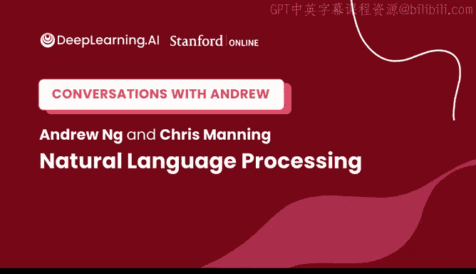
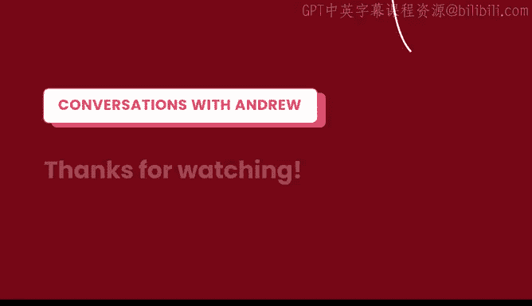
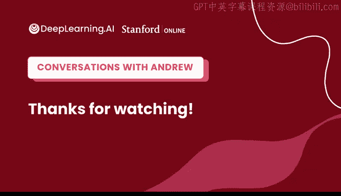

# 105：吴恩达与克里斯·曼宁谈自然语言处理发展史 🧠💬

## 概述
在本节课中，我们将跟随吴恩达（Andrew Ng）与斯坦福大学教授克里斯·曼宁（Chris Manning）的对话，回顾自然语言处理（NLP）领域从基于规则的系统到现代大规模语言模型的发展历程。我们将了解关键的技术转折点、核心思想以及未来展望。

---

## 从语言学博士到NLP先驱 🔄

吴恩达首先介绍了他的老朋友与合作者克里斯·曼宁教授。曼宁教授是斯坦福大学计算机科学教授、斯坦福人工智能实验室主任，同时也是自然语言处理领域被引用次数最多的研究者之一。

尽管曼宁教授今天在机器学习和NLP领域成就斐然，但他的学术起点却截然不同。他的博士学位实际上是在语言学领域，专注于研究语言的句法。那么，他是如何从研究句法转变为一名NLP研究者的呢？

曼宁教授指出，他至今仍兼任语言学教授，偶尔也会教授纯粹的语言学课程。他最初对人类语言及其运作方式、人们如何理解和使用语言深感兴趣。这种兴趣很早就引导他开始思考如今我们视为机器学习或计算思想的概念。

人类语言的两个核心问题吸引了他：儿童如何习得语言，以及成人如何进行流畅的交流。这些问题促使他很早就开始接触机器学习。他意识到，人类在成长过程中可以学会完全不同的语言，这非常神奇，而机器是否也能学习语言呢？

---

## 学术背景与早期研究 📚

曼宁教授在本科阶段实际上学习了三个专业：数学、计算机科学和语言学。在申请研究生时，他同时申请了卡内基梅隆大学（因其在计算语言学方面的实力）和斯坦福大学。最终，他选择在斯坦福大学攻读语言学博士学位，因为当时计算机科学系还没有自然语言处理方向。

90年代初，NLP领域正处于变革前夕。当时的主流是基于规则的、逻辑的声明式系统。但与此同时，数字化的文本和语音材料（如法律文件、报纸文章、议会记录）开始大量出现。曼宁教授敏锐地意识到，从海量的人类语言材料中进行实证研究，必将带来激动人心的成果，这将他引向了新型的自然语言处理研究，并塑造了他后续的职业生涯。

可以说，他的职业生涯最初更偏向语言学，但随着数据、机器学习和实证方法的兴起，逐渐转向了NLP和机器学习。

---

## 什么是自然语言处理（NLP）？ ❓

NLP代表自然语言处理。另一个有时使用的术语是计算语言学，两者基本是同一概念。

自然语言处理这个术语本身有点奇怪，因为它意味着我们处理的是人类语言。作为计算机科学家，当我们说“语言”时，通常指的是编程语言，因此需要加上“自然”一词来特指人类使用的语言。

总体而言，自然语言处理是指对人类语言进行任何智能化的处理。这可以分解为理解人类语言、生成人类语言和习得人类语言。

人们通常从不同应用的角度来思考NLP，例如机器翻译、问答系统、生成广告文案、文本摘要等。由于人类世界的绝大部分信息都是通过语言材料处理和传递的，因此NLP的应用非常广泛。

---

## 从规则系统到统计方法的转变 📈

当曼宁教授开始攻读研究生时，大多数自然语言处理系统都是手工构建的。这些系统使用各种规则和推理程序来尝试构建对文本的理解路径。

例如，一条规则可能是描述英语句子的结构：通常由主语名词短语、动词和宾语名词短语组成。这有助于理解句子的含义。规则也可能涉及词义消歧，比如“star”这个词在电影语境下可能指演员，而非天体。

如今看来，这种方法似乎不太可能成功，但在当时是标准做法。只有当大量数字文本和语音材料可用时，人们才开始意识到可以走另一条路：计算人类语言材料的统计数据并构建机器学习模型。

曼宁教授在90年代中后期开始深入研究，早期的工作通常被称为“统计自然语言处理”，后来逐渐融入更广泛的概率人工智能和机器学习方法中。这一趋势一直持续到大约2010年。

---

## 深度学习在NLP中的兴起 🚀

大约在2010年，使用大型人工神经网络的深度学习新浪潮开始兴起。曼宁教授表示，他要感谢当时还在斯坦福全职工作的吴恩达，因为吴恩达对深度学习领域的新进展非常兴奋，并鼓励他关注神经网络。

曼宁教授在研究生时期上过戴夫·鲁梅尔哈特的神经网络课程，但并未将其用于自己的研究。在吴恩达的推动下，他和他的学生开始在NLP会议上发表最早的深度学习论文。最初，新想法很难被接受，一些论文被会议拒绝，转而发表在机器学习会议或深度学习研讨会上。但很快，情况开始改变，人们对神经网络产生了极大兴趣。

曼宁教授认为，神经网络时期（大约从2010年开始）本身可以分为两个阶段。第一阶段直到2018年左右，人们成功地将神经网络用于各种任务，如句法分析、情感分析、问答等。但这本质上是用更好的机器学习模型（神经网络）去做以前用逻辑回归或支持向量机做的同类任务。

---

## 2018年的转折点：大规模自监督模型 ⚡

曼宁教授认为，更大的变化发生在2018年左右。那时，人们开始利用海量人类语言材料构建大型自监督模型，如BERT和GPT及其后续模型。

这些模型仅仅通过在海量文本上进行词语预测，就获得了关于人类语言的惊人知识。回顾过去，这很可能被视为一个更大的分水岭，真正改变了NLP的工作方式。

在大型语言模型趋势兴起之前，曼宁教授等人的研究工作（如GloVe词向量）已经令人印象深刻。词向量通过神经网络学习一组数字（向量）来表示一个单词。GloVe等工作简化了数学原理，使计算机能够学习到词语含义的细微差别。

这些词向量已经展示了自监督学习的思想：仅使用大量文本，就能构建出对词语含义有深刻理解的模型。这为后来发展到能够理解整段文本和上下文含义的BERT、GPT等模型奠定了基础。

---

## 预测下一个词是“AI完备”的任务吗？ 🤔

预测下一个词这个简单的任务，其效果令人惊讶。曼宁教授解释说，虽然任务本身是给定上文预测下一个词，但要想做得尽可能好，模型实际上需要理解句子的其余部分，知道“谁对谁做了什么”，甚至需要理解世界知识。

例如，如果文本是“斐济使用的货币是__”，那么模型就需要一些世界知识才能给出正确答案。因此，优秀的模型既能学习句子结构和含义，也能学习关于世界的事实。这使得预测下一个词有时被称为“AI完备”任务——即你需要无所不知才能完美完成它。

吴恩达询问曼宁教授是否认为预测下一个词是AI完备的。曼宁教授表示不完全同意，他认为人类还有其他非语言性的能力，如数学洞察力或解决三维现实世界难题的能力。但另一方面，语言确实比一些人想象的更接近普遍性，因为我们用语言描述和思考世界的方方面面，学习语言使用也间接学习了世界的许多侧面。

---

## NLP的未来展望与挑战 🔮

大型语言模型在过去几年取得了令人兴奋的成功。曼宁教授描述了典型的两阶段过程：首先通过预测下一个词在海量文本上预训练一个大模型；然后针对特定任务（如问答、摘要、检测有害内容）进行微调。预训练模型的语言知识使其能够快速泛化，用少量标注数据就能达到以前需要大量数据的效果。

更近期的激动人心的工作甚至超越了微调。通过“提示”或“指令”方法，用户可以直接用自然语言（可能附带例子或明确指令）告诉模型要做什么，模型就能执行。即使对于有30年NLP研究经验的曼宁教授来说，这效果也令人惊叹。

关于提示工程是否是未来的方向，曼宁教授认为它既是未来的方式，但目前人们也在进行大量“黑客式”的措辞调整以让模型更好工作。他希望随着发展，这种对措辞的依赖会减少，就像人与人交流一样，无需纠结具体用词。基本方向是，人类语言将成为指示计算机操作的指令语言，取代菜单、按钮或编写代码。

---

## 数据驱动与结构化知识的平衡 ⚖️

吴恩达提出了一个关于未来技术路线的问题：在依赖数据驱动的机器学习与融入手工编码的约束或显式结构之间，平衡点将在哪里？

曼宁教授认为，毫无疑问，从数据中学习是未来的方向。但他也认为，拥有更多结构、更多归纳偏置、能够利用语言本质的模型仍有空间。当前的Transformer模型本质上是一个巨大的关联机器，它从海量数据（数百亿词）中吸收一切关联。这种规模化策略非常有效，但也显示出人类学习从有限数据中提取信息的效率要高得多。

曼宁教授不认为未来的改进会来自人们显式地将传统语言规则加入系统。相反，像Transformer这样的模型正在自己发现语言的结构。它们从未被明确告知主语、宾语等概念，但通过训练，它们学到了语言学家花数十年发现的语言结构事实。

---

## 给进入AI/NLP领域者的建议 💡

对于想要进入机器学习、AI或NLP领域的人，曼宁教授认为现在是一个绝佳的时机。软件和计算机科学正在基于机器学习被重塑，各行各业都有自动化、利用人类语言解读等机会。

以下是他的具体建议：

**打好基础**
学习机器学习的核心方法，理解如何从数据构建模型、设置损失函数、进行训练和诊断错误。这些核心技能对NLP尤其相关。

**掌握关键模型**
了解常用的特定模型，特别是我们今天讨论很多的Transformer。它们正越来越多地应用于机器学习的其他领域，如视觉、生物信息学甚至机器人学。

**理解问题领域**
学习一些关于人类语言和问题本质的知识。即使不直接将语言规则编码进系统，了解语言中可能发生的情况、需要注意什么以及可能想要建模什么，仍然是一项有用的技能。

---

## 跨学科背景如何进入AI领域 🌉

曼宁教授本人就是从语言学背景进入AI的。现在，来自各行各业的人都想开始从事AI工作。他认为可以从许多不同的起点以不同的方式切入。

**利用现有工具**
一个令人惊叹的转变是，现在有非常优秀的软件包用于神经网络建模。这些软件易于使用，你不需要理解很多高深的技术细节，只需要对机器学习的概念、如何训练模型以及如何通过输出的数字判断模型是否正常工作有一个高层面的理解。甚至很多高中生也能入门。

**掌握必要数学**
但如果你想达到更深层次，真正理解底层原理，一定的数学基础是必不可少的。深度学习基于微积分，需要优化函数。如果没有这方面的背景，最终可能会遇到瓶颈。

**何时学习都不晚**
即使你主修历史或非数学的心理学，如果决定要学习这些新模型，去修一门微积分课程也为时不晚。曼宁教授自己的故事就是例证：尽管他现在在斯坦福工程学院任职，但他的博士学位是语言学，他凭借一些数学、语言学知识和编程能力，成功转向了构建AI模型。

---

## 抽象层与底层理解 🛠️

吴恩达提出了一个关于现代编码框架（如TensorFlow或PyTorch）及其自动微分等功能，是否降低了对微积分理解需求的问题。

曼宁教授表示肯定。在早期（2010-2015年），他们需要手工计算每个模型的导数，然后用代码实现。而现在，构建深度学习模型完全不需要知道这些。在他自己的深度学习课程中，他们仍然会花两周时间讲解矩阵微积分和雅可比矩阵，确保学生理解反向传播的原理，但之后整个课程都使用PyTorch，学生再也不需要手动计算导数了。

这里存在一个关于技术基础需要多深的问题。就像今天的计算机科学家是否需要理解电子学、晶体管或CPU内部原理一样，这很复杂。一方面，了解更底层的知识有时有助于解决问题或把握新机遇（如吴恩达早期将机器学习移植到GPU上）。另一方面，大多数人必须信任某些抽象层，并且如今大多数神经网络建模工作确实可以在完全不懂微积分的情况下完成。

吴恩达补充道，抽象层的可靠性决定了你需要深入底层修复问题的频率。就像我们不需要懂量子物理也能使用计算机一样，如果排序函数API足够可靠，我们也不需要理解其内部原理。我们正站在巨人的肩膀上，事物每个月都在变得更加复杂和令人兴奋。

---

## 总结 🎯

本节课中，我们一起回顾了自然语言处理从基于规则的系统到统计方法，再到深度学习和大规模语言模型波澜壮阔的发展历程。我们了解了克里斯·曼宁教授从语言学转向NLP研究的个人旅程，探讨了NLP的核心定义、关键的技术转折点（如2018年自监督模型的兴起），以及预测下一个词是否AI完备等深刻问题。

我们还展望了NLP的未来，包括提示工程、数据驱动与结构化知识的平衡，并获得了给进入该领域的学习者和跨背景研究者的宝贵建议。最后，我们讨论了现代软件抽象层如何改变了对底层数学知识的需求。

NLP领域仍有大量工作等待完成，欢迎更多人加入这个激动人心的领域，共同推动世界向前发展。