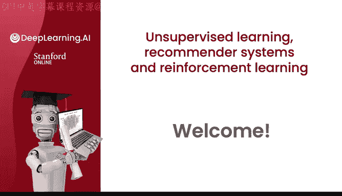
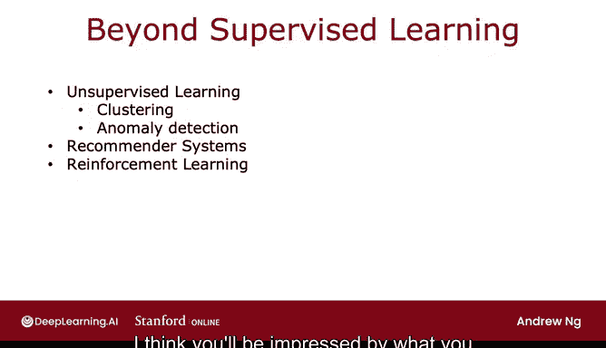

# 106：欢迎来到无监督学习、推荐系统与强化学习 🎉

在本节课中，我们将要学习吴恩达《机器学习》系列第三门也是最后一门课程的核心内容。这门课程将超越监督学习，介绍无监督学习、推荐系统与强化学习三大关键技术。这些技术是当今许多重要商业应用的核心，掌握它们将帮助你成为机器学习领域的专家。

---

## 课程概述 📚

在前两门课程中，我们重点学习了监督学习。在第三门也是最后一门课程中，我们将探讨一系列超越监督学习的新技术。这些技术将为你提供一套强大的额外工具，丰富你的技能库。完成本课程和整个系列后，你将有望成为机器学习领域的专家。

让我们开始具体了解。

---

## 第一周：无监督学习 🧩

上一节我们介绍了本课程的整体框架，本节中我们来看看第一周的内容。

第一周我们将从无监督学习开始。你将学习聚类算法和异常检测。

以下是第一周的核心学习目标：
*   **聚类算法**：这是一种将数据分组到不同簇中的方法。
*   **异常检测**：这是一种识别数据中异常点或模式的技术。

这两种技术如今被许多公司用于重要的商业应用中。到本周末，你将了解这些算法的工作原理，并能够自己动手实现它们。

---

## 第二周：推荐系统 🎬

了解了无监督学习的基础后，本节中我们来看看第二周的主题。

第二周，你将学习推荐系统。当你访问在线购物网站或视频流媒体网站时，它是如何向你推荐产品或电影的？

以下是关于推荐系统的关键信息：
*   推荐系统是商业上最重要的机器学习技术之一。
*   它驱动着价值数千亿美元的商品或服务的流转。
*   尽管非常重要，但这项技术在学术界获得的关注却出人意料地少。

在第二周，我希望你能学会这些系统的工作原理，并能够为自己实现一个推荐系统。

如果你对在线广告系统的工作原理感到好奇，对推荐系统的描述也会让你了解那些大型在线广告技术公司是如何决定向你展示哪些广告的。

---

## 第三周：强化学习 🤖

在掌握了推荐系统之后，本节中我们进入最后一周的学习。

在第三周也是本课程的最后一周，你将学习强化学习。你可能在新闻中读到过，强化学习在玩各种电子游戏方面表现出色，甚至超越了人类。我自己也曾多次使用强化学习来控制各种不同的机器人。

以下是强化学习的特点：
*   强化学习是一项新兴技术。
*   其商业应用的数量远不及本周或前两门课程中涵盖的其他技术。
*   它是一项令人兴奋的技术，正在为你能够用学习算法实现的功能开辟新疆界。

在最后一周，你将亲自实现强化学习，并用它来操控一个模拟的月球着陆器。当你在课程后期看到自己的代码成功运行时，我想你会对强化学习所能实现的功能印象深刻。

---

## 总结与展望 🚀

本节课中我们一起学习了本门课程（机器学习系列第三门课）的路线图。我们概述了接下来三周的核心内容：**无监督学习**、**推荐系统**和**强化学习**。这些技术将极大地扩展你解决现实世界问题的能力。

我非常高兴能与你一同探讨无监督学习、推荐系统和强化学习。让我们进入下一个视频，开始学习一种重要的无监督学习算法——聚类算法。