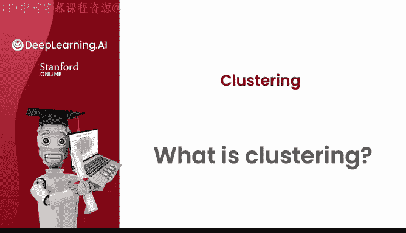
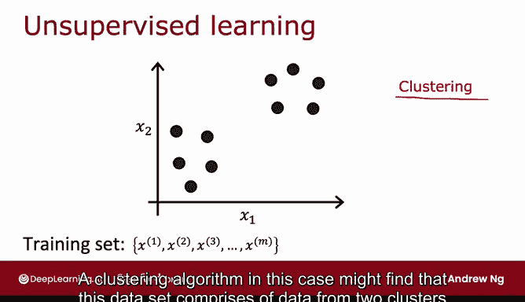
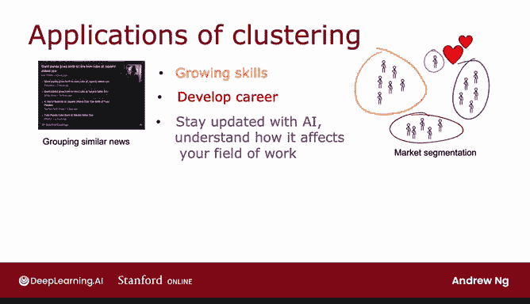

# 107：02_01_01_什么是聚类 🧩

在本节课中，我们将要学习**聚类**这一核心概念。聚类是一种无监督学习算法，它能够自动发现数据中相似或相关的点，并将它们分组。我们将通过对比有监督学习来理解聚类的特点，并了解其常见的应用场景。

---

## 什么是有监督学习？📊

上一节我们提到了聚类是无监督学习。为了更好地理解它，我们先回顾一下你已经熟悉的有监督学习。

在有监督学习中，我们拥有一个包含输入特征 **X** 和对应标签 **Y** 的训练集。例如，对于一个二元分类问题，我们的数据集可能包含特征 `X1` 和 `X2`，以及标签 `y`（通常用 `0` 或 `1` 表示）。我们可以将数据绘制在图上，并使用逻辑回归或神经网络等算法来学习一个决策边界。

**公式表示**：训练集为 `{(x^(1), y^(1)), (x^(2), y^(2)), ..., (x^(m), y^(m))}`，其中 `x` 是特征，`y` 是标签。

## 什么是无监督学习？🔍

与有监督学习不同，在无监督学习中，我们只拥有输入特征 **X**，而没有对应的标签 **Y**。

因此，当我们绘制数据时，图上只有一堆点，而没有像“X”和“O”这样的符号来区分不同的类别。由于没有目标标签 `y`，我们无法告诉算法什么是“正确的”答案。相反，我们要求算法自己去发现数据中有趣的结构或模式。

## 什么是聚类算法？🎯

聚类算法是无监督学习中最先接触到的算法之一。它专门用于寻找数据中的一种特定结构：**将数据点分组到不同的“簇”中**。

具体来说，聚类算法会观察类似上图的数据，并尝试判断这些数据是否可以分成几个内部相似的点群。例如，它可能发现一个数据集实际上由两个不同的簇组成。

**核心任务**：给定一个无标签的数据集 `{x^(1), x^(2), ..., x^(m)}`，聚类算法将其划分为 `K` 个簇。

## 聚类的应用有哪些？🌐

以下是聚类算法在现实世界中的几个应用实例：

*   **新闻文章分组**：将内容相似的新闻文章（例如，关于熊猫的不同报道）自动归类在一起。
*   **市场/用户细分**：例如，分析在线学习平台的用户，根据他们的学习目标（如提升技能、职业发展、了解AI影响）将其分成不同的群体，以便提供更有针对性的帮助。
*   **基因数据分析**：通过分析不同个体的基因表达数据，将具有相似特征的人分组，用于疾病研究或种群分析。
*   **天文数据分析**：天文学家利用聚类将太空中的天体分组，以分析哪些天体属于同一个星系，或识别太空中的特定结构。

如今，聚类技术被广泛应用于上述领域以及更多其他场景。

---

## 总结与预告 📝

本节课中我们一起学习了**聚类**的基本概念。我们了解到聚类是一种**无监督学习算法**，其目标是在没有标签的数据中自动发现相似的数据点并将它们分组。我们通过对比**有监督学习**（有X和y）和**无监督学习**（只有X）来明确了聚类的特点，并列举了它在新闻、市场、基因和天文等多个领域的实际应用。

在下一节视频中，我们将深入探讨最常用的聚类算法——**K均值算法**，一起来看看它是如何工作的。