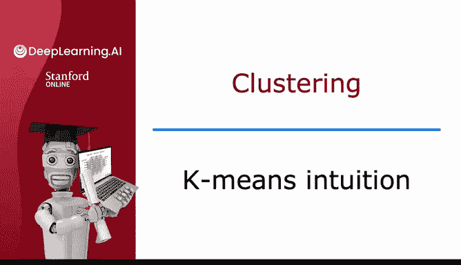
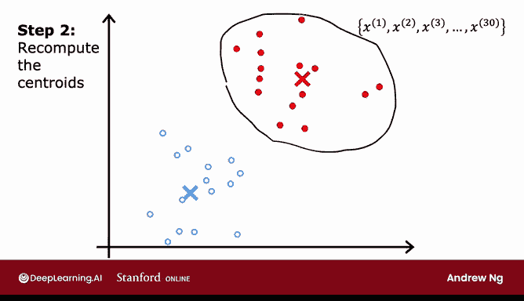

# 108：K均值算法直观理解 🧠



在本节课中，我们将学习K均值聚类算法的直观工作原理。我们将通过一个具体的例子，一步步地展示算法如何将未标记的数据点自动分组为不同的簇。

---

## 算法概述

K均值算法是一种迭代算法，用于将数据集划分为K个不同的簇。其核心思想是：首先随机初始化K个簇中心点（称为“质心”），然后重复执行两个步骤，直到质心的位置不再发生变化。

上一节我们介绍了聚类的基本概念，本节中我们来看看K均值算法的具体执行过程。

## 算法步骤详解

让我们通过一个包含30个未标记数据点的例子来理解K均值算法。

### 第一步：随机初始化质心

算法首先会随机猜测两个簇中心的位置。在这个例子中，我们要求算法寻找两个簇（K=2）。初始的质心位置用红色叉号和蓝色叉号表示。这只是一个随机的初始猜测，可能并不准确，但它是一个起点。

### 第二步：重复执行两个核心操作

K均值算法会反复执行两个不同的操作：
1.  **将每个数据点分配给最近的质心**。
2.  **根据分配结果，移动每个质心到其所属点的平均位置**。

以下是这两个步骤的详细说明。

#### 操作一：分配数据点到质心

算法会遍历数据集中的每一个数据点（例如，x1 到 x30），并检查该点距离红色质心（红叉）更近，还是距离蓝色质心（蓝叉）更近。然后，将该点分配给距离更近的那个质心。

为了直观展示，我会根据每个点距离哪个质心更近，将其涂成红色或蓝色。

例如，上方的点距离红色质心更近，因此被涂成红色；而下方的点距离蓝色质心更近，因此被涂成蓝色。

#### 操作二：移动质心到平均位置

完成分配后，算法会查看所有被标记为红色的点，计算它们的平均位置，然后将红色质心（红叉）移动到这个平均位置。对蓝色点执行相同的操作：计算所有蓝色点的平均位置，并将蓝色质心（蓝叉）移动到那里。

这样，我们就得到了两个更新后、位置可能有所改善的质心。

### 迭代过程

现在，我们有了新的质心位置，算法将重复上述两个步骤：

1.  **重新分配**：再次遍历所有30个训练样本，根据新的质心位置，重新判断每个点距离红色还是蓝色质心更近，并更新其颜色。由于质心移动了，一些点的颜色可能会改变。
2.  **重新计算质心**：再次根据当前所有红色点的位置计算新的红色质心，根据所有蓝色点的位置计算新的蓝色质心，并移动它们。

如果持续重复这两个步骤，最终数据点的颜色和质心的位置将不再发生变化。此时，我们说K均值算法已经**收敛**。

在这个例子中，算法成功地将上方的点识别为一个簇，将下方的点识别为另一个簇。

---

## 核心概念总结

本节课中我们一起学习了K均值算法的直观流程。其核心是两个迭代步骤，可以用伪代码概括如下：

```
重复执行直到收敛 {
    # 步骤一：分配点
    for i = 1 to m (m个数据点) {
        c^(i) := 距离点 x^(i) 最近的质心的索引 (从1到K)
    }
    # 步骤二：移动质心
    for k = 1 to K {
        μ_k := 所有被分配到簇k的点的坐标平均值
    }
}
```

其中：
*   `c^(i)` 表示第 `i` 个数据点被分配到的簇的编号。
*   `μ_k` 表示第 `k` 个簇的质心坐标。

---



## 课程总结

在本节课中，我们通过一个生动的例子，直观地理解了K均值聚类算法的工作原理。算法的两个关键步骤是：**将每个点分配给最近的质心**，以及**将每个质心移动到其所属点的平均位置**。通过反复迭代这两个步骤，算法能够自动将数据分组，直到结果稳定。

在下一节视频中，我们将学习如何形式化地定义这两个步骤，并写出完整的K均值算法。让我们继续前进到下一个视频。