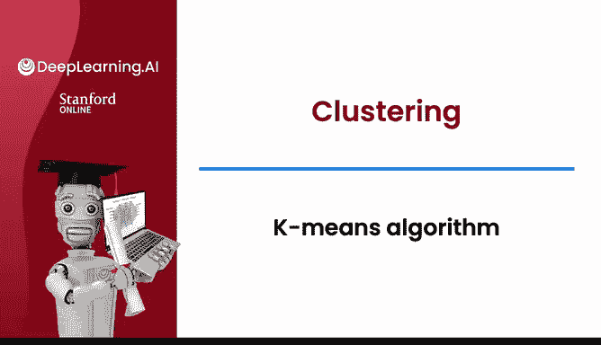
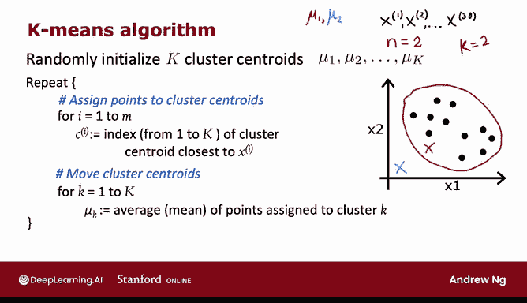
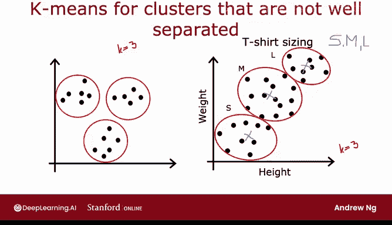

# 109：K均值算法 🧠



在本节课中，我们将详细学习K均值算法的具体步骤。我们将了解算法如何初始化、如何将数据点分配给簇中心，以及如何更新簇中心的位置。通过本教程，你将能够自己实现这个算法。

---

## 算法概述

K均值算法是一种迭代聚类方法，旨在将数据点划分为K个簇。其核心思想是：首先随机初始化K个簇中心，然后重复执行两个步骤——将每个点分配给最近的簇中心，并根据分配结果重新计算每个簇的中心位置。

## 算法步骤详解

上一节我们了解了K均值算法的直观运行过程，本节中我们来看看其具体的数学和代码实现步骤。

### 1. 随机初始化簇中心

第一步是随机初始化K个簇中心，记作 **μ₁, μ₂, ..., μₖ**。

*   在之前的例子中，这对应于我们为红色十字（簇中心1）和蓝色十字（簇中心2）随机选择位置。
*   簇中心 **μ** 是与训练样本具有相同维度的向量。例如，如果每个训练样本有 `n=2` 个特征，那么 **μ₁** 和 **μ₂** 也是二维向量。

### 2. 迭代执行分配与移动

初始化后，K均值算法将重复执行以下两个步骤。

#### 步骤一：分配点到簇中心

这一步是为每个数据点“上色”，即将其分配给最近的簇中心。

以下是其数学描述：对于 `i = 1` 到 `m` 的每一个训练样本 **x⁽ⁱ⁾**，我们计算：
```
c⁽ⁱ⁾ = argminₖ ||x⁽ⁱ⁾ - μₖ||²
```
其中：
*   `c⁽ⁱ⁾` 是样本 **x⁽ⁱ⁾** 被分配到的簇的索引（1 到 K）。
*   `||x⁽ⁱ⁾ - μₖ||` 表示 **x⁽ⁱ⁾** 与簇中心 **μₖ** 之间的欧几里得距离（L2范数）。
*   我们寻找使该距离最小的 `k` 值，这等价于寻找最近的簇中心。实际实现中，通常最小化**平方距离**，因为结果相同且计算更方便。

**具体示例**：如果一个点更接近红色簇中心（**μ₁**），则其 `c⁽ⁱ⁾` 被设为 1；如果更接近蓝色簇中心（**μ₂**），则 `c⁽ⁱ⁾` 被设为 2。

#### 步骤二：移动簇中心

第二步是根据分配结果，更新每个簇中心的位置。

以下是其数学描述：对于 `k = 1` 到 `K` 的每一个簇，我们计算：
```
μₖ = (1 / |Sₖ|) * Σ_{i ∈ Sₖ} x⁽ⁱ⁾
```
其中：
*   `Sₖ` 是所有被分配到簇 `k` 的训练样本的集合。
*   `|Sₖ|` 是该集合中样本的数量。
*   新的 **μₖ** 就是所有属于该簇的点的**平均值**（均值向量）。

**具体示例**：对于所有被标记为红色的点（`c=1`），计算它们在横轴（特征1）和纵轴（特征2）上坐标的平均值，这个平均值点就是红色簇中心的新位置。蓝色簇中心的更新同理。



### 3. 一个特殊情况

在移动簇中心时，可能会遇到一个特殊情况：**某个簇没有被分配到任何数据点**（即 `|Sₖ| = 0`）。

*   此时，计算平均值的公式将除以零，没有定义。
*   最常见的处理方法是**直接移除这个空簇**，最终得到 K-1 个簇。
*   如果必须保留 K 个簇，也可以选择**随机重新初始化**这个簇中心的位置，希望在下一次迭代中它能分配到一些点。

## 算法的应用场景

尽管我们主要用分离良好的簇来演示K均值，但它也经常应用于数据点并非明显分离的场景。

**示例**：假设你是一名T恤设计师，需要决定小号、中号、大号T恤的尺寸。你收集了潜在客户的身高和体重数据，这些数据在二维空间中是连续分布的，没有清晰的边界。

*   尽管如此，运行K均值算法（例如设置K=3）仍可能将这些点大致分为三个组。
*   这三个簇的中心可以为你提供三种尺寸最需要适配的“代表性”身高和体重，从而帮助你科学地制定尺寸标准。

这个例子说明，即使数据没有形成严格分离的群组，K均值算法也能提供有用的结果。

---

## 总结



本节课中我们一起学习了K均值聚类算法的完整流程：
1.  **随机初始化** K 个簇中心。
2.  **重复迭代**两个核心步骤：
    *   **分配**：将每个数据点分配给最近的簇中心。
    *   **移动**：根据分配结果，将每个簇中心移动到其所属所有点的平均值位置。
3.  讨论了**空簇**的特殊情况及处理方法。
4.  了解了算法在数据非明显聚类场景下的**实际应用**。

这个算法通过不断优化簇内点的紧密程度来工作。那么，这个算法最终会收敛吗？它究竟在优化什么目标？为了更深入地理解K均值算法，并探究其收敛的原因，我们将在下一节中看到，K均值实际上是在优化一个特定的**代价函数**。让我们在下一个视频中一探究竟。