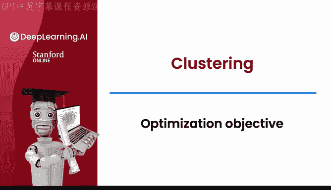
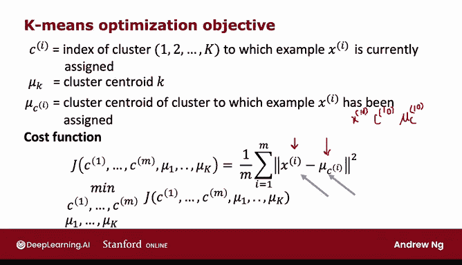
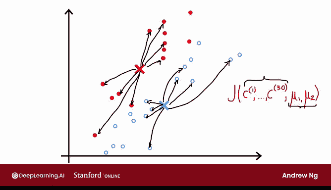
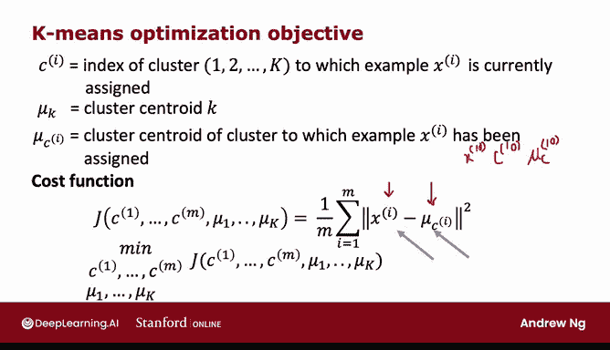
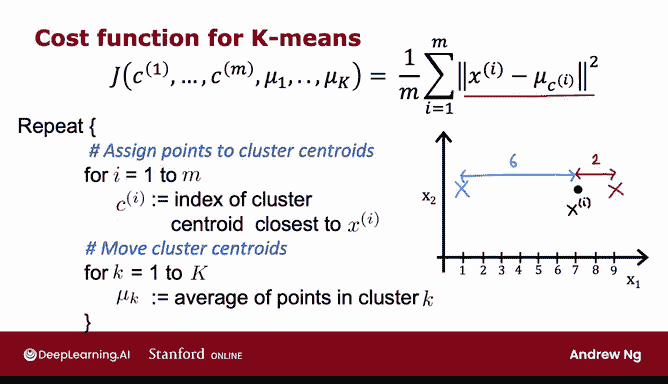
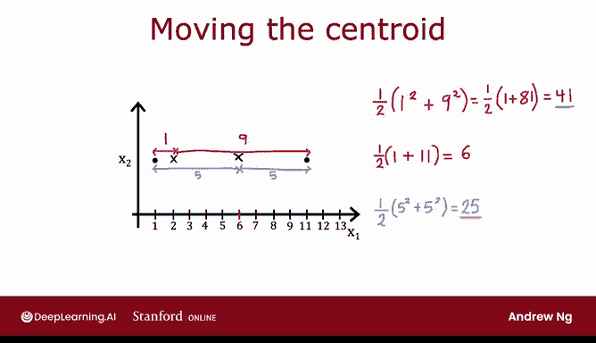

# 110：K-Means 优化目标 🎯

在本节课中，我们将学习K-Means聚类算法的优化目标。我们将了解K-Means算法实际上是在最小化一个特定的成本函数，并探讨这个成本函数如何指导算法的两个核心步骤。

---

在之前的课程中，您已经看到许多监督学习算法通过定义一个成本函数，并使用梯度下降或其他算法来优化它。K-Means算法也不例外，它也在优化一个特定的成本函数，尽管它使用的优化算法不是梯度下降，而是您在上一课中看到的迭代过程。

让我们来看看K-Means的成本函数是什么。

首先，我们回顾一下使用的符号。`c^(i)` 表示训练样本 `x^(i)` 当前被分配到的簇的索引（从1到K）。`μ_k` 表示第k个簇中心的位置。我们引入一个新符号 `μ_c^(i)`，它表示样本 `x^(i)` 被分配到的那个簇中心的位置。

例如，如果我们看第10个训练样本 `x^(10)`，`c^(10)` 会告诉我们它被分配到了哪个簇（比如红色或蓝色），那么 `μ_c^(10)` 就是那个簇中心的位置。

基于这个符号，K-Means算法最小化的成本函数 `J` 可以定义为：

**J(c^(1), ..., c^(m), μ_1, ..., μ_K) = (1/m) * Σ_{i=1}^{m} ||x^(i) - μ_c^(i)||²**

换句话说，K-Means的成本函数是每个训练样本 `x^(i)` 与其被分配到的簇中心 `μ_c^(i)` 之间距离平方的平均值。

对于上面的例子，我们需要计算 `x^(10)` 和 `μ_c^(10)` 之间的距离平方，并将其作为求平均的项之一。K-Means算法所做的就是尝试找到样本的分配 `c^(i)` 和簇中心的位置 `μ_k`，以最小化这个平方距离。

---

从视觉上看，在之前视频的K-Means运行过程中，成本函数的计算方式是：查看每一个蓝色点，测量它们到蓝色簇中心的距离并计算平方；同样地，查看每一个红色点，测量它们到红色簇中心的距离并计算平方。然后，对所有红点和蓝点的这些距离平方值求平均，就得到了在当前参数配置下成本函数 `J` 的值。

算法的每一步都会尝试更新簇分配 `c^(1)` 到 `c^(m)`（在这个例子中是30个），或者更新簇中心 `μ_1` 和 `μ_2` 的位置，以持续降低这个成本函数 `J`。顺便提一下，这个成本函数 `J` 在文献中也被称为**畸变函数**。

---

现在，让我们更深入地看看算法，以及为什么算法要最小化这个成本函数 `J`（或畸变）。上面我复制了前一页的成本函数公式。

事实证明，K-Means算法的第一部分（将点分配给最近的簇中心）是在尝试更新 `c^(1)` 到 `c^(m)`，以在固定 `μ_1` 到 `μ_K` 的情况下，尽可能最小化成本函数 `J`。

而算法的第二步（移动簇中心）则是在尝试固定 `c^(1)` 到 `c^(m)`，但更新 `μ_1` 到 `μ_K`，以尽可能最小化成本函数或畸变。

让我们看看为什么是这样。

**第一步：分配点**

在第一步中，如果你想选择 `c^(i)` 的值来最小化 `||x^(i) - μ_c^(i)||²`，你应该怎么做？这个表达式是训练样本 `x^(i)` 与其被分配到的簇中心之间的距离平方。

为了最小化这个距离平方，你应该将 `x^(i)` 分配给**最近的**簇中心。举一个简化的例子，如果你有两个簇中心（`μ_1` 和 `μ_2`）和一个训练样本 `x^(i)`。如果你把它分配给簇中心1，这个距离平方会很大；如果你把它分配给更近的簇中心2，这个距离平方会小得多。因此，为了最小化这一项，你会将 `x^(i)` 分配给更近的簇中心，这正是算法所做的。

所以，将点分配给簇中心的步骤，就是在选择 `c^(i)` 的值以尝试最小化 `J`，同时暂时不改变 `μ_k`。

**第二步：移动簇中心**

第二步是移动簇中心。事实证明，将 `μ_k` 设置为分配给该簇的所有点的平均值，是能够最小化成本函数 `J` 的选择。

再举一个简化的例子。假设一个簇只分配了两个点，如下图所示。如果簇中心在当前位置，两个距离平方的平均值是 `(1² + 9²)/2 = 41`。但如果你将簇中心移动到这两个点的中间位置（即平均值 `(1+11)/2 = 6`），那么两个距离平方的平均值就变成了 `(5² + 5²)/2 = 25`，这比41小得多。实际上，你可以尝试改变簇中心的位置，会发现取分配给该簇所有点的平均值位置，确实是使距离平方和最小的值。

---

K-Means算法在优化成本函数 `J` 这一事实意味着它**保证会收敛**。在每一次迭代中，畸变成本函数应该下降或保持不变。如果它没有下降或保持不变（在最坏的情况下甚至上升），那就意味着代码中存在错误，因为K-Means的每一步都在设置 `c^(i)` 和 `μ_k` 的值以试图减少成本函数。

此外，如果成本函数停止下降，这也为你提供了一种判断K-Means是否已经收敛的方法。一旦有一次迭代中成本函数保持不变，通常就意味着K-Means已经收敛，你应该停止运行算法。在某些罕见情况下，你可能需要运行K-Means很长时间，而畸变下降得非常缓慢。这有点像梯度下降，运行更长时间可能有点帮助，但如果成本函数下降的速度变得非常非常慢，你也可以认为它已经足够接近收敛，不必花费更多的计算周期来运行更长时间。

因此，计算成本函数有助于你判断算法是否已经收敛。

事实证明，利用成本函数还有另一个非常有用的方法，那就是使用**多个不同的随机初始化的簇中心**。这样做通常可以帮助你找到更好的聚类结果。我们将在下一个视频中看看如何做到这一点。

---

**本节课总结**

本节课我们一起学习了K-Means聚类算法的优化目标。我们了解到K-Means通过最小化一个称为**畸变**的成本函数 `J` 来工作，该函数衡量了每个数据点与其所属簇中心之间距离平方的平均值。我们详细分析了算法的两个步骤——分配点和移动簇中心——是如何分别针对固定另一组参数来最小化这个成本函数的。理解这个优化目标不仅解释了算法的工作原理，还为我们提供了判断算法收敛性和改进聚类结果（例如通过多次随机初始化）的重要工具。