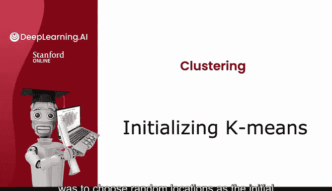
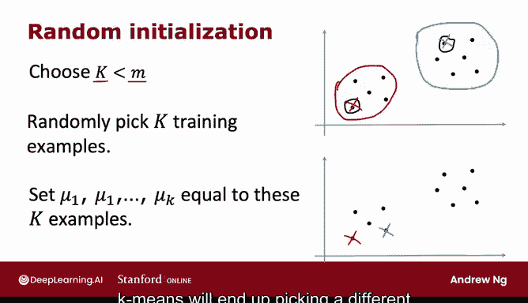
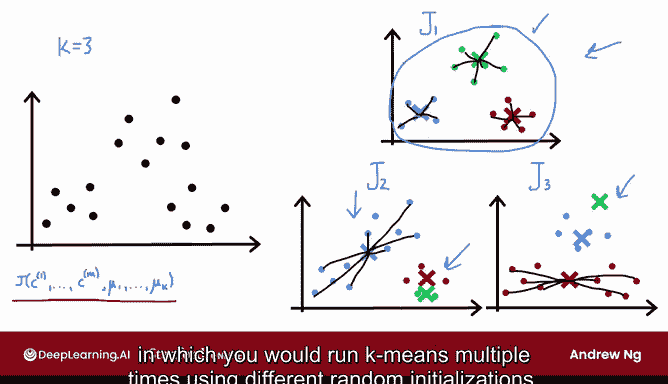
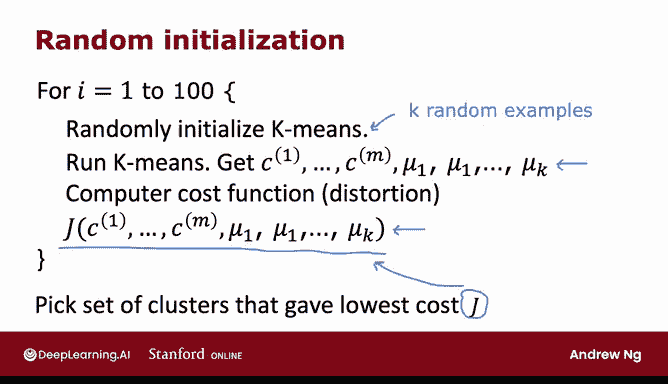

# 111：K均值初始化 🎯

在本节课中，我们将要学习K均值聚类算法的第一步：如何初始化聚类中心。我们将探讨随机初始化的具体方法，以及如何通过多次运行算法来获得更好的聚类结果。

---

K均值聚类算法的第一步是随机选择位置作为聚类中心μ₁到μ_K的初始猜测。但具体如何执行这个随机猜测呢？本节视频将展示这一过程，并介绍如何通过多次尝试不同的初始中心μ₁到μ_K，从而找到更优的聚类结果。

## 初始化方法详解

上一节我们介绍了K均值算法的整体流程，本节中我们来看看如何具体实现其第一步。

运行K均值时，聚类中心的数量K应始终小于训练样本数M。如果K大于M，则没有足够的训练样本来为每个聚类中心分配至少一个样本，这没有意义。

在之前的例子中，我们设K=2，M=30。

选择聚类中心最常见的方法是随机选择K个训练样本。以下是一个训练集示例：

如果随机选择两个训练样本，可能会选中这一个和这一个。然后，我们将μ₁到μ_K设置为这K个训练样本的位置。例如，我可能在这里初始化红色聚类中心，并在那里初始化蓝色聚类中心。

当K=2时，如果这是你的随机初始化，运行K均值后，算法很可能会判定这些是数据集中的两个聚类。

需要注意的是，这种初始化聚类中心的方法与之前视频演示中使用的略有不同。在之前的演示中，我将聚类中心μ₁和μ₂初始化为随机点，而不是位于特定训练样本之上。那样做是为了让演示更清晰，但本幻灯片展示的才是实际更常用的初始化方法。

## 初始化的影响与局部最优

使用这种方法，有可能出现红色十字在这里、蓝色十字在那里的初始化情况。根据随机初始聚类中心的选择，K均值最终会为数据集找到不同的聚类集合。

让我们看一个稍复杂的例子：

在这个数据集中，我们尝试找到三个聚类，即K=3。

如果使用一种随机初始化运行K均值，可能会得到上方的结果。这看起来是一个相当好的选择，将数据很好地分成了三个不同的聚类。

但如果使用另一种初始化，比如恰好将两个聚类中心初始化在这组点内，一个初始化在另一组点内，运行K均值后，可能会得到这种聚类结果。这看起来就不那么理想了。

这实际上是一个**局部最优解**。K均值试图最小化失真代价函数，即上一视频中看到的J(c₁, ..., c_M, μ₁, ..., μ_K)。但由于这种不太幸运的随机初始化选择，算法恰好陷入了局部最小值。

这是另一个局部最小值的例子，不同的随机初始化导致K均值找到了这种将数据分成三个聚类的方式。同样，它看起来不如上方那个结果好。

## 多次随机初始化策略

如果你想给K均值多次机会来寻找最佳局部最优解，如果你想尝试多种随机初始化，从而有更好的机会找到上方那种良好的聚类，你可以对K均值算法做一件事：**多次运行它**，然后尝试找到最佳的局部最优解。

事实证明，如果你运行K均值三次，并得到三种不同的聚类结果，那么在这三种解决方案中进行选择的一种方法是：计算所有三种解决方案（或K均值找到的这三种聚类选择）的代价函数J。

然后根据哪个能给出最小的代价函数J值，从这三种中选择一个。

实际上，如果你观察上方这种聚类分组，绿十字与绿点的距离平方和相对较小，红十字与红点的距离也较小，蓝十字同理。因此，对于上方的例子，代价函数J会相对较小。

但在下方的例子中，蓝十字到所有蓝点的距离较大，红十字到所有红点的距离也较大。这就是为什么下方这些例子的代价函数J会更大，也是为什么如果你从这三个选项中选择失真最小、代价函数J最小的那个，最终会选择上方的聚类中心选择方案。

让我更正式地将此写成一个算法，其中你将使用不同的随机初始化多次运行K均值。

以下是算法步骤：

如果你想使用100次随机初始化运行K均值，那么你需要：
1.  运行100次循环。
2.  使用本视频前面看到的方法随机初始化K均值：选择K个训练样本，并让聚类中心初始位置为这K个训练样本的位置。
3.  使用该随机初始化，运行K均值算法直至收敛。这将给你一组聚类分配和聚类中心。
4.  最后，按如下方式计算失真度，即计算代价函数。

完成此过程（例如100次）后，最终选择给出最低成本的聚类集合。

事实证明，如果这样做，通常能给你一组好得多的聚类，其失真函数值远低于只运行一次K均值得到的结果。

## 实践建议

当我使用这种方法时，我在这里填入了数字100。

通常，运行此过程大约50到1000次是相当常见的。如果运行次数远超过1000次，计算成本往往会变得很高，并且多次运行后的收益会递减。而尝试至少50或100次随机初始化，通常比只尝试一次随机初始化能得到好得多的结果。

使用这种技术，你更有可能最终得到上方那种良好的聚类选择，而不是下方那些较差的局部最小值。因此，当我亲自使用K均值时，我几乎总是使用多次随机初始化，因为这能让K均值在最小化失真代价函数和寻找更好的聚类中心方面做得更好。

---

在本节课中，我们一起学习了K均值聚类算法的初始化步骤。我们了解到，随机选择K个训练样本作为初始中心是常见做法，但单次运行可能陷入局部最优。通过**多次随机初始化并选择代价函数J最小的结果**，可以显著提高找到高质量聚类方案的概率。通常建议运行50到1000次以获得稳定良好的结果。

在结束K均值的讨论之前，还有一个视频将探讨如何选择聚类中心的数量K。让我们进入下一个视频来了解这一点。