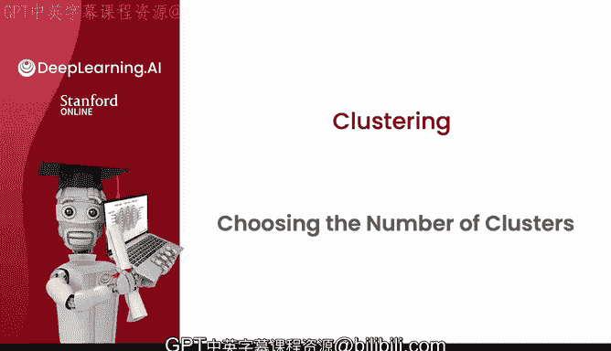
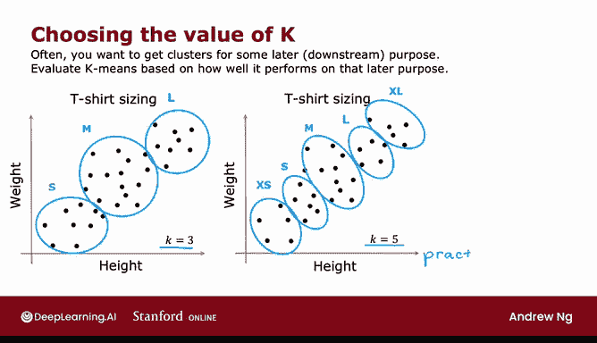

# 112：如何选择聚类数量？🤔

在本节课中，我们将要学习一个关键问题：在使用K均值算法时，如何确定最佳的聚类数量K。K均值算法需要你输入一个参数K，即你希望找到的类别数量。但如何决定是使用2个、3个、5个还是10个类别呢？让我们一起来探讨。

---

## 聚类数量选择的模糊性

对于许多聚类问题，K的正确值通常是模糊的。如果向不同的人展示同一个数据集，并询问他们看到了多少个聚类，答案可能会不同。有些人可能会说有两个明显的聚类，而另一些人可能会看到四个。他们都是对的。因为聚类是一种无监督学习算法，没有给定的“正确答案”标签可供复制。在许多应用中，数据本身并不能清晰地指示其中包含多少个聚类。

例如，对于某些数据，很难明确判断它包含两个、三个还是四个聚类。

---

## 肘部法则

在K均值的学术文献中，有一些技术可以尝试自动为特定应用选择聚类数量。这里简要介绍一种你可能看到别人提到的方法——**肘部法则**，尽管我个人并不常用它。

肘部法则的操作步骤如下：
1.  使用不同的K值多次运行K均值算法。
2.  绘制**成本函数J**（或称为畸变函数）随聚类数量K变化的曲线。

**公式：成本函数J**
`J(c, μ) = (1/m) * Σ ||x^(i) - μ_c(i)||²`
其中，`m`是样本数，`x^(i)`是第i个样本，`μ_c(i)`是该样本所属簇的中心点。

通常你会发现，当聚类数量很少时（例如K=1），成本函数J的值会很高。随着K值的增加，成本函数J会下降，曲线可能如下图所示。

如果曲线呈现这样的形态：成本函数在K=3之前快速下降，之后下降速度明显变缓，那么我们就可以选择K=3。这种方法之所以被称为“肘部法则”，是因为曲线的拐点形状类似于人的手肘。

通过绘制成本函数J随K变化的曲线，可以帮助你获得一些洞察。然而，我个人很少使用肘部法则来选择聚类数量，因为对于许多应用，正确的类别数量本身就是模糊的，而且很多成本函数曲线是平滑下降的，并没有一个清晰的“肘部”拐点可供选择K值。

**一个重要提醒**：**不能**通过选择使成本函数J最小化的K值来决定K。因为这样做几乎总是会导致你选择可能的最大K值，因为更多的类别几乎总是能降低J值。因此，最小化J值并不是一个好的选择K值的技术。

---

## 实践中的选择方法

那么在实践中如何选择K值呢？通常，你运行K均值是为了获得聚类，以便用于后续的某些目的。也就是说，你将利用这些聚类来做一些事情。

我通常推荐的做法是：**根据K均值算法对后续下游任务的执行效果来评估和选择K值**。

让我用一个T恤尺码的例子来说明。

*   **方案一**：你可以在此数据集上运行K均值，找到3个聚类。这样你可能会得到类似下图的聚类结果，并据此确定小、中、大号T恤的尺码。
*   **方案二**：你也可以用K=5运行K均值，可能会得到类似下图的聚类结果，从而将T恤尺码分为特小号、小号、中号、大号和特大号。

这两种方案都是对数据进行聚类的完全有效且合理的方式。但是，选择使用3个还是5个聚类，现在可以基于对你的T恤业务是否有意义来决定。

这里存在一个权衡：
*   **合身程度**：尺码越多（5个），T恤的合身性可能越好。
*   **成本**：但生产和运输5种不同类型的T恤，会比3种类型带来额外的成本。

因此，在这种情况下，我会分别用K=3和K=5运行K均值，然后审视这两种解决方案。基于“更多尺码带来更好合身性”与“制造更多T恤带来额外成本”之间的权衡，来决定哪种方案对T恤业务更有意义。

---

## 另一个应用：图像压缩

在编程练习中，你还会看到K均值在图像压缩中的应用。这实际上是K均值最有趣的可视化示例之一。

在那里，你将看到另一个权衡：
*   **压缩图像质量**：图像看起来有多好。
*   **压缩程度**：为了节省空间，图像能被压缩到多小。

在那个编程练习中，你可以利用这种权衡，根据你希望图像看起来多好与你希望压缩后的图像文件有多小，来手动决定最佳的K值。

---

## 课程总结

本节课中我们一起学习了如何为K均值聚类算法选择合适的聚类数量K。我们了解到：
1.  聚类数量的选择通常是模糊的，没有绝对正确的答案。
2.  介绍了**肘部法则**，但也指出了其局限性。
3.  学习了**实践中更有效的方法**：根据聚类结果对后续实际业务目标（如T恤尺码划分、图像压缩质量与大小的权衡）的贡献来评估和选择K值。

恭喜你学会了第一个无监督学习算法！现在你不仅了解如何进行监督学习，也掌握了无监督学习。希望你在实践练习中也能感受到乐趣，这确实是我所知最有趣的练习之一。

接下来，我们将准备学习第二个无监督学习算法——**异常检测**，即如何从数据中发现不寻常或异常的事物。这被证明是无监督学习在商业上最重要的应用之一，我本人在许多不同应用中多次使用过它。让我们在下一个视频中继续探讨异常检测。