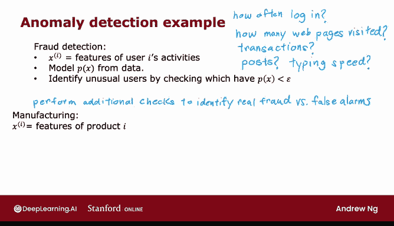

# 113：异常检测算法 🕵️

在本节课中，我们将要学习第二种无监督学习算法——异常检测。我们将了解它的工作原理、核心概念以及它在现实世界中的广泛应用。

## 算法概述

上一节我们介绍了无监督学习的基本概念，本节中我们来看看异常检测算法。

异常检测算法观察一组未标记的正常事件数据集，从而学会检测或标记出是否存在不寻常或异常的事件。

## 一个具体例子

为了更好地理解，让我们看一个例子。我的一些朋友曾使用异常检测来检测飞机制造公司生产的飞机发动机可能存在的问题。

当一家公司制造飞机发动机时，你确实希望该发动机可靠且运行良好，因为飞机发动机故障会带来非常严重的后果。

因此，我的一些朋友使用异常检测来检查制造后的飞机发动机是否看起来异常，或者是否存在任何问题。

以下是具体思路。当一架飞机发动机从装配线下线后，你可以计算该发动机的多个不同特征。

例如，特征 **X1** 测量发动机产生的热量，特征 **X2** 测量振动强度，依此类推，还可以有更多特征。

但为了简化说明，我将只使用两个特征 **X1** 和 **X2**，分别对应发动机的热量和振动。

事实证明，飞机制造商并不会制造那么多有问题的发动机。因此，更容易收集的数据类型是：如果你制造了 **M** 台飞机发动机，收集这 **M** 台发动机运行时的特征 **X1** 和 **X2**，很可能其中大多数都是正常的发动机，而不是有缺陷的。

## 异常检测问题定义

异常检测问题是：在学习算法已经了解了这 **M** 个关于飞机发动机通常如何运行（即产生多少热量和振动）的例子之后，如果一台全新的飞机发动机从装配线下线，并且它有一个由 **X_test** 给出的新特征向量，我们想知道：这台发动机看起来与之前制造的发动机相似吗？所以它可能没问题吗？或者这台发动机是否有什么非常奇怪的地方，可能导致其性能值得怀疑？这意味着也许我们应该在让它被安装在飞机上之前更仔细地检查它，希望不会出任何问题。

## 算法工作原理

以下是异常检测算法的工作原理。让我在这里绘制示例 **x1** 到 **xM**，用这些叉号表示，图中的每个数据点对应一台具有特定热量和振动量的特定发动机。

如果这台新的飞机发动机 **x_test** 从装配线下线，并且你要绘制它的 **x1** 和 **x2** 值，如果它在这里，你会说，好吧，这可能没问题，看起来与其他飞机发动机非常相似。也许我不需要担心这个。

但是，如果这台新飞机发动机的热量和振动特征，比如说，远在下方这里，那么这个位于下方的数据点看起来与我们在顶部看到的那些非常不同，因此我们可能会说，哎呀，这看起来像是一个异常，这看起来不像我以前见过的例子，我们最好在让这台发动机安装在飞机上之前更仔细地检查它。

## 如何用算法解决这个问题？

执行异常检测最常见的方法是通过一种称为**密度估计**的技术。

这意味着，当你获得包含这 **M** 个示例的训练集时，你要做的第一件事是建立一个模型，用于表示 **X** 的概率 **P(X)**。换句话说，学习算法将尝试找出哪些特征值 **X1** 和 **X2** 具有高概率，以及哪些值在数据中出现的可能性较低或概率较低。

在我们这里的这个例子中，我认为在那个中间的小椭圆内看到例子的可能性相当大，所以中间那个区域会有高概率。也许这个椭圆内的事物概率稍低一些。这个椭圆或这个椭圆形内的事物概率更低，而外部的事物概率则更低。如何根据训练集决定哪些区域概率更高、哪些更低的具体细节，我们将在接下来的几个视频中看到。

在学习了 **P(X)** 的模型之后，当你获得新的测试示例 **X_test** 时，你要做的是计算 **P(X_test)** 的概率。如果它很小，或者更准确地说，如果它小于某个我将称为 **ε** 的小数（这是一个希腊字母 epsilon，你应该把它看作一个小数），这意味着 **P(X)** 非常小，或者换句话说，你看到的某个用户的特定 **X** 值相对于你见过的其他用户来说非常不可能。

但如果 **P(X_test)** 小于某个小阈值或某个小数 **ε**，我们会发出一个标志，表示这可能是一个异常。例如，如果 **X_test** 远在这里，一个例子落在这里的概率实际上相当低，因此希望对于这个 **X_test** 值，**P(X_test)** 将小于 **ε**，这样我们就会将其标记为异常。

相反，如果 **P(X_test)** 不小于 **ε**，如果 **P(X_test)** 大于等于 **ε**，那么我们会说它看起来没问题，这看起来不像异常，这对应于如果你有一个例子在这里，比如说 A，我们的模型 **P(X)** 会说靠近中间这里的例子实际上概率相当高，新飞机发动机具有接近这些内部椭圆特征的可能性非常大，因此对于这些例子，**P(X)** 会很大，我们会说它没问题，不是异常。

## 异常检测的应用

异常检测如今在许多应用中使用，它经常用于欺诈检测。例如，如果你运行一个具有许多不同功能的网站，如果你计算 **X_i** 作为用户 **i** 活动的特征，特征的示例可能包括：该用户登录的频率、他们访问了多少网页、他们进行了多少交易、或者他们在讨论论坛上发了多少帖子、他们的打字速度是多少？他们似乎每秒能打多少个字符？有了这样的数据，你就可以从数据中建模 **P(X)**，以模拟给定用户的典型行为。

在欺诈检测的常见工作流程中，你不会仅仅因为一个账户看起来异常就自动关闭它，而是可能会要求安全团队进行更仔细的检查，或设置一些额外的安全检查，例如要求用户通过手机号码验证身份，或要求他们通过验证码来证明他们是人类，等等。但像这样的算法如今被常规使用，以试图发现不寻常或可能有点可疑的活动，这样你就可以更仔细地筛查那些账户，以确保没有欺诈行为，这种类型的欺诈检测既用于发现虚假账户，也经常用于尝试识别金融欺诈。例如，如果存在一种非常不寻常的购买模式，那么这可能值得安全团队进行更仔细的审视。

异常检测也经常用于制造业。你在上一张幻灯片中看到了飞机制造的例子。但是，在许多大洲的许多工厂中，许多制造商都常规使用异常检测来查看他们刚刚制造的从飞机发动机到印刷电路板、智能手机、电机等许多东西，看看你是否刚刚制造了一个行为有些奇怪的单元。因为这可能表明你的飞机发动机或印刷电路板等存在问题，可能会让你想在将该物品运送给客户之前进行更仔细的检查。

它还用于监控集群和数据中心的计算机，其中如果 **X_i** 是某台机器 **i** 的特征，例如，如果特征捕获了内存使用情况、每秒磁盘访问次数、CPU负载，特征也可以是比率，例如 CPU 负载与网络流量的比率。那么，如果某台特定的计算机表现得与其他计算机非常不同，可能值得查看一下那台计算机，看看是否有什么问题，例如它是否发生了硬盘故障或网络故障，或者有什么问题，或者也许它被黑客入侵了。

异常检测是那些应用非常广泛的算法之一，尽管你似乎不常听到人们谈论它。我记得我第一次从事异常检测的商业应用是当我帮助一家电信公司实施异常检测，以查看任何一个蜂窝基站是否以异常方式运行，因为这可能意味着该蜂窝基站有问题，所以他们希望派技术人员去查看，希望更多的人能获得良好的手机信号覆盖。我也曾使用异常检测来发现欺诈性金融交易，如今我经常用它来帮助制造公司发现他们可能制造但应该更频繁检查的异常零件。因此，它是你工具箱中一个非常有用的工具，在接下来的几个视频中，我们将讨论如何构建这些算法并让它们为你工作。

## 核心算法组件

为了使异常检测算法工作，我们需要使用**高斯分布**来对数据 **P(X)** 进行建模。所以让我们进入下一个视频来讨论高斯分布。

---

本节课中我们一起学习了异常检测算法的基本概念、工作原理及其在欺诈检测、制造业监控等领域的广泛应用。我们了解到，该算法的核心是通过密度估计（通常使用高斯分布）来建模正常数据的概率分布 **P(X)**，并通过比较新数据点的概率与阈值 **ε** 来判断其是否为异常。