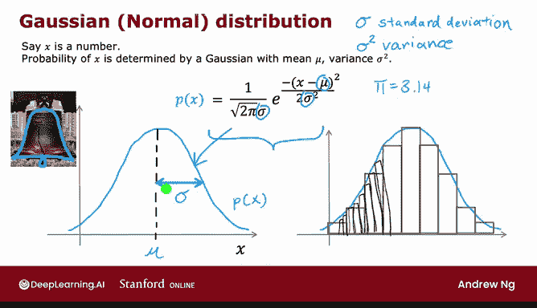
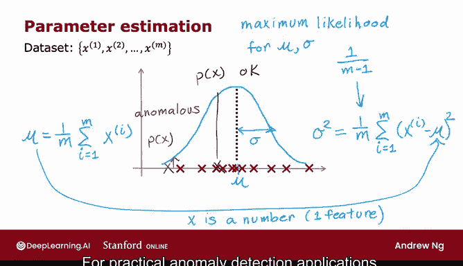

# 114：高斯正态分布 🧮

在本节课中，我们将学习高斯分布，也称为正态分布。这是构建异常检测算法的基础。我们将了解其数学定义、参数含义，以及如何从数据中估计这些参数。

---

## 高斯分布的定义与公式

上一节我们提到了异常检测，本节中我们来看看其核心工具——高斯分布。

高斯分布描述了一个随机变量 `x` 取值的概率分布。它由两个参数决定：均值 `μ` 和方差 `σ²`。其概率密度函数 `P(x)` 的图像呈钟形曲线，中心在 `μ` 处，宽度由 `σ` 决定。

该分布的概率密度函数公式如下：

**`P(x) = (1 / (√(2π) σ)) * e^(-( (x - μ)² / (2σ²) ))`**

其中，`π` 是圆周率，`e` 是自然常数。这个公式精确地描述了钟形曲线的形状。

---

## 参数 `μ` 和 `σ` 的影响

理解了公式后，我们来看看改变参数 `μ` 和 `σ` 会如何影响分布的形状。

以下是不同参数组合下高斯分布的变化：

*   **`μ = 0, σ = 1`**：这是标准正态分布，曲线以0为中心，宽度适中。
*   **`μ = 0, σ = 0.5`**：曲线仍以0为中心，但变得更窄、更高。因为概率曲线下总面积恒为1，所以变窄就必须变高。
*   **`μ = 0, σ = 2`**：曲线以0为中心，但变得更宽、更矮。
*   **`μ = 5, σ = 0.5`**：曲线形状与 `σ=0.5` 时相同，但中心向右平移到了 `μ=5` 的位置。

---

## 从数据中估计参数

在实际应用中，我们通常有一个包含 `m` 个样本的数据集，需要从中估计出最合适的 `μ` 和 `σ²`。

给定数据集后，我们可以通过以下公式计算参数的估计值：

*   均值 `μ` 的估计公式为：**`μ = (1/m) * Σ (xⁱ)`**，即所有样本值的平均值。
*   方差 `σ²` 的估计公式为：**`σ² = (1/m) * Σ ( (xⁱ - μ)² )`**，即每个样本与均值之差的平方的平均值。

在统计学中，这两个公式被称为参数 `μ` 和 `σ²` 的“最大似然估计”。有些教材会建议方差公式的分母使用 `m-1` 而非 `m`，但在实际机器学习应用中，两者差异很小，使用 `m` 即可。

---

## 与异常检测的联系

现在，我们可以将高斯分布与异常检测联系起来。

当我们从训练数据中估计出 `μ` 和 `σ²`，并得到对应的高斯分布 `P(x)` 后，对于任何一个新样本 `x_test`，我们可以计算其概率 `P(x_test)`。

*   如果 `x_test` 落在概率较高的区域（靠近 `μ`），则 `P(x_test)` 值较高，我们认为它是一个正常样本。
*   如果 `x_test` 落在概率很低的区域（远离 `μ` 的尾部），则 `P(x_test)` 值很低，我们就有理由认为它是一个异常点。

---

## 从单特征到多特征

以上讨论基于 `x` 是单个数字（即只有一个特征）的情况。

然而，对于实际的异常检测问题，我们通常拥有多个特征。在下一节视频中，我们将把单变量高斯分布的概念扩展，构建一个能够处理多个特征的、更复杂的异常检测算法。

---

本节课中我们一起学习了高斯（正态）分布。我们掌握了其数学公式，理解了参数 `μ` 和 `σ` 如何影响分布形状，学会了如何从数据中估计这些参数，并初步了解了如何利用计算出的概率 `P(x)` 来识别异常点。这是构建异常检测系统的关键第一步。