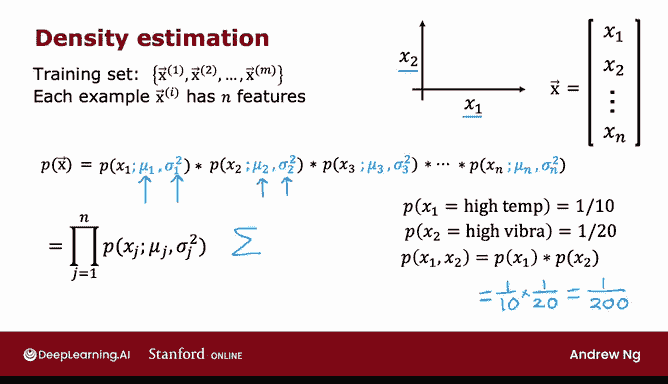
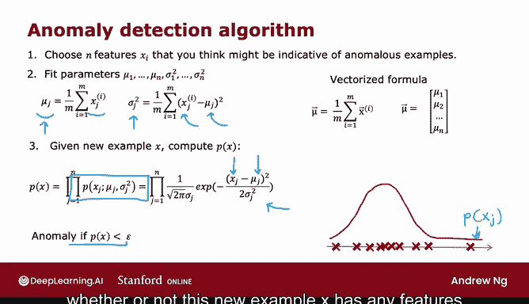
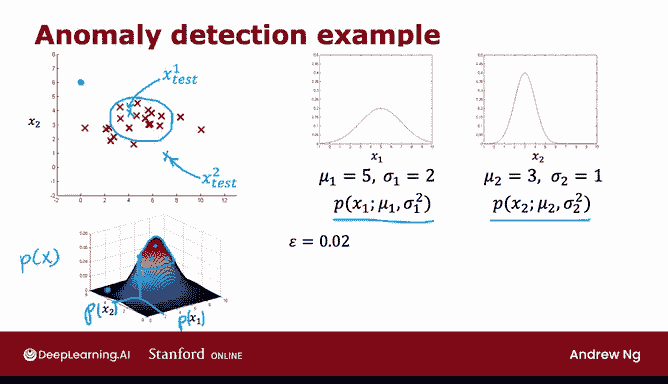

# 115：异常检测算法 🚨

在本节课中，我们将学习如何构建一个异常检测算法。我们将从高斯分布的基础出发，逐步推导出完整的算法流程，并通过一个具体例子来理解其工作原理。

---

## 概述

异常检测算法的核心思想是：通过对正常数据特征的分布进行建模，计算新数据点属于该分布的概率。如果概率低于某个阈值，则将该点标记为异常。

上一节我们介绍了高斯（正态）分布如何描述单个特征。本节中，我们将利用高斯分布来构建一个完整的异常检测系统。

---

## 算法步骤

以下是构建异常检测系统的具体步骤。

### 1. 选择特征

首先，需要选择你认为可能指示异常的特征 \( x_i \)。例如，在飞机引擎的例子中，我们选择了热量和振动两个特征。

### 2. 拟合参数

假设我们有 \( m \) 个训练样本 \( x^{(1)}, x^{(2)}, ..., x^{(m)} \)，每个样本有 \( n \) 个特征。对于每个特征 \( j \)，我们需要估计其高斯分布的参数：均值 \( \mu_j \) 和方差 \( \sigma_j^2 \)。

计算公式如下：
- 均值 \( \mu_j \)：特征 \( j \) 在所有训练样本上的平均值。
  \[
  \mu_j = \frac{1}{m} \sum_{i=1}^{m} x_j^{(i)}
  \]
- 方差 \( \sigma_j^2 \)：特征 \( j \) 与其均值之差的平方的平均值。
  \[
  \sigma_j^2 = \frac{1}{m} \sum_{i=1}^{m} (x_j^{(i)} - \mu_j)^2
  \]

如果有向量化实现，可以一次性计算所有特征的均值向量 \( \mu \)：
\[
\mu = \frac{1}{m} \sum_{i=1}^{m} x^{(i)}
\]

### 3. 计算新样本的概率

对于一个新样本 \( x \)，我们计算其概率 \( p(x) \)。我们假设各个特征之间是统计独立的，因此联合概率是每个特征概率的乘积：
\[
p(x) = \prod_{j=1}^{n} p(x_j; \mu_j, \sigma_j^2)
\]
其中，每个特征的概率由高斯分布公式给出：
\[
p(x_j; \mu_j, \sigma_j^2) = \frac{1}{\sqrt{2\pi}\sigma_j} \exp\left(-\frac{(x_j - \mu_j)^2}{2\sigma_j^2}\right)
\]

### 4. 判断异常

最后，将计算出的概率 \( p(x) \) 与一个预先设定的阈值 \( \epsilon \) 进行比较：
- 如果 \( p(x) < \epsilon \)，则将该样本标记为异常。
- 如果 \( p(x) \ge \epsilon \)，则认为该样本正常。

算法的直观理解是：如果新样本的任何一个特征值相对于训练集中看到的分布来说过大或过小，都会导致该特征的概率 \( p(x_j) \) 非常小，从而使整体乘积 \( p(x) \) 变小，最终被判定为异常。

---

## 算法示例

让我们通过一个具体例子来理解算法的工作过程。

假设我们有一个数据集，包含两个特征 \( x_1 \) 和 \( x_2 \)。
- 特征 \( x_1 \) 的均值 \( \mu_1 = 5 \)，方差 \( \sigma_1^2 \approx 4 \)（标准差 \( \sigma_1 \approx 2 \)）。
- 特征 \( x_2 \) 的均值 \( \mu_2 = 3 \)，方差 \( \sigma_2^2 = 1 \)（标准差 \( \sigma_2 = 1 \)）。

这对应于 \( x_1 \) 的一个较宽的高斯分布和 \( x_2 \) 的一个较窄的高斯分布。将两个特征的概率相乘，我们得到联合概率分布 \( p(x) \) 的曲面图。曲面中心区域（特征值接近均值）的概率较高，边缘区域（特征值远离均值）的概率较低。

现在考虑两个测试样本：
1.  **测试样本1** \( x_{test}^{(1)} \)：位于数据密集区域。
2.  **测试样本2** \( x_{test}^{(2)} \)：位于数据稀疏的偏远区域（例如 \( x_1=8, x_2=0.5 \)）。

设定阈值 \( \epsilon = 0.02 \)。
- 计算得 \( p(x_{test}^{(1)}) \approx 0.04 > \epsilon \)，算法判定其为正常。
- 计算得 \( p(x_{test}^{(2)}) \approx 0.0021 < \epsilon \)，算法判定其为异常。

结果符合预期：算法认为位于训练数据分布中心附近的点正常，而远离训练数据分布的点可能是异常。

---

## 总结

本节课中我们一起学习了异常检测算法的构建过程。我们从选择特征开始，通过高斯分布对每个特征的正常范围进行建模，并计算新样本属于该联合分布的概率。通过设定阈值 \( \epsilon \)，我们可以系统性地识别出具有异常特征组合的数据点。

下一节，我们将深入探讨如何选择阈值 \( \epsilon \)，以及如何评估异常检测系统的性能。