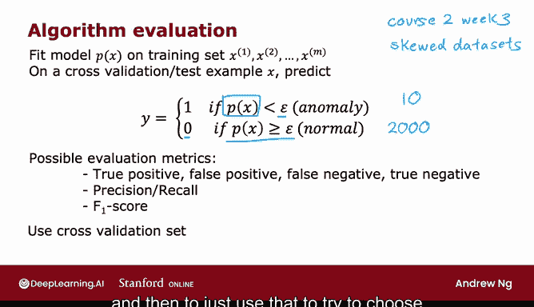

# 116：开发与评估异常检测系统 🚀

在本节课中，我们将学习如何开发并评估一个异常检测系统。我们将探讨如何利用少量带标签的异常数据来指导算法开发，并介绍评估系统性能的实用方法。

上一节我们介绍了异常检测算法的基本原理。本节中，我们来看看如何系统地开发和评估一个异常检测系统。

## 开发异常检测系统的实用技巧

开发学习算法时，例如选择不同的特征或调整参数（如 **ε**），如果有一种方法可以评估算法性能，那么做出决策就会容易得多。这种方法有时被称为**实数评估**。如果你能通过改变特征或参数，并计算出一个数值来判断算法是变好还是变坏，那么就能更容易地决定是否保留这次改动。

## 引入带标签的数据

尽管我们主要讨论的是无标签数据，但为了评估，我们需要稍微改变一下假设。我们假设拥有一些带标签的数据，其中包含少量已知的异常样本。

*   对于已知的异常样本，我们为其关联标签 **y = 1**。
*   对于我们认为正常的样本，我们为其关联标签 **y = 0**。

异常检测算法学习所用的训练集仍然是这个无标签的训练集 **{x^(1), ..., x^(m)}**。我们假设所有这些样本都是正常的（即 **y = 0**）。在实践中，即使有少数异常样本混入训练集，算法通常也能正常工作。

## 划分数据集

为了评估算法，拥有少量异常样本非常有用，这样我们就可以创建交叉验证集和测试集。

以下是数据集划分的一个示例：

假设你制造飞机引擎多年，收集了10000个正常引擎的数据和20个有缺陷（异常）引擎的数据。我们将数据划分如下：

*   **训练集**：6000个正常引擎。
*   **交叉验证集**：2000个正常引擎 + 10个已知异常引擎。
*   **测试集**：2000个正常引擎 + 10个已知异常引擎。

## 系统开发流程

以下是开发和评估异常检测系统的步骤：

1.  **训练模型**：在训练集上训练算法，拟合高斯分布。
2.  **在交叉验证集上评估**：查看算法能正确标记出多少个异常引擎。你可以使用交叉验证集来调整参数 **ε**，也可以增删或调整特征 **x_j**。
3.  **在测试集上最终评估**：在调整好参数和特征后，在独立的测试集上评估算法，看它能发现多少个异常引擎，以及错误地将多少正常引擎标记为异常。

## 另一种数据划分方案

当异常样本数量极少时（例如只有2个），另一种常见的做法是只使用训练集和交叉验证集，而不单独划分测试集。

*   **优点**：在数据量极少时，这是更可行的方案。
*   **缺点**：由于没有独立的测试集，你无法公平地评估算法在未来数据上的泛化性能，存在过拟合交叉验证集的风险。

## 如何评估算法性能

在交叉验证集或测试集上评估算法的具体步骤如下：

1.  在训练集上拟合模型 **p(x)**。
2.  对于交叉验证集或测试集中的任何一个样本 **x**，计算 **p(x)**。
3.  进行预测：
    *   如果 **p(x) < ε**，则预测 **ŷ = 1**（异常）。
    *   如果 **p(x) ≥ ε**，则预测 **ŷ = 0**（正常）。
4.  将预测结果 **ŷ** 与真实标签 **y** 进行比较，评估准确性。

由于异常检测的数据分布通常是高度偏斜的（异常样本远少于正常样本），除了准确率，还可以考虑使用以下评估指标：

*   真阳性、假阳性、假阴性、真阴性
*   精确率、召回率、F1分数

这些指标能更好地衡量算法在大量正常样本中发现少数异常样本的能力。

## 总结

本节课中我们一起学习了如何开发和评估异常检测系统。核心要点是，即使主要使用无监督学习，拥有少量带标签的异常样本对于指导参数调整和特征选择至关重要。我们介绍了数据集的标准划分方法，以及在数据极少时的替代方案，并讨论了在偏斜数据分布下如何选择合适的评估指标。这使得构建一个实用的异常检测系统变得更加高效和可靠。

这引出了一个问题：既然有了一些带标签的样本，为什么还要使用无监督学习？为什么不直接使用监督学习算法呢？在下一节视频中，我们将比较异常检测与监督学习，并探讨在何种情况下应优先选择其中一种方法。