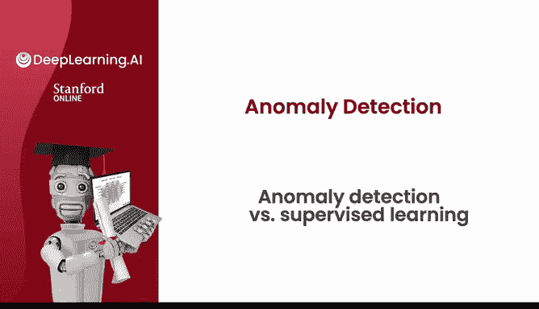
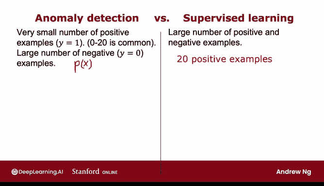
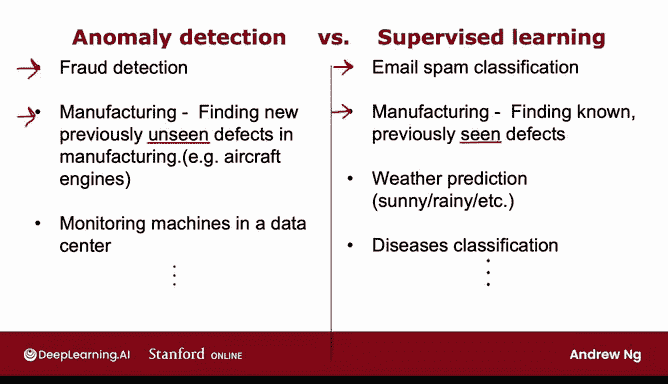

# 117：异常检测与监督学习对比 🎯

在本节课中，我们将学习如何在实际应用中，根据数据集的特点，在异常检测算法和监督学习算法之间做出合适的选择。我们将通过对比两种方法的核心思想、适用场景以及具体案例，帮助你建立一个清晰的决策框架。

## 概述

当你的数据集中只有少量正例（y=1）和大量负例（y=0）时，选择使用异常检测还是监督学习是一个需要仔细权衡的问题。本节将分享一些思考和具体建议，帮助你在这两类算法之间做出选择。

## 异常检测的适用场景

上一节我们介绍了异常检测的基本概念，本节中我们来看看它最适合在什么情况下使用。

异常检测算法通常在以下情况下是更合适的选择：你拥有**非常少的正例**（例如0到20个正例的情况并不少见），以及**相对大量的负例**。这些负例用于构建概率模型 **p(x)**。需要记住的是，**p(x)** 的参数仅从负例中学习。正例数量极少，因此它们仅用于交叉验证集和测试集，以进行参数调整和模型评估。

以下是异常检测更适用的核心情况：
*   **正例（异常）类型繁多且未来可能出现全新类型**：例如，飞机发动机可能有多种不同的故障方式，并且未来可能出现一种全新的、从未见过的故障模式。你手头少量的正例（如20个）可能无法涵盖所有可能的故障类型。这使得任何算法都难以从这少量正例中学习到“异常”或“正例”的完整特征。未来的异常可能与我们迄今为止见过的任何异常示例都完全不同。
*   **算法逻辑**：异常检测算法观察正常的例子（即y=0的负例），并尝试建模它们的特征。任何与正常情况偏差很大的事物都会被标记为异常，**即使它是数据集中从未出现过的一种全新故障模式**。

## 监督学习的适用场景

与异常检测不同，监督学习以另一种方式看待问题。

相比之下，如果你拥有**数量较多的正例和负例**，那么监督学习可能更适用。当你应用监督学习时，理想情况下，你希望有足够的正例让算法了解正例的特征。监督学习倾向于假设未来的正例很可能与训练集中的正例相似。

以下是监督学习更适用的核心情况：
*   **未来正例与历史正例相似**：例如，在垃圾邮件检测中，虽然垃圾邮件有多种类型，但多年来，垃圾邮件通常试图推销类似的产品或将你引向类似的网站。因此，你在未来几天收到的垃圾邮件，很可能与你过去在训练集中见过的垃圾邮件相似。这就是为什么监督学习对垃圾邮件检测效果很好，因为它旨在检测更多你过去可能在训练集中见过的垃圾邮件类型。

## 具体案例对比

以下是几个具体领域的案例，展示了两种方法的不同适用性：

*   **金融欺诈检测**：欺诈手段层出不穷，每年甚至每月都可能出现全新的欺诈形式。因此，**异常检测**常被用于寻找任何与过去交易记录不同的行为。
*   **制造业缺陷检测**：
    *   如果你想检测**已知的、先前见过的缺陷**（例如，智能手机外壳上的划痕是一种常见缺陷），并且你能获得足够多有划痕手机（y=1）的训练样本，那么**监督学习**效果很好，可以训练系统判断新生产的手机是否有划痕。
    *   如果你怀疑未来会出现**全新的故障方式**，那么**异常检测**效果更好。
*   **数据中心机器监控**：如果机器被黑客入侵，其行为可能以一种全新的、不同于以往任何方式的形式表现出来，这更像一个**异常检测**应用。事实上，许多安全相关应用（因为黑客经常发现入侵系统的新方法）都会使用异常检测。
*   **天气预报**：天气类型通常只有有限的几种（晴天、雨天、多云、下雪等），因为你反复看到相同的标签，所以天气预报往往是一个**监督学习**任务。
*   **疾病诊断**：如果你想根据患者的症状判断其是否患有一种你以前见过的特定疾病，那么这也往往是一个**监督学习**应用。

## 总结

本节课中，我们一起学习了如何根据数据集特征选择异常检测或监督学习。

希望这为你提供了一个决策框架：当你拥有少量正例和大量负例时，是选择异常检测还是监督学习。**异常检测**试图发现可能是你前所未见的、全新的正例；而**监督学习**则观察你的正例，并试图判断未来的例子是否与你已经见过的正例相似。

需要指出的是，在构建异常检测算法时，**特征的选择非常重要**。在构建异常检测系统时，我通常会花一些时间来调整用于系统的特征。在下一个视频中，我将分享一些关于如何调整输入给异常检测算法的特征的实用技巧。