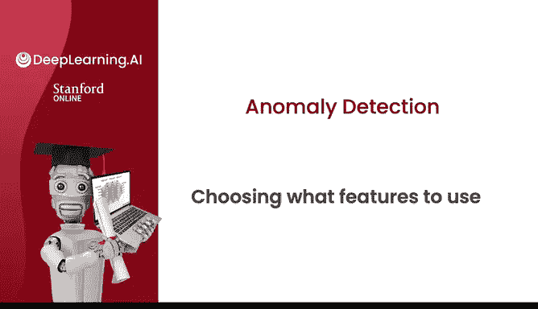
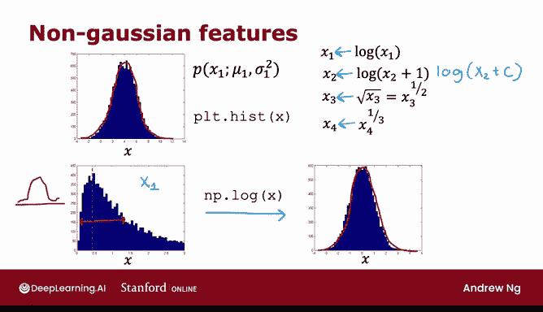
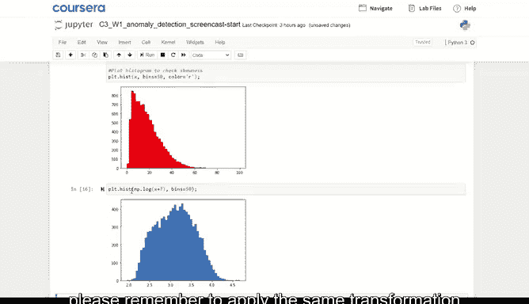
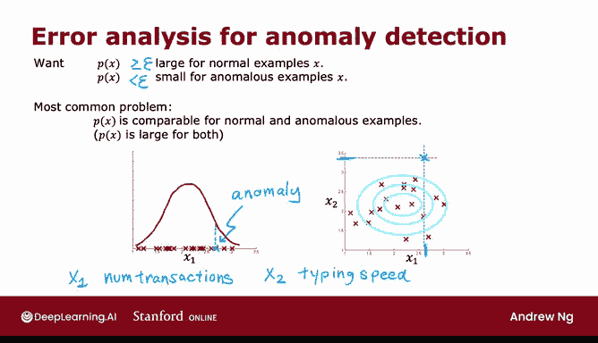
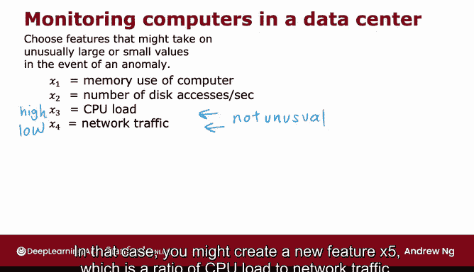
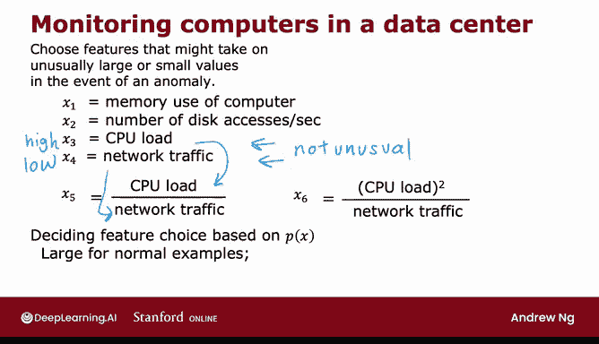

# 118：特征选择技巧 🎯



在本节课中，我们将学习如何为异常检测算法选择和优化特征。特征选择对于异常检测至关重要，因为算法仅从无标签数据中学习，难以自动识别哪些特征应被忽略。我们将探讨如何使特征更接近高斯分布，以及如何通过错误分析创建新特征来提升算法性能。

---

## 使特征更接近高斯分布 📊

上一节我们介绍了特征选择的重要性，本节中我们来看看如何通过变换使特征更接近高斯分布。高斯分布（即正态分布）的曲线对称且呈钟形，这有助于异常检测模型更好地拟合数据。

如果特征的分布不是高斯分布，我们可以尝试对其进行变换。以下是常见的变换方法：

- **对数变换**：`log(x)`
- **对数加常数变换**：`log(x + C)`
- **平方根变换**：`sqrt(x)` 或 `x**0.5`
- **立方根变换**：`x**(1/3)`

在实际操作中，我们可以通过绘制直方图来观察特征分布，并尝试不同的变换参数，直到分布看起来更接近高斯分布。



以下是使用Python进行特征变换的示例代码：

```python
import matplotlib.pyplot as plt
import numpy as np

# 假设x是原始特征数据
x = np.random.exponential(scale=2, size=1000)

# 绘制原始特征的直方图
plt.hist(x, bins=50, color='blue', alpha=0.7)
plt.title('Original Feature Distribution')
plt.show()

# 尝试对数变换
x_log = np.log(x + 0.001)  # 加一个小常数避免对0取对数
plt.hist(x_log, bins=50, color='green', alpha=0.7)
plt.title('Log Transformed Feature Distribution')
plt.show()

# 尝试幂变换
x_power = x**0.4
plt.hist(x_power, bins=50, color='red', alpha=0.7)
plt.title('Power Transformed Feature Distribution (0.4)')
plt.show()
```



通过不断调整参数，我们可以找到使特征分布最接近高斯分布的变换方式。请注意，对训练集应用的任何变换，都必须同样应用于交叉验证集和测试集。

---

## 通过错误分析创建新特征 🔍

在训练异常检测模型后，如果其在交叉验证集上表现不佳，我们可以通过错误分析来改进特征。错误分析的核心是检查那些被算法错误分类的样本，并思考如何通过新特征来区分它们。

例如，假设我们有一个特征`x1`（用户交易次数），但某个异常用户在此特征上与其他正常用户相似。如果我们发现该用户的打字速度异常快，就可以创建一个新特征`x2`（打字速度）。这样，异常用户在新特征`x2`上会表现出异常值，从而使算法更容易检测到。

以下是创建新特征的常见方法：

- **组合现有特征**：例如，`x5 = CPU负载 / 网络流量`
- **创建多项式特征**：例如，`x6 = (CPU负载)**2 / 网络流量`
- **基于领域知识设计特征**：例如，在数据中心监控中，可以创建“高CPU负载但低网络流量”的特征



通过添加这些新特征，我们可以使正常样本的`P(x)`值保持较大，而使异常样本的`P(x)`值变小，从而提高检测准确率。

---

## 总结与回顾 🏁

本节课中我们一起学习了异常检测中的特征选择与优化技巧。我们首先探讨了如何通过变换使特征更接近高斯分布，以提升模型拟合效果。随后，我们介绍了如何通过错误分析创建新特征，以区分那些难以被现有特征捕捉的异常样本。





特征工程是异常检测中的关键步骤，精心设计的特征可以显著提升算法性能。在实践中，建议结合领域知识，不断迭代和优化特征，以达到最佳检测效果。

---

下周我们将探讨推荐系统，了解其工作原理及如何构建。推荐系统是机器学习中商业价值极高的算法之一，掌握它将帮助你理解日常生活中的个性化推荐，并能够自行构建类似系统。请继续完成实验练习，我们下周再见！