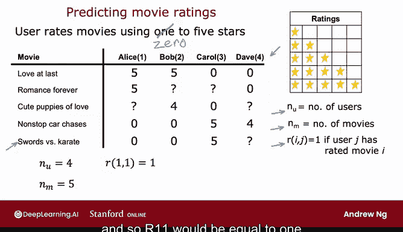

# 119：推荐系统构建 🎬

在本节课中，我们将学习推荐系统的基本概念和构建方法。推荐系统在商业应用中具有巨大价值，能够根据用户的历史行为预测其可能喜欢的物品，从而提供个性化推荐。

---

## 推荐系统简介

推荐系统广泛应用于电商、流媒体和外卖平台，通过分析用户行为预测其偏好，从而提升用户体验和商业效益。本节将以电影评分预测为例，介绍推荐系统的基本框架。

## 数据表示与符号定义

在构建推荐系统时，我们需要明确用户、物品及评分数据的表示方式。以下是常用的符号定义：

- **用户数量**：用 `NU` 表示，例如 `NU = 4` 表示有 4 位用户。
- **物品数量**：用 `NM` 表示，例如 `NM = 5` 表示有 5 部电影。
- **评分矩阵**：用 `Y` 表示，`Y[i][j]` 表示用户 `j` 对电影 `i` 的评分。
- **评分指示矩阵**：用 `R` 表示，`R[i][j] = 1` 表示用户 `j` 对电影 `i` 进行了评分，否则为 0。

例如，用户 Alice（用户 1）对电影 1 的评分为 5 星，对电影 3 未评分，因此 `Y[1][1] = 5`，`R[3][1] = 0`。

## 推荐系统的目标

推荐系统的核心目标是预测用户对未评分物品的评分，从而推荐高分物品。例如，若预测用户对某部电影的评分为 5 星，系统可将该电影推荐给用户。

## 算法构建思路

在下一节中，我们将基于电影特征（如浪漫或动作类型）开发推荐算法。假设我们已知这些特征，可以构建模型预测用户评分。后续课程将探讨在没有特征的情况下如何实现推荐。

---

本节课中，我们一起学习了推荐系统的基本概念、数据表示方法以及系统目标。下一节将开始构建基于特征的推荐算法。