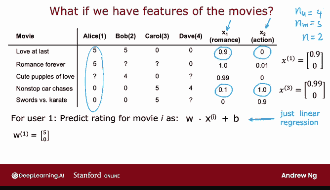
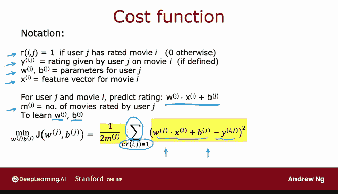
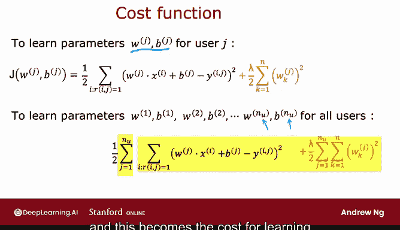

# 120：使用物品特征构建推荐系统 🎬

在本节课中，我们将学习如何利用物品（例如电影）的特征来构建一个推荐系统。我们将看到，当每个物品都有描述其特征的数值时，如何为不同用户训练模型来预测他们的评分。

---

## 数据集与特征介绍

上一节我们讨论了推荐系统的基本概念。本节中，我们来看看一个具体的例子。假设我们有一个包含四位用户和五部电影的数据集，用户对部分电影进行了评分。

现在，我们额外获得了每部电影的两个特征：
*   **x₁**：表示电影的“浪漫”程度。
*   **x₂**：表示电影的“动作”程度。

例如：
*   电影《Love at last》非常浪漫，所以特征为 `[0.9, 0]`。
*   电影《Nonstop car chases》有一点浪漫，但动作场面非常多，所以特征为 `[0.1, 1.0]`。

我们用以下符号表示：
*   `n_u` = 用户数量（此处为4）
*   `n` = 电影数量（此处为5）
*   `n` = 特征数量（此处为2）

因此，电影 `i` 的特征向量可以表示为 `x⁽ⁱ⁾`。例如，电影3（《Cute puppies of love》）的特征是 `x⁽³⁾ = [0.99, 0]`。

---

## 为单个用户建立预测模型

让我们以第一位用户 Alice 为例，看看如何预测她对电影的评分。

我们可以为 Alice 建立一个类似于线性回归的模型。预测她对电影 `i` 的评分公式为：

**`预测评分 = w·x⁽ⁱ⁾ + b`**

其中：
*   `w` 是权重参数向量（与特征维度相同）。
*   `b` 是偏置参数。
*   `x⁽ⁱ⁾` 是电影 `i` 的特征向量。

例如，如果我们为 Alice 学习到的参数是 `w⁽¹⁾ = [5, 0]` 和 `b⁽¹⁾ = 0`，那么她对电影3的预测评分为：
`w⁽¹⁾·x⁽³⁾ + b⁽¹⁾ = 5 * 0.99 + 0 * 0 = 4.95`

这个预测是合理的，因为 Alice 之前给浪漫电影评分很高，而给动作电影评分很低。《Cute puppies of love》是一部浪漫电影，预测高分符合她的偏好。

由于我们有多个用户，每个用户都有自己独特的偏好，因此我们需要为**每个用户 `j`** 学习一套独立的参数 `w⁽ʲ⁾` 和 `b⁽ʲ⁾`。

**通用的预测模型**对于用户 `j` 和电影 `i` 可以写为：

**`预测评分 = w⁽ʲ⁾·x⁽ⁱ⁾ + b⁽ʲ⁾`**

这就像为数据集中的每个用户分别训练一个线性回归模型。

---

## 定义成本函数

为了学习参数 `w⁽ʲ⁾` 和 `b⁽ʲ⁾`，我们需要定义一个成本函数。首先，回顾一下符号：
*   `r(i, j)` = 1 如果用户 `j` 对电影 `i` 评过分，否则为 0。
*   `y⁽ⁱʲ⁾` = 用户 `j` 给电影 `i` 的实际评分。
*   `m⁽ʲ⁾` = 用户 `j` 评过分的电影数量。

我们专注于单个用户 `j`。其成本函数基于**均方误差**，并只对用户实际评过分的电影求和：

**`J(w⁽ʲ⁾, b⁽ʲ⁾) = (1 / (2m⁽ʲ⁾)) * Σ [ (w⁽ʲ⁾·x⁽ⁱ⁾ + b⁽ʲ⁾ - y⁽ⁱʲ⁾)² ] + (λ / (2m⁽ʲ⁾)) * Σ [ (w_k⁽ʲ⁾)² ]`**

以下是该公式的组成部分说明：

*   **误差项**：`(w⁽ʲ⁾·x⁽ⁱ⁾ + b⁽ʲ⁾ - y⁽ⁱʲ⁾)²` 计算预测评分与实际评分的平方差。
*   **求和范围**：`Σ` 只对满足 `r(i, j)=1` 的电影 `i` 进行，即用户 `j` 评过分的电影。
*   **归一化**：`1/(2m⁽ʲ⁾)` 是均值归一化项，`m⁽ʲ⁾` 是用户评分的电影数。
*   **正则化项**：`(λ/(2m⁽ʲ⁾)) * Σ (w_k⁽ʲ⁾)²` 用于防止过拟合，其中 `λ` 是正则化参数。

通过最小化这个成本函数 `J(w⁽ʲ⁾, b⁽ʲ⁾)`，我们可以得到用户 `j` 的一组良好参数 `w⁽ʲ⁾` 和 `b⁽ʲ⁾`。

> 注：在推荐系统中，成本函数中的 `m⁽ʲ⁾` 是一个常数，即使去掉它，优化得到的参数 `w` 和 `b` 也是相同的。因此，为了简便，有时会省略它。

---

## 为所有用户学习参数

上一节我们定义了单个用户的成本函数。现在，我们将其扩展到所有用户。

为了学习所有用户的参数（`w⁽¹⁾, b⁽¹⁾` 到 `w⁽ⁿᵘ⁾, b⁽ⁿᵘ⁾`），我们需要最小化所有用户成本函数的总和：

**`J = Σ [ J(w⁽ʲ⁾, b⁽ʲ⁾) ]` （对 j 从 1 到 n_u 求和）**

这个总成本函数 `J` 就是我们的最终目标函数。使用梯度下降或其他优化算法来最小化 `J`，我们就可以同时为所有用户学到一组良好的参数，用于预测他们对未评分电影的评分。

这个方法本质上是为每个用户训练一个独立的线性回归模型，所有模型的训练通过一个总成本函数联合进行。

---

## 总结与展望

本节课中我们一起学习了如何利用物品的特征来构建推荐系统。核心步骤包括：
1.  **定义模型**：为每个用户 `j` 使用线性模型 `w⁽ʲ⁾·x⁽ⁱ⁾ + b⁽ʲ⁾` 来预测其对物品 `i` 的评分。
2.  **构建成本函数**：基于用户已有的评分，定义包含正则化项的均方误差成本函数。
3.  **联合优化**：通过最小化所有用户成本函数的总和，来学习所有用户的参数。

这个方法的**前提**是我们需要事先知道每个物品的特征（`x⁽ⁱ⁾`）。然而，在实际应用中，我们可能无法获得足够详细或有效的特征。

在下一节课中，我们将探讨这个算法的改进版本。即使没有预先定义好的物品特征，我们也能通过学习来自动发掘这些特征，从而构建出强大的推荐系统。让我们继续学习。