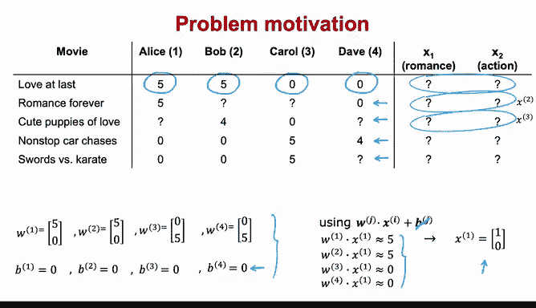
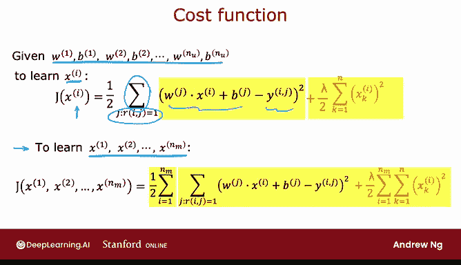
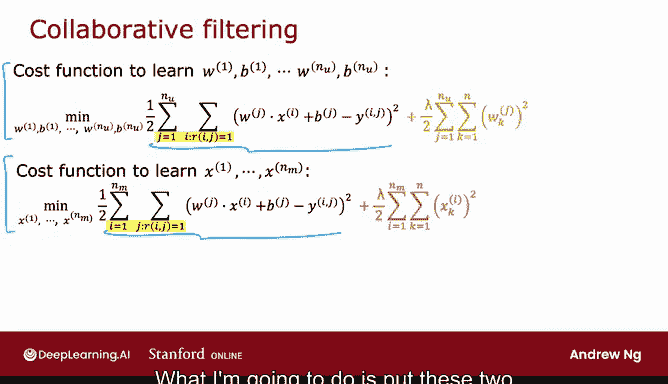
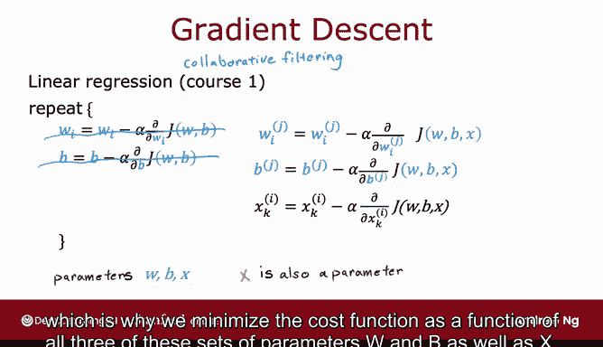
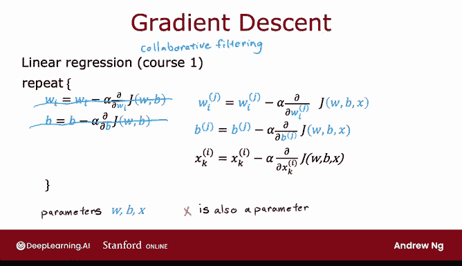

# 121：协同过滤算法 🎬

在本节课中，我们将要学习协同过滤算法。这是一种在缺乏电影特征数据时，如何从用户评分中学习出这些特征，并同时优化用户参数和电影特征的方法。

## 概述

上一节我们介绍了如何利用已知的电影特征（如浪漫程度和动作程度）来预测用户评分。本节中我们来看看，如果这些特征未知，我们如何从用户评分数据中学习出这些特征，并构建一个完整的推荐模型。

## 从参数推导特征

假设我们有以下用户评分数据，但电影的特征 `x1` 和 `x2` 是未知的（用问号表示）。

为了说明，我们假设已经通过某种方式学习了四个用户的参数：
*   用户1：`w1 = [5, 0]`, `b1 = 0`
*   用户2：`w2 = [5, 0]`, `b2 = 0`
*   用户3：`w3 = [0, 5]`, `b3 = 0`
*   用户4：`w4 = [0, 5]`, `b4 = 0`

预测用户 `j` 对电影 `i` 的评分公式为：`w_j · x_i + b_j`。为简化，本例中所有 `b` 均为0。

现在，我们尝试为电影1猜测一个合理的特征向量 `x1`。根据四位用户的评分：
*   用户1（Alice）评分为5：`w1 · x1 ≈ 5`
*   用户2（Bob）评分为5：`w2 · x1 ≈ 5`
*   用户3评分为0：`w3 · x1 ≈ 0`
*   用户4评分为0：`w4 · x1 ≈ 0`

一个可能的选择是令 `x1 = [1, 0]`。这样计算可得：
*   `w1 · x1 = 5*1 + 0*0 = 5`
*   `w2 · x2 = 5*1 + 0*0 = 5`
*   `w3 · x1 = 0*1 + 5*0 = 0`
*   `w4 · x1 = 0*1 + 5*0 = 0`

这个结果与观测到的评分一致。同理，我们可以利用已知的用户参数，为其他电影推导出特征向量 `x2`, `x3` 等，使得模型的预测尽可能接近用户的真实评分。

协同过滤之所以可行，是因为我们有多个用户对同一部电影进行了评分。这种“协作”使得我们能够推断出电影的特征。在典型的线性回归中，如果只有一个用户的数据，是无法凭空学习出特征的。

## 学习电影特征的成本函数

给定所有 `nu` 个用户的参数 `w1...wnu`, `b1...bnu`，如果我们想学习某部特定电影 `i` 的特征 `xi`，可以使用以下成本函数：

我们希望通过最小化这个成本函数来选择特征 `xi`，使得对所有给电影 `i` 评过分的用户 `j`，模型预测的评分 `w_j · x_i + b_j` 与实际评分 `y(i,j)` 的平方差最小。`r(i,j)=1` 表示用户 `j` 对电影 `i` 有评分。

最后，我们可以加入正则化项 `(λ/2) * Σ (x_ik)²` 以防止过拟合。

要学习数据集中所有 `nm` 部电影的特征 `x1...xnm`，只需将上述针对单部电影的成本函数对所有电影求和：

`J = Σ (针对电影 i 的成本函数)`

通过梯度下降或其他优化算法最小化这个总成本函数，我们就能为所有电影学习到一组良好的特征。这在机器学习中是很了不起的，因为特征通常需要外部提供，而此算法可以自动从数据中学习。

## 完整的协同过滤算法

到目前为止，我们假设用户参数 `w` 和 `b` 是已知的。现在，我们将上一节学习 `w` 和 `b` 的算法，与本节学习 `x` 的算法结合起来。

学习特征的成本函数（上图）与学习参数的成本函数包含相同的核心误差项。它们都是对所有存在评分的用户-电影对 `(i, j)` 求和。

因此，我们可以将两者合并，形成一个用于同时学习 `w`, `b` 和 `x` 的总体成本函数：

`J(w, b, x) = (1/2) * Σ (w_j · x_i + b_j - y(i,j))² + (λ/2) * Σ (w_jk)² + (λ/2) * Σ (x_ik)²`
（求和范围：所有 `r(i,j)=1` 的 `(i, j)` 对）

为了最小化这个关于 `w`, `b` 和 `x` 的成本函数，我们可以使用梯度下降法。

以下是梯度下降的更新步骤（为简洁，下标表示略有不正式）：
1.  更新用户参数 `w` 和 `b`：
    `w_j := w_j - α * (∂J/∂w_j)`
    `b_j := b_j - α * (∂J/∂b_j)`
2.  更新电影特征 `x`：
    `x_i := x_i - α * (∂J/∂x_i)`

通过同时更新所有这些参数，算法能够找到较好的 `w`, `b` 和 `x` 的值。在这个模型中，`w`, `b` 和 `x` 都是需要学习的参数。

这个算法被称为**协同过滤**。其名称源于“协作”的理念：多个用户对同一部电影的评分行为，共同提供了关于这部电影特性的信息，使得算法能够推断出合适的电影特征。进而，这些特征可以用来预测其他尚未对该电影评分的用户未来的可能评分。

## 从星级评分到二元标签

到目前为止，我们的问题设定都使用了1到5星（或0到5星）的电影评分。推荐系统另一个非常常见的应用场景是处理二元标签，例如用户是否“喜欢”、“收藏”或与某个项目发生了交互。

在下一节视频中，我们将看看如何将目前看到的模型推广到二元标签的情况。

## 总结

本节课中我们一起学习了协同过滤算法的核心思想。我们从如何利用已知用户参数推导电影特征入手，定义了学习特征的成本函数。接着，我们将学习用户参数和学习电影特征的过程统一到一个整体的成本函数中，并通过梯度下降法同时优化所有参数（`w`, `b`, `x`）。这种方法的关键在于利用多个用户的评分数据“协同”地推断出项目和用户的潜在特征，从而实现对未知评分的预测。最后，我们了解到该算法可以进一步推广到处理二元交互数据。