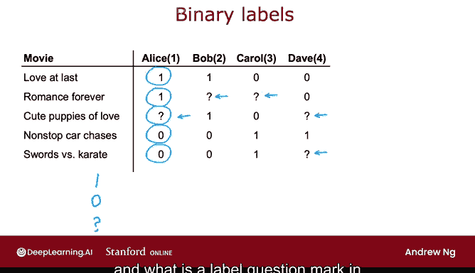
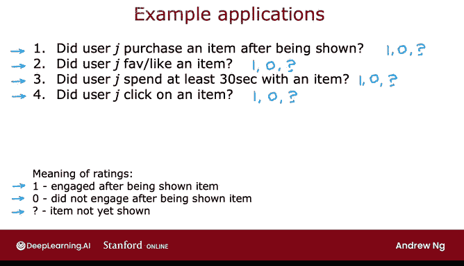
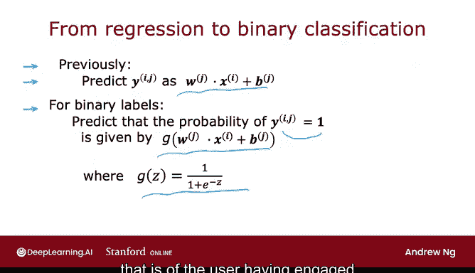
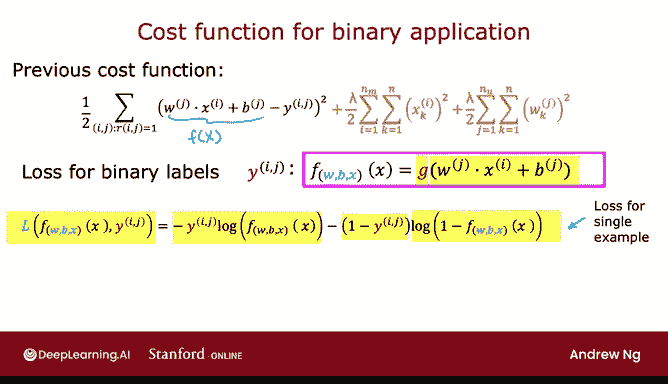

# 122：17_02_04 二元标签（收藏、喜欢与点击）🎯

在本节课中，我们将学习推荐系统或协同过滤算法的一个重要应用场景：处理二元标签数据。我们将探讨如何将之前学习的算法推广到用户仅表达“喜欢”或“不喜欢”的场景，而非给出1到5星的评分。

---

## 从线性回归到二元标签预测 🔄

上一节我们介绍了基于评分的协同过滤算法。本节中，我们来看看当数据标签变为二元（例如“喜欢”/“不喜欢”）时，算法应如何调整。这个过程与我们之前在课程中从线性回归推广到逻辑回归、从预测数值到预测二元标签的思路非常相似。

以下是一个带有二元标签的协同过滤数据集示例。标签“1”表示用户喜欢或与某部电影产生了互动。

例如，标签1可能意味着爱丽丝完整观看了《Love at Last》和《Romance Forever》，但在播放了几分钟《Nonstop Car Chases》后决定停止观看并退出。或者，这可能意味着她在应用上明确点击了“喜欢”或“收藏”来表示她喜欢这些电影，但在查看了《Nonstop Car Chases》和《Swords vs. Karate》后没有点击喜欢。问号通常表示用户尚未观看该项目，因此他们无法决定是否喜欢它。

核心问题是：我们如何将上一视频中看到的协同过滤算法应用于此数据集？通过预测爱丽丝、鲍勃、卡罗尔和戴夫有多大可能喜欢他们尚未评分的项目，我们可以决定应该向他们推荐这些项目的程度。

---

## 二元标签的定义与应用场景 📊

在二元标签的协同过滤中，定义标签1、0和问号的方式有很多种。以下是几个常见的例子。

在购物网站上，标签可以表示用户J在接触到（被展示）某商品后是否选择购买它。

*   **1** 表示用户购买了该商品。
*   **0** 表示用户没有购买该商品。
*   **问号** 表示用户甚至没有被展示过该商品。

在社交媒体环境中，标签1或0可以表示用户在看到内容后是否收藏或点赞了它，问号则表示他们尚未看到该内容。

许多网站不会要求用户进行显式评分，而是利用用户行为来推断用户是否喜欢某内容。例如：
*   如果用户在某内容上花费了至少30秒，则分配标签 **1**，因为用户觉得该内容有吸引力。
*   如果用户被展示了某内容但花费时间不足30秒，则分配标签 **0**。
*   如果用户尚未被展示该内容，则分配 **问号**。

另一种根据用户行为隐式生成评分的方法是观察用户是否点击了某项目。这在在线广告中很常见：
*   如果用户看到了广告并点击了它，则分配标签 **1**。
*   如果用户看到了但没有点击，则分配标签 **0**。
*   **问号** 则表示用户根本还没有看到过该广告。

通常，这些二元标签具有以下大致含义：
*   **标签1**：用户在看到项目后产生了互动。互动可以指点击、花费30秒以上、明确收藏/点赞或购买。
*   **标签0**：用户在看到项目后没有产生互动。
*   **问号**：项目尚未展示给用户。

---

## 算法推广：从线性到逻辑模型 🧠

给定这些二元标签，我们来看看如何将之前几节中类似线性回归的算法推广到预测这些二元输出。

之前，我们使用公式 **`y(i,j) = w(j)·x(i) + b(j)`** 来预测评分 `y(i,j)`，这很像线性回归模型。

对于二元标签，我们将预测 `y(i,j)` 等于1的概率，公式不再是 `w(j)·x(i) + b(j)`，而是 **`g(w(j)·x(i) + b(j))`**。其中，`g(z)` 是逻辑函数：**`g(z) = 1 / (1 + e^(-z))`**。这就像我们在逻辑回归中看到的那样。

我们实际上是将一个类似线性回归的模型，转变为一个类似逻辑回归的模型，用于预测用户喜欢或与项目互动的概率。

为了构建这个算法，我们还需要将成本函数从平方误差成本函数修改为更适合二元标签、类似逻辑回归模型的成本函数。

---

## 修改成本函数 ⚖️

之前，我们使用的成本函数中，`f(x)` 项扮演着算法预测值的角色。

现在，对于二元标签 `y(i,j)`（取值为1、0或问号），预测值 `f(x)` 从 `w(j)·x(i) + b(j)` 变成了 **`g(w(j)·x(i) + b(j))`**，其中 `g` 是逻辑函数。

类似于我们推导逻辑回归时，我们为单个样本写出了以下损失函数：如果算法预测为 `f(x)`，真实标签为 `y`，则损失为：
**`L(f(x), y) = -y * log(f(x)) - (1 - y) * log(1 - f(x))`**
这有时也被称为二元交叉熵成本函数，也是我们训练神经网络处理二元分类问题时使用的标准成本函数。

为了使其适应协同过滤场景，我将写出新的成本函数，它是所有参数 `W`、`B` 以及所有用户/项目特征参数 `X` 的函数。

现在，我们需要对所有满足 `r(i,j)=1` 的 `(i, j)` 对求和（这与顶部的求和类似）。并且，我们不再使用平方误差成本函数，而是使用上面定义的损失函数 `L(f(x), y(i,j))`。其中，`f(x)` 是我对 **`g(w(j)·x(i) + b(j))`** 的简写。

将这个代入，就得到了可用于二元标签协同过滤的成本函数。

---

## 总结与展望 📝

本节课中，我们一起学习了如何将类似线性回归的协同过滤算法推广到处理二元标签。这极大地扩展了该算法所能解决的应用范围。

现在，尽管你已经了解了算法的核心结构和成本函数，但还有一些实现技巧可以使你的算法效果更好。在下一节中，我们将看看如何实现此算法的一些细节，以及一些能使算法运行得更快的小修改。让我们进入下一个视频。