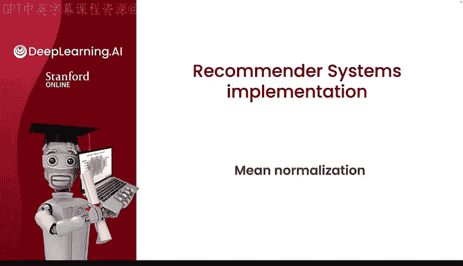
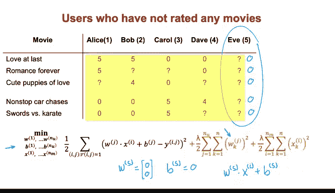
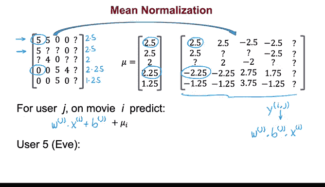

# 123：均值归一化 📊

在本节课中，我们将学习均值归一化（Mean Normalization）技术。这是一种在构建推荐系统时，用于预处理用户评分数据的方法。通过均值归一化，我们可以让协同过滤算法运行得更高效，并且在面对新用户（尚未对任何项目评分）时，能做出更合理的预测。

## 概述

在之前的线性回归课程中，我们已经了解到特征归一化可以帮助算法更快地运行。对于使用数字评分（如1到5星）的推荐系统，均值归一化同样重要。它通过调整评分数据，使其具有一致的均值，从而提升算法的效率和性能。

## 均值归一化的动机

假设我们有一个电影评分数据集，包含四位用户对五部电影的评分。现在，我们引入第五位用户 Eve，她尚未对任何电影评分。

如果我们直接在这个数据集上训练协同过滤算法，由于正则化项会促使参数变小，并且 Eve 的评分数据不参与成本函数计算，算法很可能会将 Eve 的参数 `W5` 和 `B5` 都学习为 0。

这意味着，算法会预测 Eve 对所有电影的评分都是 0 星。这显然不是一个有意义的预测，因为我们更希望新用户的初始预测能基于其他用户的平均评分，而不是一个固定的零值。

## 均值归一化的步骤

为了解释均值归一化，我们首先将所有评分（包括未知的）放入一个矩阵中。

以下是均值归一化的具体操作步骤：

1.  **计算每部电影的平均评分**：对于每一部电影，我们仅根据已评分的用户计算其平均分。
2.  **构建均值向量**：将所有电影的平均分收集到一个向量中，我们称之为 `mu`。
3.  **执行归一化**：从每一个原始评分中，减去对应电影的平均分 `mu[i]`。

经过上述步骤，我们得到一组新的 `Y_ij` 值。这些值将作为算法训练时使用的目标值。

## 预测时的调整

当我们使用学习到的参数 `w_j` 和 `b_j` 为用户 `j` 预测电影 `i` 的评分时，公式为：
`预测评分 = w_j · x_i + b_j`

但是，由于我们在训练前从原始评分中减去了均值 `mu[i]`，为了得到最终在原始评分尺度（如0-5星）上的预测值，我们必须将这个均值加回去：

`最终预测评分 = (w_j · x_i + b_j) + mu[i]`

## 对新用户的影响

现在，让我们看看这对新用户 Eve 意味着什么。由于 Eve 没有评分记录，算法很可能仍会学习到 `W5 = 0` 和 `B5 = 0`。

那么，对于电影1的预测将是：
`最终预测评分 = (0 · x_1 + 0) + mu[1] = mu[1] = 2.5`

这比预测所有电影为0星要合理得多。均值归一化的效果是，让新用户的初始预测值等于其他用户对该电影评分的平均值。

## 行归一化与列归一化

在上面的例子中，我们对矩阵的**行**（即每部电影）进行了归一化，使其均值为零。这主要解决了**新用户**的预测问题。

另一种方法是归一化矩阵的**列**（即每个用户），使其均值为零。这在处理**全新项目**（尚无任何评分）时可能有用。然而，在实践中，处理新用户的问题通常比处理新项目更为紧迫，因为一个新项目在获得足够评分前，可能根本不会被推荐给用户。因此，在本周的实践练习中，仅对行进行归一化通常就足够了。

## 总结

本节课我们一起学习了均值归一化技术。我们了解到，通过对评分数据进行均值归一化处理，不仅能使推荐算法运行得更快，更重要的是，它能显著提升算法在面对评分数据极少甚至没有评分的新用户时的预测合理性。这个实现细节将使你的推荐系统表现得更好。

在下一节视频中，我们将探讨如何亲自实现这一技术。