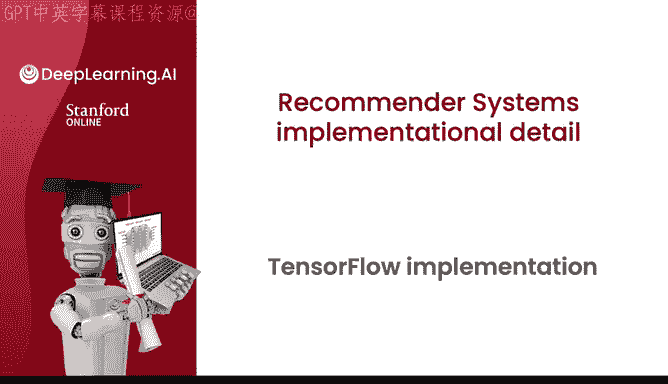
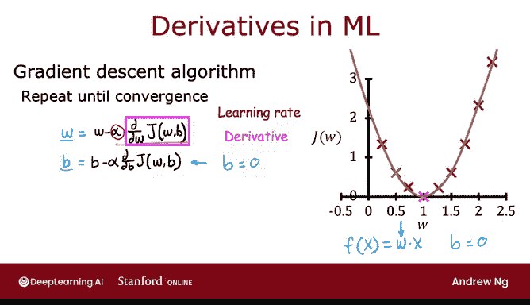
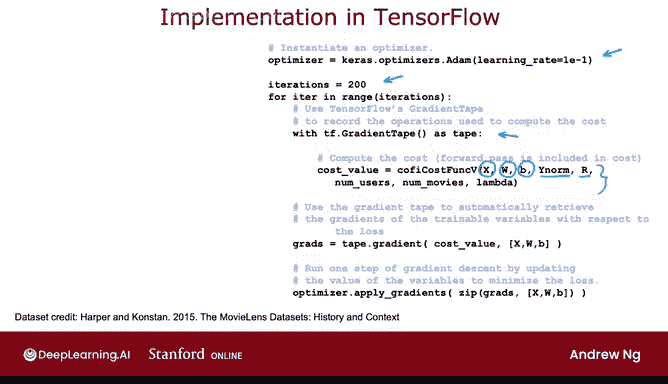

# 124：协同过滤的TensorFlow实现 🎬



在本节课中，我们将学习如何使用TensorFlow来实现协同过滤算法。我们将看到，TensorFlow不仅能用于构建神经网络，还能高效地实现其他类型的机器学习算法，例如协同过滤。其核心优势在于能够自动计算成本函数的导数，从而简化梯度下降等优化过程。

---

## 从线性回归到自动微分

上一节我们介绍了协同过滤的基本概念。本节中，我们来看看如何利用TensorFlow的自动微分功能来优化算法。

你或许习惯于将TensorFlow视为构建神经网络的工具，这确实是它的主要用途之一。然而，TensorFlow对于构建其他类型的学习算法，如协同过滤算法，也大有裨益。

我喜欢将TensorFlow用于此类任务的原因之一是：在许多应用中，为了实现梯度下降，你需要找到成本函数的导数。而TensorFlow可以自动为你计算出成本函数的导数。你只需实现成本函数本身，无需了解任何微积分知识或手动求导，仅用几行代码就能让TensorFlow计算出导数项，进而用于优化成本函数。

让我们看看这是如何运作的。你可能还记得课程1中的这张图，这正是我们讨论第一个线性回归示例时，优化参数 **W** 时所使用的图。当时我们设 **B=0**，因此模型预测为 **f(x) = w * x**。我们的目标是找到使成本函数 **J** 最小化的 **W** 值。

我们通过梯度下降更新来实现这一点，更新规则如下：



**w := w - α * (∂J/∂w)**

如果你也需要更新 **B**，你会使用类似的表达式。但若设 **b=0**，你只需忽略第二个更新项，并持续执行此梯度下降更新直到收敛。有时计算这个导数或偏导数项可能很困难，而TensorFlow正好可以在这方面提供帮助。

---

## 一个简单的TensorFlow示例

让我们通过一个简单的例子来理解。我将使用一个非常简单的成本函数：**J = (w*x - 1)²**。这里，**w*x** 是简化的 **f_w(x)**，而 **y** 等于1。这就是我们的成本函数。

如果我们有 **f(x) = w*x**，**y=1**（针对我们拥有的一个训练样本），并且我们不针对 **B** 进行优化，那么梯度下降算法将重复执行以下更新直到收敛：

**w := w - α * (∂J/∂w)**

事实证明，如果你实现了这里的成本函数 **J**，TensorFlow可以自动为你计算这个导数项，从而使梯度下降得以运行。

以下代码提供了一个高层次概述：

```python
w = tf.Variable(3.0)  # 初始化参数 w 为 3.0
x = 1.0
y = 1.0
alpha = 0.01
iterations = 30

for i in range(iterations):
    with tf.GradientTape() as tape:
        f_w = w * x
        cost_J = (f_w - y) ** 2
    # 自动计算导数
    [dJ_dw] = tape.gradient(cost_J, [w])
    # 更新参数 w
    w.assign_sub(alpha * dJ_dw)
```

在这段代码中：
*   `tf.Variable` 将参数 **w** 初始化为 3.0，并告知 TensorFlow **w** 是我们想要优化的参数。
*   我们设置 **x=1**, **y=1**，学习率 **α=0.01**，并运行30次梯度下降迭代。
*   `tf.GradientTape()` 是关键：它记录计算成本 **J** 所需的一系列操作，这是实现自动微分所必需的。
*   `tape.gradient(cost_J, [w])` 会自动计算成本 **J** 关于 **w** 的导数，我们称之为 **dJ_dw**。
*   最后，我们通过 `w.assign_sub(alpha * dJ_dw)` 执行更新。对TensorFlow变量需要使用特殊的赋值方法。

请注意，借助TensorFlow的梯度功能，你需要做的主要工作是告诉它如何计算成本函数 **J**，其余的语法会使TensorFlow自动为你计算出导数。

通过这个过程，TensorFlow将从 **w=3** 开始（如图中虚线所示斜率），执行梯度步骤更新 **w**，然后重复计算导数和更新 **w**，最终达到 **w=1** 的最优值。

这个流程让你无需自己计算导数项就能实现梯度下降。这是TensorFlow一个非常强大的功能，称为**自动微分**。其他一些机器学习包（如PyTorch）也支持自动微分。有时人们也称之为“autograd”（自动求导），技术上正确的术语是自动微分，而“autograd”实际上是一个特定软件包的名称。但有时人们提到“autograd”时，只是指代自动计算导数这一相同概念。

---

## 实现协同过滤算法

现在，让我们看看如何利用自动微分来实现协同过滤算法。

事实上，一旦你能自动计算导数，你就不局限于使用梯度下降，还可以使用更强大的优化算法，如**Adam优化器**。

为了在TensorFlow中实现协同过滤，你可以使用以下语法：

```python
# 指定优化器为Adam，并设置学习率
optimizer = keras.optimizers.Adam(learning_rate=1e-1)



for iter in range(200):
    # 使用梯度带记录计算成本的操作
    with tf.GradientTape() as tape:
        # 实现计算协同过滤成本函数 J 的代码
        # 成本函数 J 的输入参数包括 X, W, B, 归一化后的评分矩阵 Ynorm，
        # 评分指示矩阵 R，用户数 Nu，电影数 Nm，以及正则化参数 lambda
        cost_value = cofi_cost_func_v(X, W, b, Ynorm, R, Nu, Nm, lambda)
    # 自动计算成本函数关于 X, W, B 的梯度
    grads = tape.gradient(cost_value, [X, W, b])
    # 使用优化器应用计算出的梯度来更新参数
    optimizer.apply_gradients(zip(grads, [X, W, b]))
```

以下是关键步骤说明：
1.  首先，指定优化器为带有所设学习率的Adam优化器。
2.  然后，进行一定次数（例如200次）的迭代。
3.  和之前一样，使用 `tf.GradientTape() as tape`，并提供计算成本函数 **J** 值的代码。
4.  回想一下，在协同过滤中，成本函数 **J** 的输入参数包括 **X**, **W**, **B**，以及归一化的评分矩阵 **Ynorm** 和评分指示矩阵 **R**，还有用户数 **Nu**、电影数 **Nm** 以及正则化参数 **λ**。
5.  这段语法将使TensorFlow记录用于计算成本的运算序列。
6.  通过 `tape.gradient(...)` 请求，你将获得成本函数关于 **X**, **W**, **B** 的导数（梯度）。
7.  最后，使用我们之前指定的优化器（Adam优化器），配合刚刚计算出的梯度，通过 `apply_gradients` 函数来更新参数。Python中的 `zip` 函数只是将数字重新排列成适合 `apply_gradients` 函数的顺序。

如果你对协同过滤使用梯度下降，回想一下，成本函数 **J** 是 **W**, **B** 和 **X** 的函数。应用梯度下降时，你需要计算关于 **W** 的偏导数，然后如下更新 **W**，同样计算关于 **B** 的偏导数并更新 **B**，类似地更新特征 **X**，并重复此过程直到收敛。

但如前所述，有了TensorFlow和自动微分，你不仅可以使用标准的梯度下降，还可以使用像Adam优化器这样更强大的优化算法。

你在实践实验室中使用的数据集是一个真实的数据集，包含真实用户对真实电影的评分。这是MovieLens数据集，由Harper和Konstan提供。希望你享受在一个真实的电影和评分数据集上运行协同过滤算法，并亲眼看看它能得到的结果。

---

## 为何不使用标准神经网络流程？

如果你想知道为什么我们必须以这种方式实现，为什么不能使用密集层（Dense layer）然后 `model.compile` 和 `model.fit`？原因在于，协同过滤算法及其成本函数无法整齐地适配到TensorFlow的密集层或其他标准神经网络层类型中。这就是为什么我们必须以另一种方式实现：我们自己实现成本函数，但利用TensorFlow的自动微分工具（也称为AutoDiff），并使用TensorFlow实现的Adam优化算法，让它为我们完成优化成本函数的大部分工作。

如果你的模型是由一系列密集神经网络层或TensorFlow支持的其他类型层组成的，那么旧的 `model.compile`、`model.fit` 实现方法仍然有效。但即使不是这种情况，TensorFlow中的这些工具也能为你提供一种非常有效的方法来实现其他学习算法。

---

## 总结

本节课中，我们一起学习了如何使用TensorFlow实现协同过滤算法。核心要点包括：
1.  TensorFlow的**自动微分**功能可以自动计算成本函数的导数，极大简化了优化过程。
2.  通过 `tf.GradientTape()` 记录运算，并使用 `tape.gradient()` 获取梯度。
3.  我们可以利用更高级的优化器（如**Adam**）而不仅仅是基础梯度下降。
4.  协同过滤的成本函数结构特殊，因此需要直接实现成本函数并利用自动微分，而非套用标准的神经网络层构建流程。

希望你能享受在本周的实践实验室中进一步探索协同过滤练习。如果代码和语法看起来很多，请不要担心，确保你拥有成功完成该练习所需的一切。在下一个视频中，我们将继续讨论协同过滤的更多细节，特别是如何根据一部电影找到相关项目（即，与这部电影相似的其他电影有哪些）。让我们进入下一个视频。