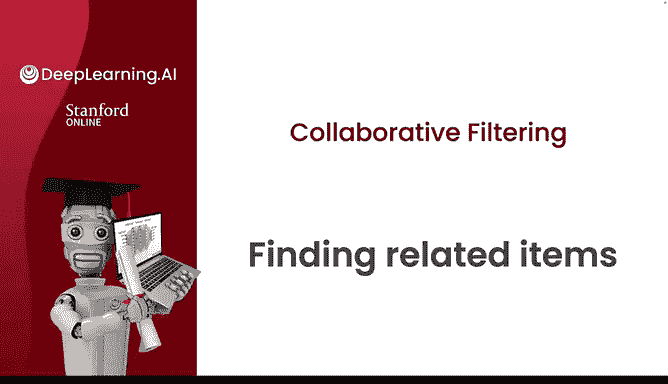
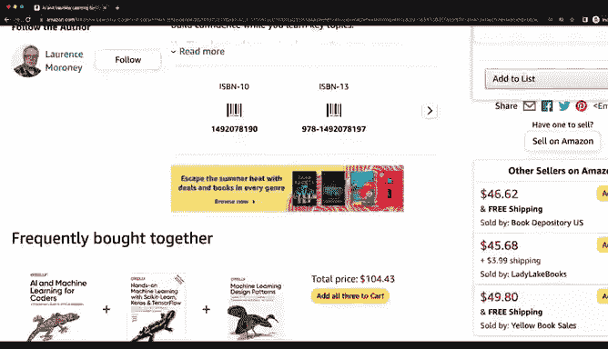
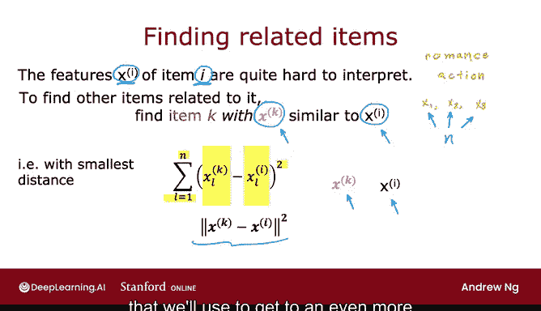
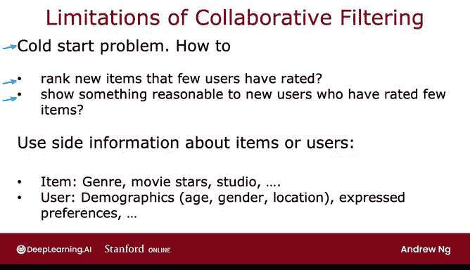

# 125：协同过滤与查找相关物品 🎯

在本节课中，我们将学习协同过滤算法的一个重要应用：如何为用户正在查看的特定物品（例如一本书或一部电影）查找并推荐其他相似的物品。我们还将探讨协同过滤算法的一些局限性，并简要介绍可以解决这些问题的“基于内容的过滤”算法。

---

## 查找相关物品 🔍

上一节我们介绍了协同过滤算法如何学习每个物品的特征向量。本节中我们来看看如何利用这些特征向量来查找相似的物品。

在协同过滤算法中，我们为每个物品 `i`（例如每部电影）学习到一个特征向量 **x_i**。在实践中，这些自动学习的特征（如 **x1, x2, x3**）可能难以单独解释，但它们作为一个整体，能够有效地表征该物品的特性。

给定物品 `i` 的特征向量 **x_i**，如果我们想找到与它相似的其他物品 `k`，我们可以计算其特征向量 **x_k** 与 **x_i** 之间的相似度。具体方法是计算两个向量之间的**平方欧氏距离**。

以下是衡量相似度的公式：

`distance = Σ (x_k[l] - x_i[l])^2`，其中 `l` 从 1 到 `n`（`n` 是特征数量）。

这个公式计算的是向量 **x_k** 和 **x_i** 之间的平方距离。在数学上，这个距离有时也写作 `||x_k - x_i||^2`。

实际操作中，我们不会只找一个距离最小的物品，而是：
以下是查找相关物品的步骤：
1.  对于目标物品 `i`，获取其特征向量 **x_i**。
2.  计算它与系统中所有其他物品特征向量 **x_k** 的距离。
3.  选择距离最小的 5 个或 10 个物品。
4.  这些物品就是与物品 `i` 最相关的推荐项。

因为特征向量 **x_i** 蕴含了物品 `i` 的本质信息，所以拥有相似特征向量的其他物品 **x_k**，自然与物品 `i** 高度相似。这个查找相关物品的思路，也将是我们后续构建更强大推荐系统的一个基础模块。

---

## 协同过滤的局限性 ⚠️

在介绍了如何利用协同过滤查找相关物品后，我们也需要了解该算法存在的一些不足。认识这些局限性有助于我们理解为何需要其他更先进的算法。

协同过滤算法依赖于用户对物品的评分数据。它的一个主要弱点是处理**冷启动问题**的能力不强。
以下是冷启动问题的两个典型场景：
*   **新物品问题**：当目录中新增了一个物品（例如一部刚上映的电影），几乎没有用户对它进行过评分，算法就很难对该物品进行有效的排名和推荐。
*   **新用户问题**：对于一个新用户，如果他只对极少数物品进行了评分，系统也很难准确地为他推荐可能感兴趣的内容。

我们在之前的视频中看到，均值归一化可以在一定程度上缓解这个问题，但或许还有更好的方法。

协同过滤的第二个局限性是，它无法自然地利用关于物品或用户的**附加信息（Side Information）**。
以下是几个附加信息的例子：
*   **关于物品的信息**：对于电影，你可能知道它的类型、主演、制片公司、预算等。
*   **关于用户的信息**：你可能了解用户的人口统计学特征（如年龄、性别、地理位置）、他们明确表达的偏好，甚至可以从他们的IP地址、使用的设备（移动端/桌面端）或网络浏览器中推断出一些线索。例如，使用不同浏览器（Chrome, Firefox, Safari, Edge）的用户行为模式可能存在差异，这些信息都能为预测用户喜好提供线索。

因此，尽管协同过滤是一套非常强大的算法，但它也存在上述局限。

---

## 总结与展望 🚀

本节课中，我们一起学习了如何利用协同过滤算法学习到的物品特征向量来查找和推荐相关物品，其核心是通过计算特征向量间的平方欧氏距离来度量相似性。同时，我们也探讨了协同过滤在应对冷启动问题和利用附加信息方面的局限性。

在下一节视频中，我们将开始发展**基于内容的过滤算法**。这种算法能够有效地利用我们刚才提到的各种附加信息，从而解决协同过滤的许多不足。基于内容的过滤是当今许多商业应用中使用的先进技术，让我们一起去看看它是如何工作的。