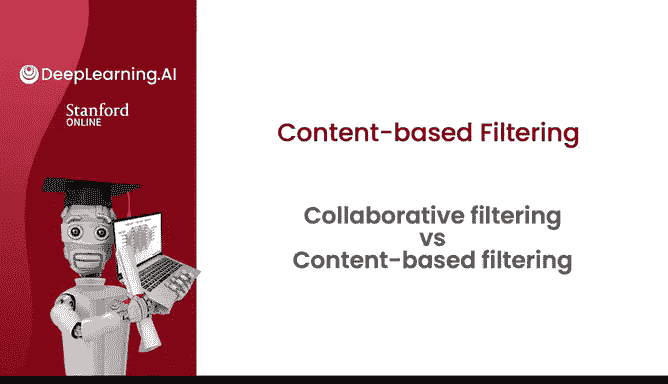
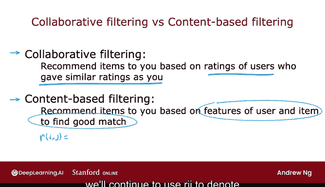
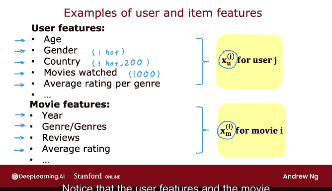
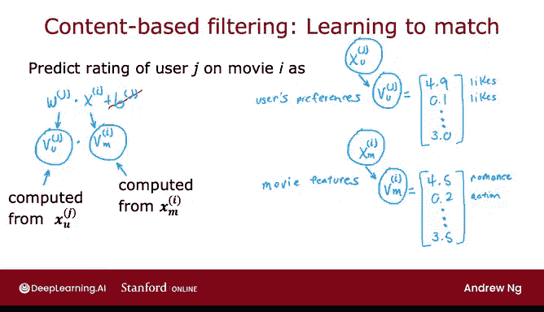

# 126：协同过滤与基于内容的过滤对比 🎬

在本节课中，我们将开始学习第二种推荐系统算法——基于内容的过滤算法。首先，我们将对比之前讨论的协同过滤方法与这种新的基于内容过滤方法。

## 协同过滤与基于内容过滤的对比

上一节我们介绍了协同过滤的基本思想。本节中，我们来看看基于内容的过滤采取了何种不同的方法。

协同过滤的一般方法是：根据与你评分相似的其他用户的评分，向你推荐物品。算法利用用户对物品的评分数据，来为你推荐新物品。

相比之下，基于内容的过滤采用了一种不同的方法来决定向你推荐什么。基于内容的过滤算法会根据用户特征和物品特征来寻找良好匹配，从而向你推荐物品。

换句话说，它需要拥有每个用户的一些特征，以及每个物品的一些特征，并利用这些特征来尝试决定哪些物品和用户可能彼此匹配良好。

## 基于内容过滤的数据表示

在基于内容的过滤算法中，我们仍然拥有用户对某些物品评分的数据。因此，我们将继续使用 `R(i, j)` 来表示用户 `j` 是否对物品 `i` 进行了评分，并继续使用 `y(i, j)` 来表示用户 `j` 对物品 `i` 的评分（如果已定义）。

但基于内容过滤的关键在于，我们将能够充分利用用户和物品的特征，从而可能找到比纯协同过滤方法更好的匹配。

## 电影推荐中的特征示例

以下是电影推荐中可能使用的一些特征示例。

**用户特征示例：**
*   你可能知道用户的年龄。
*   你可能知道用户的性别。这可以是一个独热编码特征，类似于我们在讨论决策树时看到的情况，根据用户自我认同的性别是男性、女性或未知等，可以有多个值。
*   你可能知道用户的国家。如果世界上大约有200个国家，那么这将是一个具有大约200个可能值的独热编码特征。
*   你还可以查看用户的过去行为来构建特征向量。例如，如果你查看目录中的前1000部电影，你可能会构建1000个特征，这些特征告诉你用户过去观看过这1000部最受欢迎电影中的哪些。
*   实际上，你也可以利用用户可能已经给出的评分来构建新特征。事实证明，如果你有一组电影，并且你知道每部电影属于哪种类型，那么用户对每种类型电影的平均评分（例如，用户评分的所有浪漫电影的平均评分，用户评分的所有动作电影的平均评分，等等）也可以成为描述用户的强大特征。这个特征的一个有趣之处在于，它实际上依赖于用户给出的评分，但这完全没有问题。构建依赖于用户评分的特征向量是完全可行的描述该用户的方法。

基于上述特征，你可以为每个用户 `j` 构建一个特征向量 `x_u^(j)`（`u` 代表用户，上标 `j` 表示第 `j` 个用户）。

**电影特征示例：**
*   同样，你也可以为每部电影或每个物品构建一组特征，例如电影的年份、电影的类型（一种或多种）。
*   如果已知电影的影评，你可以构建一个或多个特征来捕捉影评人对电影的评价。
*   或者，再次地，你实际上可以利用用户对电影的评分来构建一个特征，例如这部电影的平均评分。这个特征再次依赖于用户给出的评分，但这同样没有问题。你可以为给定电影构建一个依赖于该电影所获评分的特征，例如电影的平均评分。
*   如果你愿意，还可以有按国家或按用户人口统计特征划分的平均评分等，以构建其他类型的电影特征。

基于此，对于每部电影 `i`，你可以构建一个特征向量，我将其表示为 `x_m^(i)`（`m` 代表电影，上标 `i` 表示第 `i` 部电影）。

## 基于内容过滤的算法目标

给定这样的特征，任务是尝试判断给定的电影 `i` 是否会是用户 `j` 的良好匹配。请注意，用户特征和电影特征在大小上可能非常不同。例如，用户特征可能是1500个数字，而电影特征可能只有50个数字，这也没关系。

在基于内容的过滤中，我们将开发一种学习匹配用户和电影的算法。之前，我们通过 `w(j)·x(i) + b(j)` 来预测用户 `j` 对电影 `i` 的评分。

为了开发基于内容的过滤，我将去掉 `b(j)`。事实证明，这完全不会损害基于内容过滤的性能。此外，我不再为用户 `j` 使用 `w(j)`，为电影 `i` 使用 `x(i)`，而是用 `v_u^(j)` 替换这个表示法（这里的 `v` 代表向量，它将是为用户 `j` 计算的一组数字，下标 `u` 代表用户），并用 `v_m^(i)` 替换 `x(i)`（下标 `m` 代表电影，上标 `i` 表示第 `i` 部电影）。

因此，`v_u^(j)` 是一个根据用户 `j` 的特征计算出的向量（一组数字），`v_m^(i)` 是根据上一张幻灯片中看到的电影 `i` 的特征计算出的一组数字。如果我们能够为这些向量 `v_u^(j)` 和 `v_m^(i)` 找到合适的选择，那么希望这两个向量之间的点积将成为用户 `j` 给电影 `i` 评分的一个良好预测。

## 向量表示的直观理解

为了说明学习算法可能得出什么，假设 `v_u`（即用户向量）最终捕获了用户的偏好，例如 `[4.9, 0.1, ...]` 这样的数字列表，其中第一个数字表示他们有多喜欢浪漫电影，第二个数字表示他们有多喜欢动作电影，依此类推。而 `v_m`（电影向量）是 `[4.5, 0.2, ...]` 等，这些数字捕获了这部电影在多大程度上是浪漫电影，在多大程度上是动作电影等。

那么，点积（将这些列表中的数字逐元素相乘然后求和）有望给出这个特定用户有多喜欢这部特定电影的感觉。

## 核心挑战与总结

因此，挑战在于：给定用户 `j` 的特征 `x_u^(j)`，我们如何计算这个简洁或紧凑地表示用户偏好的向量 `v_u^(j)`？类似地，给定电影 `i` 的特征，我们如何计算 `v_m^(i)`？请注意，虽然 `x_u` 和 `x_m` 的大小可能不同（一个可能是很长的数字列表，另一个可能短得多），但这里的 `v` 必须具有相同的大小，因为如果你想计算 `v_u` 和 `v_m` 之间的点积，那么两者必须具有相同的维度，例如可能都是32个数字。

**总结一下：**
*   在协同过滤中，我们拥有许多用户对不同物品的评分。
*   相比之下，在基于内容的过滤中，我们拥有用户特征和物品特征，以找到一种方法来发现用户和物品之间的良好匹配。
*   我们将通过为用户计算向量 `v_u`，为电影（物品）计算向量 `v_m`，然后取它们之间的点积来尝试找到良好匹配。

那么，我们如何计算 `v_u` 和 `v_m` 呢？让我们在下一个视频中探讨这个问题。