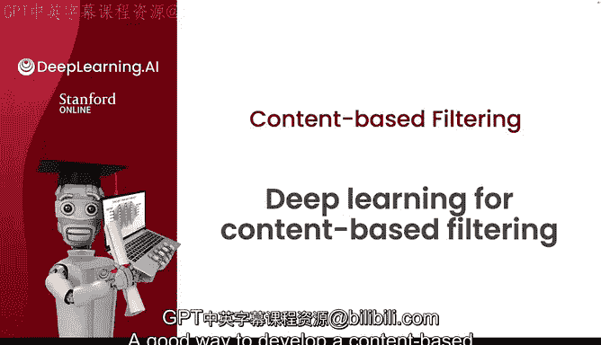
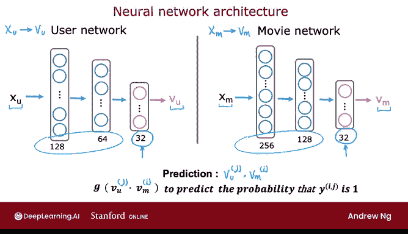
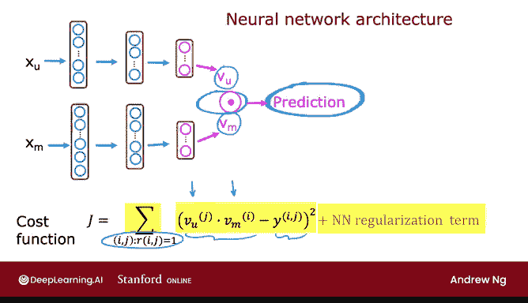
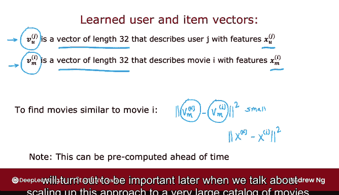

# 127：基于内容过滤的深度学习 🧠

在本节课中，我们将学习如何利用深度学习技术来构建一个基于内容的过滤算法。我们将了解如何设计用户网络和电影网络，如何训练这些网络，以及如何利用它们进行预测和寻找相似项目。

---

## 概述

基于内容的过滤算法通过分析用户和项目的特征来进行推荐。本节课程将介绍一种使用深度学习实现该算法的方法，这是目前许多重要商业推荐系统构建的基础。

---

## 用户与电影的特征向量

回忆一下我们的方法：给定一个描述用户的特征向量（如年龄、性别、国家等），我们需要计算一个用户向量 **VU**。同样，给定一个描述电影的特征向量（如发行年份、电影风格等），我们需要计算一个电影向量 **VM**。

---

## 构建神经网络

为了计算上述向量，我们将使用神经网络。第一个神经网络被称为**用户网络**。

以下是用户网络的一个示例：它以用户特征列表 **XU**（如年龄、性别、国家等）作为输入。然后，通过几层（例如密集神经网络层），它将输出描述用户的向量 **VU**。

请注意，在这个神经网络中，输出层有32个单元，因此 **VU** 实际上是一个包含32个数字的列表。与之前使用的大多数神经网络不同，其最后一层不是只有一个单元，而是有32个单元。

类似地，为了计算电影的 **VM**，我们可以构建一个**电影网络**。该网络以电影特征作为输入，通过神经网络的几层处理，最终输出描述电影的向量 **VM**。

---

## 进行预测

最终，我们将预测该用户对这部电影的评分，公式为：

**预测评分 = VU · VM**

用户网络和电影网络在理论上可以拥有不同数量的隐藏层和每层不同数量的单元。只有输出层需要具有相同的大小或维度。

在之前的描述中，我们预测的是1到5星或0到5星的电影评分。如果我们处理的是二元标签（例如，用户是否喜欢或收藏了某个项目），你也可以修改此算法，将输出从 **VU · VM** 改为应用 **sigmoid** 函数，并用它来预测 **Y(IJ) = 1** 的概率。

为了明确表示，我们也可以在这里添加上标 **I** 和 **J**，以强调这是用户 **J** 对电影 **I** 的预测。

---

## 统一的网络架构

虽然我将用户网络和电影网络画成了两个独立的神经网络，但实际上我们可以将它们合并到一个单一的图表中，就像一个单一的神经网络。

图表的上半部分是用户网络，它输入 **XU** 并最终计算出 **VU**。图表的下半部分是电影网络，它输入 **XM** 并最终计算出 **VM**。然后这两个向量进行点积运算（图中的点代表点积），从而得到我们的预测。

---

## 训练模型

这个模型有很多参数，神经网络的每一层都有一套常规的参数。那么，如何训练用户网络和电影网络的所有参数呢？

我们将构建一个成本函数 **J**，它与你在协同过滤中看到的成本函数非常相似。假设你拥有一些用户对某些电影的评分数据。

成本函数 **J** 的公式如下：

**J = Σ (VU(J) · VM(I) - Y(IJ))²**

我们将对所有拥有标签（即 **Y(IJ)** 有值）的用户-电影对 **(I, J)** 求和。

我们训练这个模型的方式是：根据神经网络的参数，你会得到不同的用户向量和电影向量。因此，我们希望训练神经网络的参数，使得得到的用户和电影向量能在此处的预测中产生较小的平方误差。

需要明确的是，用户网络和电影网络没有单独的训练过程。下面的这个表达式，就是用于训练用户网络和电影网络所有参数的成本函数。我们将根据 **VU** 和 **VM** 预测 **Y(IJ)** 的效果来评判这两个网络。

使用这个成本函数，我们将应用梯度下降或其他优化算法来调整神经网络的参数，以使成本函数 **J** 尽可能小。如果你想对这个模型进行正则化，我们也可以添加通常的神经网络正则化项，以鼓励神经网络保持其参数值较小。

---

## 寻找相似项目

训练完成后，你也可以利用这个模型来寻找相似的项目。这与我们之前在协同过滤中看到的、特征帮助你寻找相似项目的方法是类似的。

让我们来看一下。

**VU(J)** 是一个长度为32的向量，它描述了具有特征 **XU(J)** 的用户 **J**。类似地，**VM(I)** 是一个长度为32的向量，它描述了具有这些特征的电影 **I**。

那么，给定一部特定的电影，如果你想找到其他与之相似的电影，该怎么办呢？向量 **VM(I)** 描述了电影 **I**。因此，如果你想找到其他与之相似的电影，你可以寻找其他电影 **K**，使得描述电影 **K** 的向量与描述电影 **I** 的向量之间的距离（或平方距离）很小。

这个表达式的作用类似于我们之前在协同过滤中讨论的、寻找与特征 **X(I)** 相似的特征 **X(K)** 的电影。因此，通过这种方法，你也可以找到与给定项目相似的项目。

最后一点说明：这可以提前进行预计算。我的意思是，你可以让计算服务器在夜间运行，遍历所有电影列表，并为每部电影找到与之相似的电影。这样，明天如果有用户访问网站并浏览某部特定电影时，你已经可以预先计算出10部或20部更相似的电影，在那个时候展示给用户。能够提前预计算与给定电影相似的电影，这一点在我们后面讨论如何将这种方法扩展到非常大的电影目录时将变得非常重要。

---

## 深度学习的力量

这就是你如何使用深度学习来构建基于内容的过滤算法。

你可能还记得，当我们讨论决策树以及决策树与神经网络的优缺点时，我提到过神经网络的优点之一是，更容易将多个神经网络组合在一起，让它们协同工作以构建更大的系统。你刚才看到的实际上就是这样一个例子，我们可以将用户网络和电影网络组合在一起，然后对输出进行内积运算。这种将两个神经网络组合在一起的能力，使我们能够设计出更复杂且功能强大的架构。

---

## 实践注意事项

有一点需要注意：如果你在实践中实现这些算法，我发现开发人员通常最终会花费大量时间精心设计需要输入到这些基于内容的过滤算法中的特征。因此，如果你最终要商业构建其中一个系统，可能值得花一些时间为这个应用设计好的特征。

就这些应用而言，我们所描述的算法的一个局限性是：如果你有一个包含大量不同电影的大型目录需要推荐，运行起来在计算上可能会非常昂贵。

---

## 总结

在本节课中，我们一起学习了如何利用深度学习构建基于内容的推荐系统。我们介绍了用户网络和电影网络的设计，如何通过统一的成本函数训练它们，以及如何利用学习到的向量进行评分预测和寻找相似项目。我们还讨论了这种方法的优势以及在实践中需要注意的特征工程和计算效率问题。

在下一个视频中，我们将探讨一些实际问题，以及如何修改此算法以使其能够扩展到处理甚至非常大的项目目录。让我们在下一个视频中继续学习。