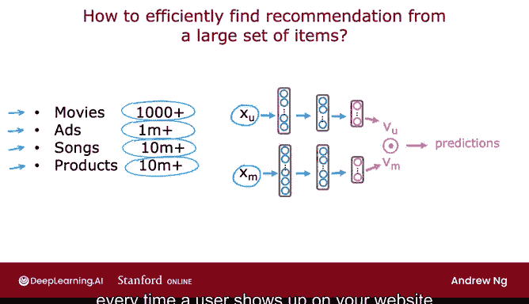
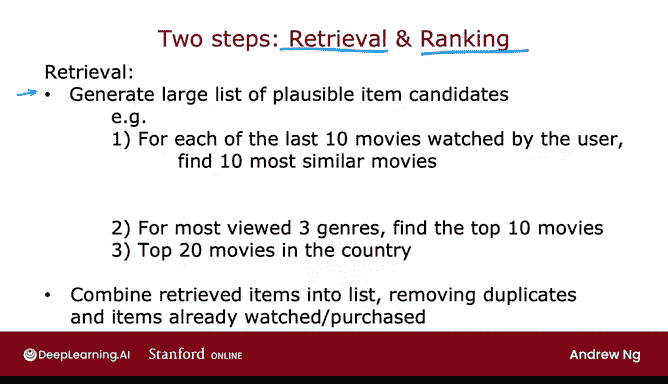
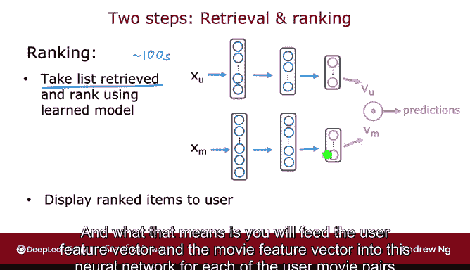
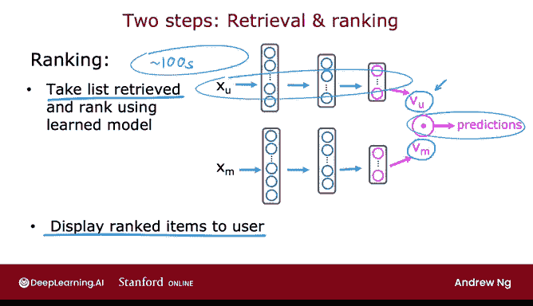
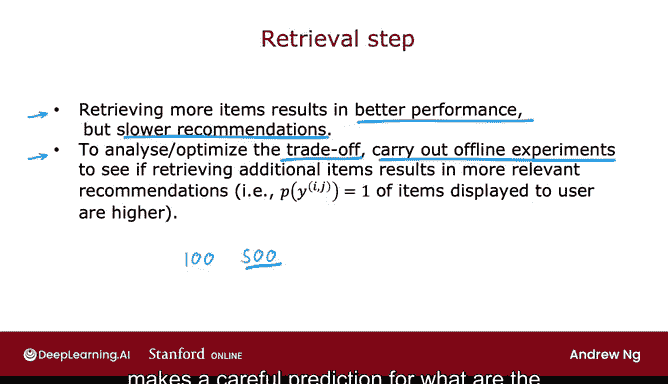

# 128：从大型目录中推荐 🎯

在本节课中，我们将学习推荐系统如何从包含成千上万甚至数百万物品的大型目录中，高效地挑选出少量物品进行推荐。我们将重点介绍一个两阶段方法：**检索**与**排名**。

---

## 推荐系统面临的挑战

上一节我们介绍了使用神经网络预测用户对物品的评分。然而，当用户访问网站时，我们拥有用户特征 `X_U`。

但如果需要将成千上万的物品输入神经网络，通过计算内积来确定推荐哪些产品，那么每次用户访问网站时都需要运行数百万次神经网络推理，这在计算上是不可行的。

---

## 两阶段解决方案：检索与排名

为了解决上述挑战，许多大规模推荐系统采用两个步骤实现：**检索**和**排名**。

检索步骤的目标是生成一个包含大量可能物品候选的列表，力求覆盖你可能推荐给用户的各种可能性。在检索阶段，即使包含许多用户可能不喜欢的物品也没关系。

排名步骤则会对这些候选物品进行精细调整，并挑选出最佳的物品推荐给用户。

以下是检索步骤的一个例子。

### 检索步骤的具体操作

以下是检索步骤可能采取的几个行动：

*   **基于最近观看记录**：针对用户最近观看的10部电影，分别找出10部最相似的电影。例如，如果用户观看了向量为 `V_IM` 的电影，你可以找到向量为 `V_KM` 的相似电影。正如上一视频所见，寻找与给定电影相似的电影可以预先计算，因此你可以直接通过查找表获取结果。
*   **基于用户偏好类型**：根据用户观看最多的3种电影类型（例如爱情片、喜剧片、历史剧），将每种类型中排名前10的电影加入候选列表。
*   **基于用户所在地区**：将用户所在国家/地区排名前20的电影也加入此列表。

这个检索步骤可以非常快速地完成，最终你可能会得到一个包含一百或数百部可能推荐电影的列表。这个列表有望包含一些好的选项，但即使包含一些用户完全不会喜欢的选项也可以接受。检索步骤的目标是确保广泛的覆盖范围，拥有足够多的电影，以便其中至少包含许多好的选择。

最后，我们会将检索步骤中获得的所有物品合并成一个列表，去除重复项以及用户已经观看或购买过、你可能不想再次推荐的物品。

### 排名步骤

检索与排名步骤是紧密衔接的。检索步骤提供了一个粗筛后的候选池，排名步骤则在此基础上进行精准排序。

排名步骤是第二个阶段。在此阶段，你将获取检索步骤得到的列表（可能只有数百部电影），并使用学习到的模型对它们进行排名。

这意味着你需要将用户特征向量和电影特征向量输入神经网络，并为每一对用户-电影组合计算预测评分。基于此，你现在就拥有了所有（例如）100多部电影中，用户最可能给出高评分的那些电影。然后，你可以根据你认为用户会给出最高评分的顺序，向用户展示这个排名后的物品列表。

一个额外的优化是：如果你已经预先计算了所有电影的 `V_M`，那么你只需要对神经网络的这一部分进行一次推理，计算出 `V_U`。然后，取这个刚刚为当前网站用户计算出的 `V_U`，并与检索步骤中获得的电影的 `V_M` 计算内积。

如果检索步骤只提出几百部电影，这个计算可以相对快速地完成。

---

## 关键决策：检索多少物品？

你需要为此算法做出的一个决策是：在检索步骤中，你希望检索多少物品来输入更精确的排名步骤？

在检索步骤中，检索更多物品往往会带来更好的性能，但算法最终会变得更慢。为了优化检索物品数量（例如是检索100、500还是1000件物品）之间的权衡，我建议进行离线实验，看看检索更多物品能在多大程度上带来更相关的推荐。

具体来说，如果你的神经网络模型预测的、检索物品的 `Y_IJ` 等于1的估计概率，或者 `Y` 的估计评分很高，那么如果你检索500件物品而不是仅100件，这个值最终会高得多。这将支持检索更多物品，即使它会稍微减慢算法速度。

然而，通过独立的检索步骤和排名步骤，当今许多推荐系统能够同时提供快速和准确的结果。因为检索步骤试图剔除大量不值得进行更详细推理和内积计算的物品，然后排名步骤再对用户实际可能喜欢的物品进行更仔细的预测。

---

## 总结与伦理考量

本节课中，我们一起学习了如何使推荐系统即使在电影、产品等非常庞大的目录上也能高效工作。

事实证明，尽管推荐系统具有重要的商业价值，但它们也伴随着一些重大的伦理问题。不幸的是，已经有一些推荐系统造成了伤害。因此，在你构建自己的推荐系统时，我希望你采取合乎伦理的方法，用它来服务你的用户和整个社会，以及你自己和你可能工作的公司。让我们在下一个视频中看看与推荐系统相关的伦理问题。