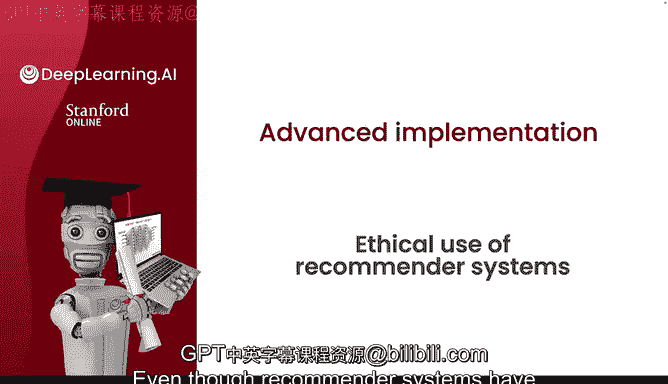
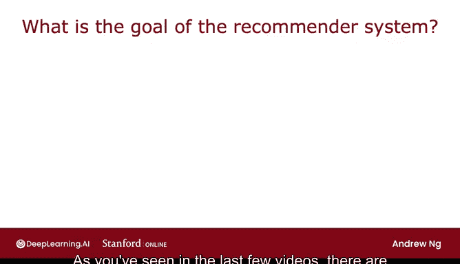
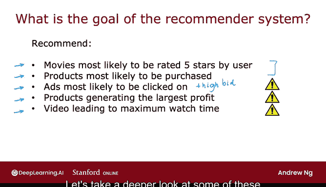
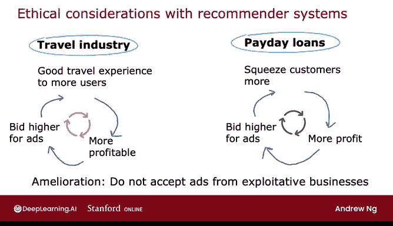
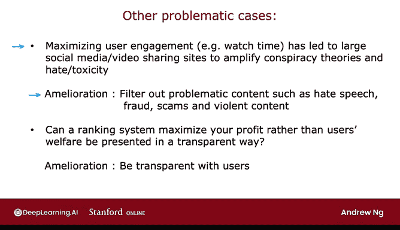

# 129：推荐系统的伦理使用 ⚖️

在本节课中，我们将探讨推荐系统的伦理问题。尽管推荐系统为许多企业带来了巨大利润，但其某些应用场景却可能对用户乃至整个社会产生负面影响。我们将分析这些潜在问题，并思考如何设计系统以最大化其益处、减少其危害。

上一节我们介绍了推荐系统的基本配置和目标设定。本节中，我们来看看推荐系统在实际应用中可能引发的一些伦理困境。

## 推荐系统的目标设定

设计推荐系统时，需要设定其核心目标，这决定了系统将向用户推荐什么内容。以下是几种常见的目标设定：

*   **最大化用户喜好**：例如，推荐用户最可能给出五星评分的电影。公式可表示为：`argmax(P(评分=5星 | 用户, 电影))`。
*   **最大化购买概率**：例如，推荐用户最可能购买的商品。公式可表示为：`argmax(P(购买 | 用户, 商品))`。
*   **最大化点击率**：在广告场景中，许多公司倾向于展示用户最可能点击的广告，尤其是当广告主出价较高时。因为公司的收入通常取决于广告是否被点击以及每次点击的出价。
*   **最大化公司利润**：一些网站会优先推荐能为公司带来最高利润的商品，而非最相关或用户最可能购买的商品。
*   **最大化用户参与度/停留时间**：视频或社交媒体网站可能通过推荐系统来最大化用户的观看时间或停留时间，从而展示更多广告。

前两种目标看似无害，而后三种目标则可能引发伦理问题。接下来，我们将深入探讨这些潜在的问题用例。

## 潜在的问题用例分析

### 广告行业的放大效应

广告行业有时会放大某些有害的商业行为，当然也能放大优秀的企业。

**良性循环示例（旅游业）**：
一家优秀的旅游公司提供出色的旅行体验，从而获得更高利润。高利润使其有能力在广告竞价中出价更高，从而获得更多流量和用户。这形成了一个良性循环：服务越好 -> 利润越高 -> 广告投入越大 -> 用户越多。

**恶性循环示例（发薪日贷款行业）**：
发薪日贷款公司通常向低收入人群收取极高利息。那些最擅长榨取客户每一分钱的公司利润更高，因此能在广告中出价更高，从而获得更多流量，进而剥削更多客户。这形成了一个恶性循环，使得最具剥削性的公司反而能获得最多曝光。

一个可能的缓解措施是拒绝为剥削性企业投放广告。然而，如何准确定义“剥削性企业”本身就是一个难题。

### 最大化参与度的副作用

最大化用户参与度（如视频观看时间、社交媒体停留时间）已被广泛报道可能导致不良后果。

为了吸引用户长时间停留，推荐系统可能会放大阴谋论或充满仇恨、毒性的内容，因为这些内容通常具有很高的参与度。即使这些内容对个人和社会有害，系统仍可能优先推荐它们。

一个不完美但可行的缓解方案是尝试过滤掉有问题的内容，例如仇恨言论、欺诈、诈骗或某些暴力内容。但同样，如何精确定义应过滤的内容极具挑战性。

### 透明度问题

当用户使用许多应用或网站时，他们通常认为推荐是基于个人喜好。然而，许多应用和网站实际上是在试图最大化自身利润，而非用户的满意度。

我鼓励开发者和公司尽可能向用户透明公开推荐内容所依据的标准。虽然这并不容易，但提高透明度有助于增加用户信任，并促使系统为社会创造更多价值。

## 总结与展望

本节课中，我们一起学习了推荐系统可能面临的伦理挑战。推荐系统是一项强大且有利可图的技术，但也存在一些有问题的应用场景。

在构建推荐系统或任何机器学习技术时，希望大家不仅考虑其可能带来的益处，也深思其潜在的危害。邀请多元视角进行讨论和辩论，并致力于构建那些你真正相信能让社会变得更好的事物。

希望我们所有从事人工智能工作的人，都能共同努力，只做让世界变得更美好的工作。

感谢聆听。关于推荐系统，我们还有最后一个视频，将探讨在 TensorFlow 中实现基于内容的过滤推荐系统的实用技巧。让我们进入推荐系统的最后一个视频。