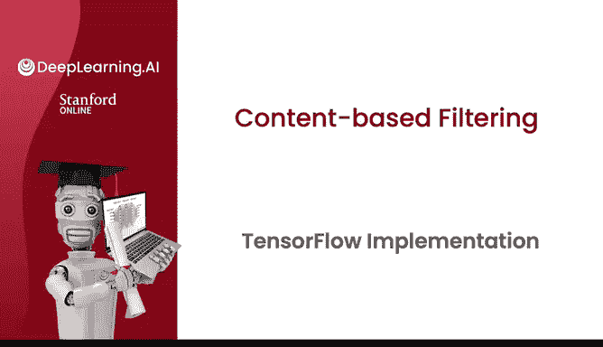
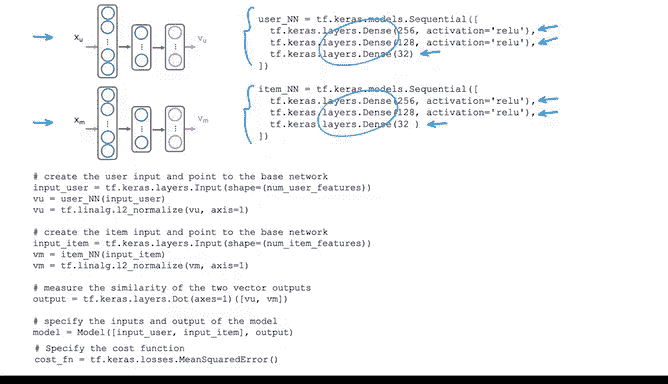

# 130：基于内容过滤的TensorFlow实现 🎬



在本节课中，我们将学习如何在TensorFlow中实现基于内容过滤的推荐算法。我们将通过分析关键代码片段，理解如何构建用户网络和物品（电影）网络，并计算它们之间的相似度以进行预测。

---

## 概述

基于内容过滤的核心思想是为用户和物品分别学习一个向量表示，并通过计算这两个向量的点积来预测用户对物品的偏好程度。在TensorFlow中，我们可以通过构建两个神经网络（用户网络和物品网络）来实现这一过程。

上一节我们介绍了基于内容过滤的基本概念，本节中我们来看看如何在TensorFlow中具体实现它。

---

## 构建用户网络


首先，我们需要构建一个用户神经网络。这个网络的结构与我们之前实现的全连接神经网络类似。

以下是构建用户网络的关键步骤：

*   我们使用`Sequential`模型。
*   在这个例子中，我们有两个全连接层，隐藏单元的数量在此指定。
*   最后一层输出32个数字。

```python
# 示例代码：用户网络结构
user_model = tf.keras.Sequential([
    tf.keras.layers.Dense(256, activation='relu'),
    tf.keras.layers.Dense(128, activation='relu'),
    tf.keras.layers.Dense(32)  # 输出用户向量 Vu
])
```

---

## 构建物品（电影）网络

接下来，我们构建物品网络。这里我们将电影视为物品。

以下是构建物品网络的关键步骤：

*   我们再次使用几个全连接隐藏层。
*   该层输出32个数字。
*   对于隐藏层，我们使用默认的激活函数，即ReLU激活函数。

```python
# 示例代码：物品网络结构
item_model = tf.keras.Sequential([
    tf.keras.layers.Dense(256, activation='relu'),
    tf.keras.layers.Dense(128, activation='relu'),
    tf.keras.layers.Dense(32)  # 输出物品向量 Vm
])
```



---

## 处理输入与向量归一化

我们需要告诉TensorFlow如何将用户特征或物品特征（即电影特征）输入到两个神经网络中。

以下是处理输入和进行向量归一化的步骤：

*   此语法提取用户的输入特征并将其输入到我们上面定义的用户神经网络中，以计算用户向量**Vu**。
*   为了使算法效果更好，我们增加了归一化步骤，将向量**Vu**的长度归一化为1。这行代码对向量的长度进行归一化，也称为L2范数归一化，但基本上是将向量**V**的长度设置为1。
*   我们对物品网络（电影网络）执行相同的操作。这提取物品特征并将其输入到我们上面定义的物品神经网络中，并计算电影向量**Vm**。
*   最后，此步骤也将该向量的长度归一化为1。

```python
# 示例代码：输入处理与归一化
# 假设 user_features 和 item_features 是输入数据
vu = user_model(user_features)
vu = tf.nn.l2_normalize(vu, axis=1)  # 归一化用户向量

vm = item_model(item_features)
vm = tf.nn.l2_normalize(vm, axis=1)  # 归一化物品向量
```

---

## 计算点积与模型输出

在计算出**Vu**和**Vm**之后，我们必须计算这两个向量之间的点积。

以下是计算点积和定义模型输出的步骤：

*   Keras有一个特殊的层类型。注意，我们之前在这里使用了`tf.keras.layers.Dense`，而这里是`tf.keras.layers.Dot`。实际上，有一个特殊的Keras层可以直接计算两个数字之间的点积。
*   因此，我们将使用它来计算向量**Vu**和**Vm**的点积，这给出了神经网络的输出，即最终的预测值。
*   最后，为了告诉Keras模型的输入和输出是什么，这行代码指明整体模型是一个以用户特征和电影（或物品）特征为输入，以上面定义的输出为输出的模型。

```python
# 示例代码：计算点积与定义模型
dot_product = tf.keras.layers.Dot(axes=1)([vu, vm])

model = tf.keras.Model(inputs=[user_features_input, item_features_input], outputs=dot_product)
```

---

## 损失函数与训练

我们用于训练此模型的成本函数将是均方误差成本函数。

```python
# 示例代码：编译模型
model.compile(optimizer='adam', loss='mse')
```

这些是实现基于内容过滤神经网络的关键代码片段。你可以在实践实验室中查看其余代码，但希望你能尝试运行并了解所有这些代码片段如何组合成一个可工作的基于内容过滤算法的TensorFlow实现。

实际上，我之前没有讨论的另一个步骤是归一化向量**Vu**的长度，这会使算法效果更好。因此，TensorFlow有这个`L2 normalize`函数来归一化向量，它也被称为归一化向量的L2范数，因此得名。

---

## 总结

本节课中我们一起学习了基于内容过滤推荐系统的TensorFlow实现。我们了解了如何构建用户和物品的双塔神经网络模型，如何对学习到的向量进行归一化处理，以及如何通过计算点积来生成预测。这些是构建现代推荐系统的重要基础。

感谢你坚持学习推荐系统的所有材料，这是一个令人兴奋的领域。希望你在实践实验室中享受这些想法和代码的乐趣。这标志着我们关于推荐系统的视频讲座以及本专业倒数第二周的结束。

我期待下周也能见到你，我们将讨论强化学习这项激动人心的技术。希望你喜欢测验和实践实验室，我期待下周与你再见。