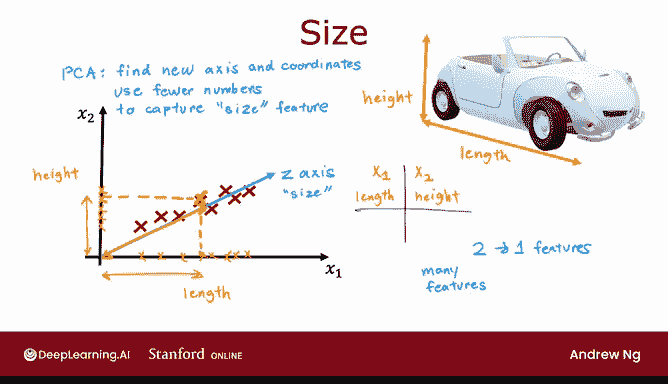
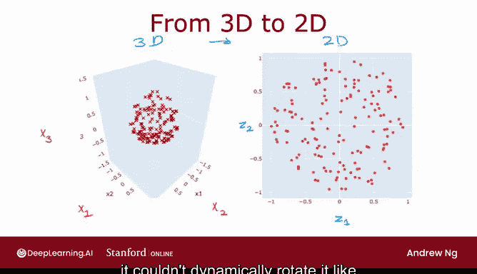
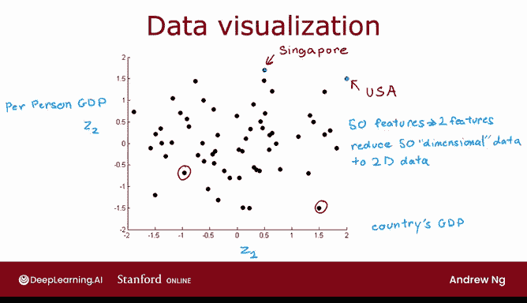

# 131：主成分分析（PCA）入门 🧠

在本节课中，我们将学习一种名为**主成分分析**的无监督学习算法。该算法常用于数据可视化，特别是当你拥有大量特征（例如10个、50个甚至上千个）时。由于我们无法直接绘制高维数据，PCA可以帮助我们将数据的特征数量减少到两个或三个，从而能够进行可视化，帮助数据科学家更好地理解和探索数据。

## 数据降维的需求 📉

在深入PCA的工作原理之前，我们先来看看为什么需要降维。假设你有一个关于乘用车的数据集，其中包含许多特征，例如：
*   汽车长度
*   汽车宽度
*   车轮直径
*   汽车高度

如果你希望可视化这些数据，但无法绘制100维的图表，PCA就能派上用场。它可以将具有大量特征的数据集压缩到更少的维度。

## PCA工作原理示例 🚗

为了更好地描述PCA，我们将以汽车数据为例。

### 示例一：长度与宽度
假设数据集只有两个特征：`x1`（汽车长度）和`x2`（汽车宽度）。由于道路宽度的限制，汽车的宽度变化通常不大。因此，数据点可能如下图所示，其中`x1`变化很大，而`x2`变化很小。

如果你想减少特征数量，一个简单的做法是只保留`x1`，因为`x2`提供的信息很少。PCA算法应用于此数据时，基本上会自动做出这个决定。

### 示例二：长度与车轮直径
现在，假设`x1`仍是长度，`x2`是车轮直径。车轮直径确实有一些变化，数据分布可能如下图所示。同样，如果你想简化为一个特征，可能还是会选择`x1`。PCA处理这个数据集时，结果也类似。

### 示例三：长度与高度
这是一个更复杂的情况。`x1`是长度，`x2`是高度，两者都有显著变化。数据点分布可能显示，较大的汽车通常更长、更高，而较小的汽车则相反。

此时，你不希望只保留长度或只保留高度，因为两者都包含重要信息。PCA的解决方案是引入一个新的轴，我们称之为`z`轴。这个`z`轴不是凭空出现的第三个维度，而是位于原始`x1`-`x2`平面内的一条新直线。

`z`轴可能对应于“汽车大小”这个概念。这样，原本需要用两个数字（`x1`, `x2`）描述的汽车，现在可以用一个数字（它在`z`轴上的坐标）来大致捕获其核心信息。PCA的核心思想正是如此：**定义一个新的坐标系（由“主成分”轴构成），使得数据在新坐标系下的坐标能最大程度地保留原始数据的有用信息，同时使用更少的维度。**

## PCA的实际应用 🌍

在实践中，PCA通常用于将大量特征（如10、20、50甚至上千个）减少到2或3个，以便进行二维或三维可视化。

例如，假设你有一个关于各国发展状况的数据集，包含50个特征，如GDP、人均GDP、人类发展指数、预期寿命等。你无法在二维屏幕上绘制50维数据。

PCA可以将这50个特征（`x1`, `x2`, ..., `x50`）压缩成两个新特征`z1`和`z2`。然后，你可以将各个国家根据它们的`(z1, z2)`坐标绘制在图上。

你可能会发现：
*   `z1`大致对应**国家规模与总GDP**（大国通常有更高的GDP）。
*   `z2`大致对应**人均经济活动水平**（人均GDP）。

于是，美国（大国，高人均）可能位于图的右上方；新加坡（小国，高人均）可能位于图的中上方；而其他组合则分布在不同的位置。

这种可视化让你能够洞察高维数据的结构和模式，有时还能发现数据中异常或有趣的现象。

## 总结 📝

本节课我们一起学习了**主成分分析**的基本概念。PCA是一种强大的无监督学习算法，它能将高维数据（特征多）降维到低维空间（通常是2维或3维），从而让我们能够可视化数据，并更好地理解数据的内在结构和关键信息。在接下来的课程中，我们将具体探讨PCA算法是如何实现的。