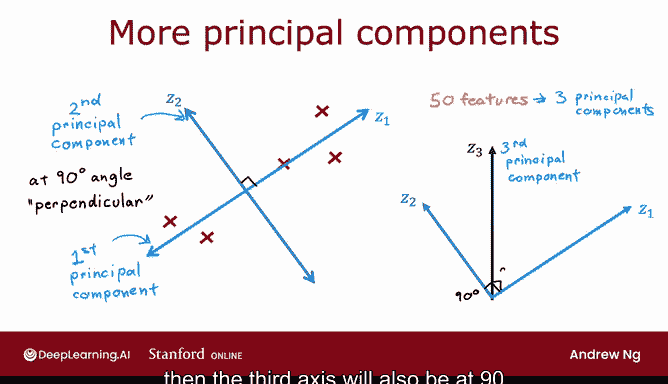
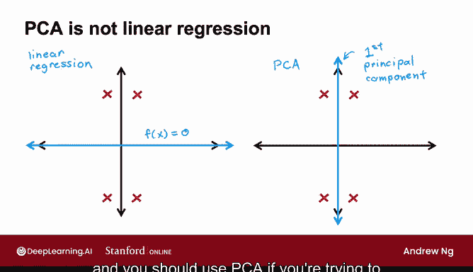
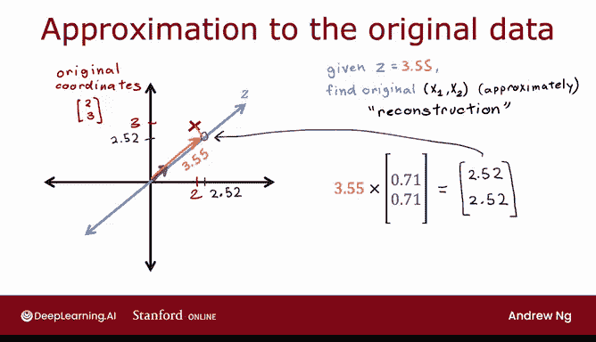

# 132：PCA算法详解 🧠

在本节课中，我们将学习主成分分析（PCA）算法。PCA是一种无监督学习技术，用于降低数据维度，同时尽可能保留原始数据中的信息。我们将从直观理解开始，逐步深入到其数学原理，并解释PCA与线性回归的区别。

---

## 数据预处理与PCA的目标

上一节我们介绍了PCA的基本概念，本节中我们来看看PCA具体如何工作。假设你有一个包含两个特征X1和X2的数据集。数据最初使用X1和X2轴绘制或表示，但你想用仅一个特征（我们称之为Z轴）来替换这两个特征。如何选择一个新轴，使其能很好地捕捉或表示数据？让我们看看PCA是如何做的。

以下是包含五个训练示例的数据集。请记住，这是一种无监督学习算法，因此我们只有x1和x2，没有标签Y。例如，这里的一个点可能坐标为x1=10，x2=8。

如果我们不想使用X1和X2轴，如何选择不同的轴来捕捉或表示数据？

在应用PCA的后续步骤之前，需要注意预处理：特征应首先归一化以具有零均值。此处已假设完成此操作。如果特征x1和x2的取值范围差异很大（例如，x1是房屋面积，x2是卧室数量），那么在应用PCA的后续步骤之前，你还需要先进行特征缩放。

假设特征已归一化至零均值（即从每个特征中减去均值），并且可能也进行了特征缩放，使范围相差不大。接下来PCA会做什么？

---

## 选择新轴与投影

为了检查PCA的作用，让我们移除X1和X2轴，只留下五个训练示例。这里的点代表原点。现在，PCA需要选择一个轴（而不是之前的两个轴）来捕捉这五个示例的重要信息。

如果我们选择这个轴作为Z轴（在这个例子中，它实际上与X1轴相同），那么对于这个示例，我们将只捕获其在Z轴上的坐标值。对于第二个示例，我们将捕获这个值，依此类推。

换句话说，我们将取每个示例并将其投影到Z轴上的一个点。“投影”指的是你取这个示例，并使用与Z轴成90度角的线段将其带到Z轴。这里的小方框用于表示该线段与Z轴成90度角。

选择这个方向作为Z轴不是一个坏选择，但有更好的选择。这个选择不算太差，因为当你将示例投影到Z轴上时，你仍然捕捉到了数据的很大一部分分布。这五个点在这里相当分散，因此仍然捕捉到了原始数据集中的大量方差或变化。这意味着投影到Z轴上的数据的方差或变化相当大，因此我们仍然捕捉到了原始五个示例中的大量信息。

---

## 不同轴选择的影响

以下是轴Z的一些可能选择。这是另一个选择，但实际上不是一个好选择。如果我选择这个作为我的Z轴，那么如果我取同样的五个示例并将它们投影到Z轴上，我最终会得到这五个点。你会注意到，与之前的选择相比，这五个点被挤压在一起，它们之间的差异量或方差或变化要小得多。这意味着，选择这个Z轴，你捕捉到的原始数据集的信息要少得多，因为你部分地将所有五个示例挤压在一起。

让我们看最后一个选择：如果我选择这个作为Z轴，这实际上比我们之前看到的两个选择更好。因为如果我们将数据投影到Z轴上，我们会发现这些点实际上相距甚远。因此，即使我们现在只使用一个坐标或一个数字来表示或捕捉每个训练示例，而不是使用两个数字或两个坐标X1和X2，我们仍然捕捉到了原始数据中的大量变化和信息。

在PCA算法中，这个轴被称为**主成分**。它是当你将数据投影到其上时，能获得最大可能方差的轴。因此，如果你要将数据减少到一个轴或一个特征，这个主成分实际上是一个很好的选择，这就是PCA会做的。

---

## 可视化不同轴选择的影响

这里我们有10个训练示例。当我们滑动这里的滑块时（你可以在一个可选实验室中自己尝试），Z轴的角度会改变。你在左侧看到的是每个示例通过那个与Z轴成90度的短线段投影的结果，右侧是数据的投影，即这10个示例的Z坐标值。

你会注意到，当我把轴设置在这里时，点被挤压在一起，因此这保留了较少原始数据的信息。而如果我把Z轴设置成这样，这些点分散得多，因此这捕捉到了原始数据集中更多的信息。这就是为什么主成分对应于将Z轴设置在这里，如果你要求PCA将数据减少到一个数字或一个维度，这就是PCA会做出的选择。

像Scikit-learn这样的机器学习库（你将在下一个视频中了解更多）可以帮助你自动找到主成分，但让我们更深入地了解一下它是如何工作的。

---

## PCA的数学原理

这是我的X1和X2轴，这是一个训练示例，坐标为X1轴上的2和X2轴上的3。假设PCA已经找到了这个作为Z轴。我在这里画的这个小箭头是一个长度为1的向量，指向PCA将选择或我们已经选择的Z轴方向。

这个长度为1的向量实际上是向量 `[0.71, 0.71]`（四舍五入后，实际上是0.707等更多数字）。那么，给定这个在x1、x2轴上坐标为 `[2, 3]` 的示例，我们如何将其投影到Z轴上？公式是取向量 `[2, 3]` 和这个向量 `[0.71, 0.71]` 的点积。

如果你计算 `[2, 3]` 与 `[0.71, 0.71]` 的点积，结果是 `2*0.71 + 3*0.71 = 3.55`。这意味着从原点到这个点的距离是3.55，也就是说，如果我们想用一个数字来尝试捕捉这个示例，那个数字就是3.55。

到目前为止，我们已经讨论了如何使用PCA将数据降低到一个维度或一个数字，我们通过找到主成分（有时也称为第一主成分）来实现。在这个例子中，我们找到了这个作为第一个轴。事实证明，如果你要选择第二个轴，第二个轴将始终与第一个轴成90度角。如果你要选择第三个轴，那么第三个轴将与第一个和第二个轴成90度角。

顺便说一下，在数学中，90度有时被称为垂直。“垂直”一词仅意味着成90度角。因此，数学家有时会说第二个轴Z2与第一个轴Z1成90度角或垂直。如果你选择额外的轴，它们也与Z1和Z2以及PCA将选择的任何其他轴成90度角或垂直。因此，如果你有50个特征并想找到三个主成分，那么如果那是第一个轴，第二个轴将与之成90度角，第三个轴也将与第一个和第二个轴成90度角。

---

## PCA与线性回归的区别

现在，我经常被问到的一个问题是：PCA与线性回归有何不同？事实证明，PCA不是线性回归，它是一个完全不同的算法，让我解释为什么。

线性回归是一种监督学习算法，你有数据X和Y。这里的数据集，水平轴是特征X，垂直轴是标签Y。在线性回归中，你试图拟合一条直线，使预测值尽可能接近真实标签Y。换句话说，你试图最小化这些小线段的长度，这些小线段在垂直方向上，它们与Y轴对齐。

相比之下，在PCA中，没有真实标签Y，所以你只有未标记的数据x1和x2。此外，你不是试图拟合一条线来使用x1预测x2。相反，算法平等对待x1和x2，我们试图找到这个轴Z，结果是我们最终使这些小线段变小。当你将数据投影到Z上时。

在线性回归中，有一个数字Y被给予特殊对待，我们总是试图测量拟合线与Y之间的距离，这就是为什么这些距离仅在Y轴方向上测量。而在PCA中，你可以有很多特征，x1、x2，可能一直到x50（如果你有50个特征），所有50个特征都被平等对待，我们只是试图找到一个轴Z，使得当数据使用这些线段投影到Z轴上时，你仍然尽可能保留原始数据的方差。

我知道当我在二维空间中绘制这些东西时（只有两个特征，这是我能在平面计算机显示器上绘制的全部），这些箭头看起来可能有点相似。但当你拥有两个以上的特征时（大多数情况如此），线性回归和PCA之间的差异以及箭头的作用是非常大的。这些箭头用于完全不同的目的，并给出非常不同的答案：线性回归用于预测目标输出Y，而PCA试图处理许多特征，平等对待它们，并减少表示数据所需的轴的数量。

事实证明，最大化这些投影的分布将对应于最小化这些线段的距离，即点必须移动以投影到Z上的距离。

为了以另一种方式说明线性回归和PCA之间的区别：如果你有一个看起来像这样的数据集，线性回归所能做的就是拟合一条看起来像那样的线。而如果你的数据看起来像这样，PCA将选择这个作为主成分。因此，如果你试图预测Y的值，应该使用线性回归；如果你试图减少数据集中的特征数量（例如为了可视化），应该使用PCA。

---

## PCA的重建步骤

最后，在结束这个视频之前，你还可以用PCA做一件事。回想一下这个坐标为 `[2, 3]` 的示例。我们发现，如果你将其投影到Z轴上，最终得到3.55。你可以做的一件事是，如果你有一个示例，其中z=3.55，仅给定这个数字z=3.55，我们能尝试找出原始示例是什么吗？

事实证明，PCA中有一个称为**重建**的步骤，即尝试从这个数字z=3.55回到原始的2个数字x1和x2。事实证明，你没有足够的信息来完全恢复x1和x2，但你可以尝试近似它。具体来说，公式是取这个数字3.55（即z）乘以我们刚才拥有的那个长度为1的向量 `[0.71, 0.71]`。

这最终得到 `[2.52, 2.52]`，也就是这里的这个点。因此，我们可以用这个新点（坐标为 `[2.52, 2.52]`）来近似原始训练示例（坐标为 `[2, 3]`）。原始点与投影点之间的差异是这里的小线段。在这种情况下，这是一个不错的近似：`[2.52, 2.52]` 离 `[2, 3]` 并不远。因此，仅用一个数字，我们就可以对原始训练示例的坐标进行合理的近似。这被称为PCA的重建步骤。

---

## 总结

本节课中我们一起学习了PCA算法。PCA算法查看你的原始数据，并选择一个或多个新轴（Z或可能是Z1和Z2）来表示你的数据。通过将原始数据投影到你的新轴上，这为你提供了一组更小的数字，你可以用它们来可视化你的数据。

你已经看到了数学原理，现在让我们看看如何在代码中实现它。在下一个视频中，我们将看看如何使用Scikit-learn库自己应用PCA。让我们继续下一个视频。